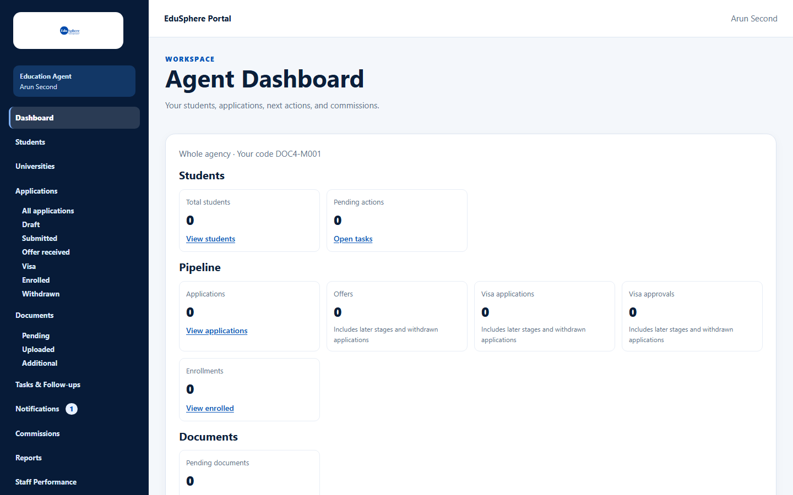
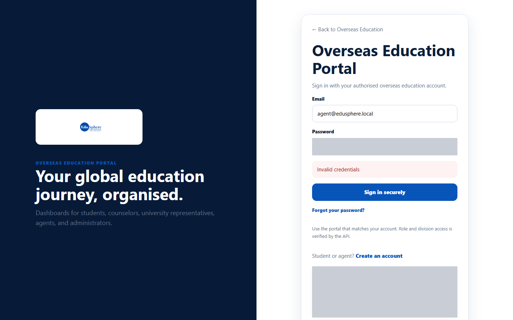
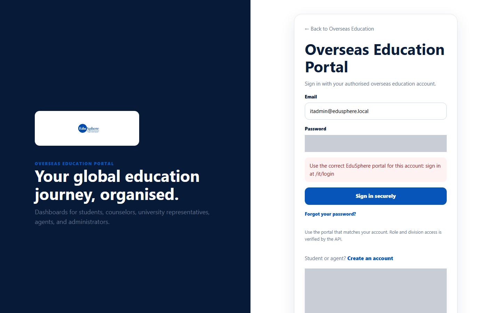

# Sign in and sign out

> Doc ID: DOC-AUTH-002 · Verified 2026-10-05 against `main` @ `6a9be770` (docs branch) · Roles: Agency Master, Agency Staff

## Purpose
Sign in to reach your agency workspace, and sign out when you finish so nobody else can use your session.

## Who Can Use This Feature
Agency Masters and Agency Staff. (Overseas Admins use the same page.)

## Prerequisites
- An EduSphere Overseas account. Staff get theirs from their agency Master.
- For staff and invited Masters: you have set your password from the emailed link
  (see [Reset your password](auth-004-reset-password.md)).

## How to Access
Go to the Overseas Education sign-in page: `/overseas/login`.

## Steps

### Step 1 — Open the sign-in page
The page **Overseas Education Portal** opens with **Email** and **Password** fields.

### Step 2 — Sign in
1. Enter your **Email** and **Password**.
2. Click **Sign in securely**.

You are taken to your **Agent Dashboard**. The sidebar on the left lists everything you can use. The box under
the sidebar logo shows your role ("Education Agent" for Masters, "Agency Staff" for staff) and your name.

### Step 3 — Sign out
At the bottom of the sidebar, click **Sign out**. You are signed out and returned to the EduSphere home page.

## Fields
| Field | Description | Required | Example |
|---|---|---|---|
| Email | The email your account was created with. | Yes | priya@agency.example |
| Password | Your password. | Yes | — |

## Expected Result
You land on the Agent Dashboard. If you followed a link to a specific page before signing in, you are taken back to
that page instead.

## Validation Messages
| Message | When |
|---|---|
| Invalid credentials | The email or password is wrong, or the login has been switched off. |
| Use the correct EduSphere portal for this account: sign in at /it/login | The account belongs to the IT Training division, not Overseas Education. |

## Common Errors
**Problem:** "Invalid credentials".
**Cause:** Wrong email or password.
**Resolution:** Check the email for typos and try again, or use **Forgot your password?**.

**Problem:** "Use the correct EduSphere portal for this account…".
**Cause:** You are on the Overseas Education sign-in page, but your account belongs to another EduSphere portal.
**Resolution:** Sign in at the address shown in the message.

**Problem:** You sign in, but see "Access unavailable".
**Cause:** Your agency is not approved yet, is suspended, or your login was deactivated.
**Resolution:** See ["Access unavailable" messages](auth-003-access-unavailable.md).

## Tips
- Use **Forgot your password?** on the sign-in page if you cannot remember your password.
- Always sign out on shared computers.

## Related Features
- [Register an agency](auth-001-register-an-agency.md)
- [Reset your password](auth-004-reset-password.md)
- [Change your password](auth-005-change-password.md)
