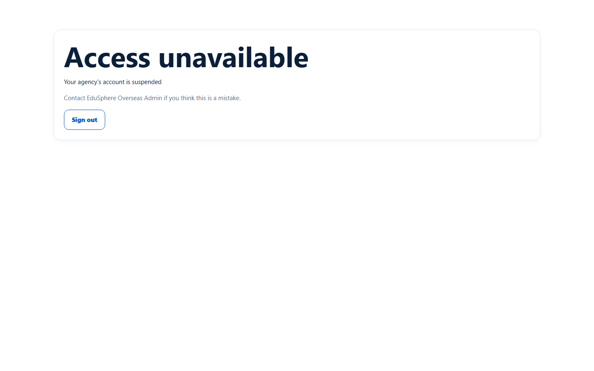
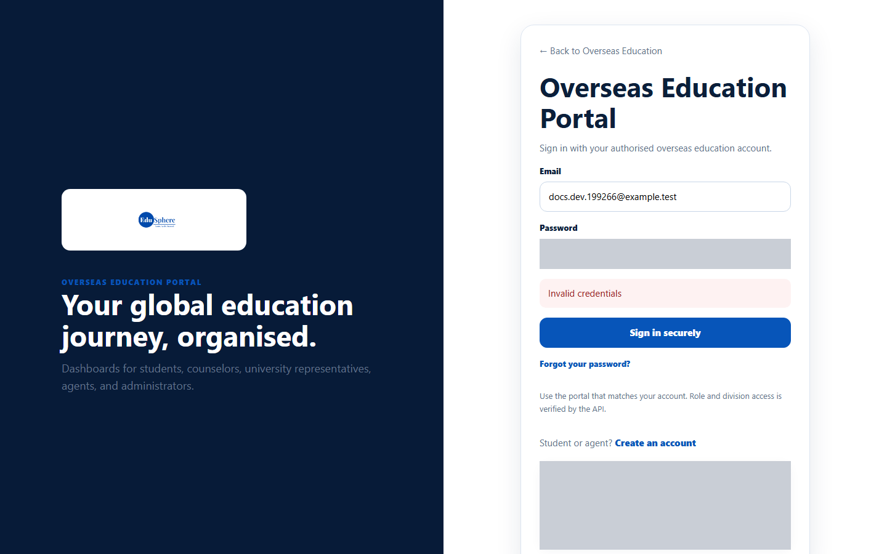

# "Access unavailable" messages

> Doc ID: DOC-AUTH-003 · Verified 2026-10-05 against docs commit `717d6aa8` (`main` @ `6a9be770`) · Roles: Agency Master, Agency Staff

## Purpose
Explains the **Access unavailable** page you may see after signing in, what each message means and what to do.

## Who Can Use This Feature
Any Agency Master or Agency Staff member whose agency or login is not in good standing.

## Prerequisites
None. The page appears automatically.

## How to Access
It replaces every Agent Portal page while access is blocked.

## Steps

### Step 1 — Read the message
The page shows the heading **Access unavailable**, a reason, the note "Contact EduSphere Overseas Admin if you think this
is a mistake." and a **Sign out** button.

| Message | Meaning |
|---|---|
| Agent registration is pending approval | Your agency has registered but has not been approved yet. **A rejected registration shows this same message.** |
| Your agency's account is suspended | EduSphere has suspended your agency. Every Master and staff member is blocked. |
| Your Master account is deactivated | Your own login has been deactivated (wording from the application code; not observed in testing — VERIFICATION REQUIRED). In testing, a deactivated staff member who signs in is refused at the sign-in page with **Invalid credentials** instead. |

### Step 2 — Sign out or wait
Click **Sign out** to leave. You cannot use the portal until the reason is resolved.

## Fields
None.

## Expected Result
Once EduSphere approves or reinstates the agency (or your Master reactivates your login), the portal works again on
your next page load. No email is sent when this changes.

## Validation Messages
See the table in Step 1.

## Common Errors
**Problem:** "Agent registration is pending approval" for a long time.
**Cause:** The agency is still waiting for approval, or the registration was rejected (both show the same message).
**Resolution:** Contact EduSphere Overseas Admin.

**Problem:** "Your agency's account is suspended".
**Cause:** An Overseas Admin suspended the agency.
**Resolution:** An agency Master should contact EduSphere Overseas Admin. Staff should contact their agency Master.

## Tips
- While blocked you can still open **Change password** from the account pages.
- If your agency Master deactivates your login, signing in shows **Invalid credentials**. Ask your Master to
  reactivate you.

## When to Contact Administrator
Always — only EduSphere Overseas Admin (agency status) or your agency Master (your own login) can restore access.

## Related Features
- [Register an agency](auth-001-register-an-agency.md)
- Admin: [Approve, reject, suspend or reinstate agencies](../../admin-manual/adm-001-agency-approvals.md)
