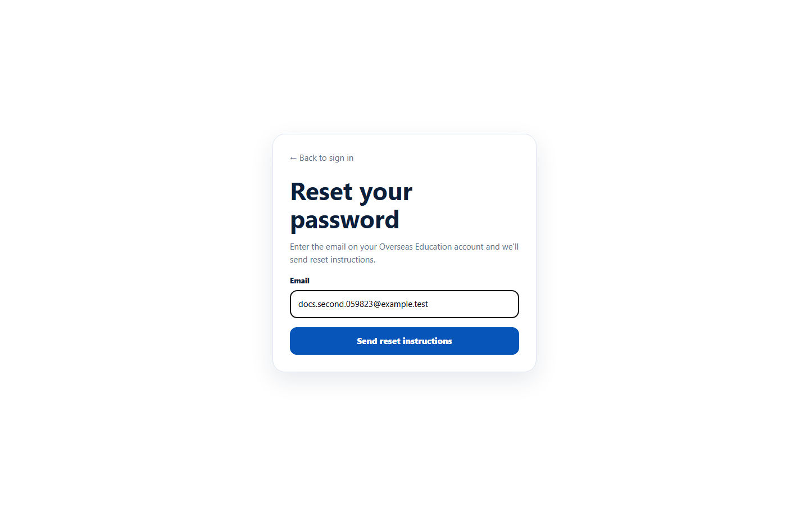
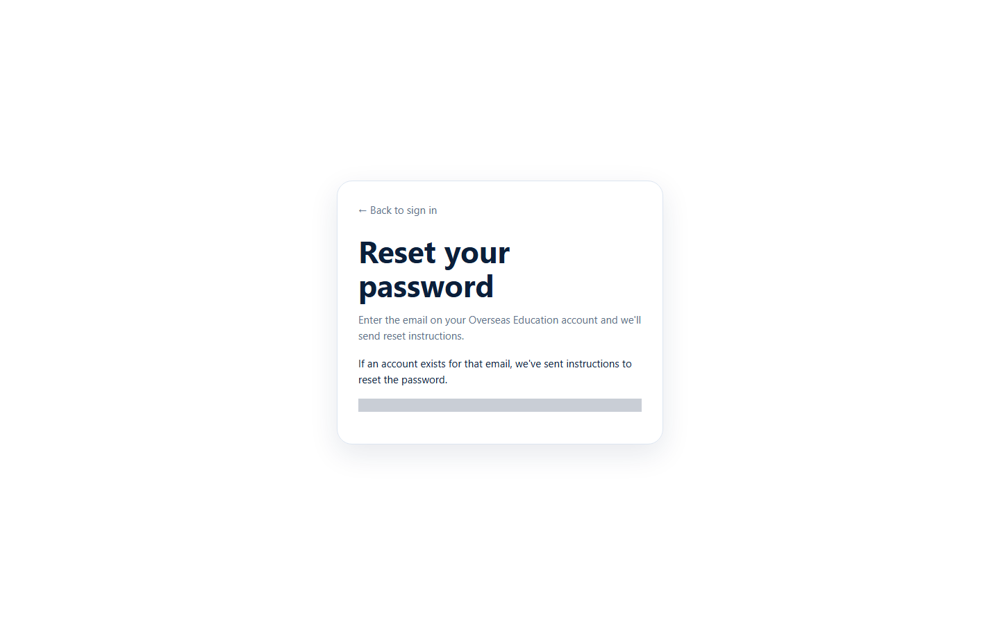

# Reset your password

> Doc ID: DOC-AUTH-004 · Verified 2026-10-05 against `main` @ `6a9be770` (docs branch) · Roles: Agency Master, Agency Staff

## Purpose
Set a new password when you have forgotten yours. New staff and invited Masters use the same "Choose a new password"
page from their invitation email to set their first password.

## Who Can Use This Feature
Agency Masters and Agency Staff.

## Prerequisites
Access to the mailbox of your EduSphere account.

## How to Access
Overseas sign-in page > **Forgot your password?**

## Steps

### Step 1 — Request reset instructions
1. On the sign-in page click **Forgot your password?**. The page **Reset your password** opens.
2. Enter your account **Email**.
3. Click **Send reset instructions**.

The page always answers: "If an account exists for that email, we've sent instructions to reset the password." It
does not say whether the email exists, to protect accounts.

### Step 2 — Open the link in the email
Open the reset email and click its link. The page **Choose a new password** opens. The link works for **30 minutes**
(invitation links for new staff and Masters work for **72 hours**).

### Step 3 — Choose a new password
1. Enter a **New password** (10 to 128 characters).
2. Click **Reset password**.

You are taken to the sign-in page. Sign in with the new password.

## Fields
| Field | Description | Required | Example |
|---|---|---|---|
| Email | Your account email (Step 1). | Yes | priya@agency.example |
| New password | Your new password, 10–128 characters. | Yes | — |

## Expected Result
Your password is changed and you are returned to the sign-in page.

## Validation Messages
| Message | When |
|---|---|
| Reset token is invalid or expired | The link is older than its time limit, was already used, or was copied incompletely. |
| This reset link is missing its token. Request a new one from the forgot-password page. | The page was opened without the link's code. |
| (browser prompt) | The new password is shorter than 10 characters. |

## Common Errors
**Problem:** "Reset token is invalid or expired".
**Cause:** The link has expired or was already used.
**Resolution:** Click **Request a new reset link**. If this was your first-time invitation, ask your agency Master (staff)
or EduSphere Overseas Admin (Masters) to re-send it.

**Problem:** No email arrives.
**Cause:** The email may be in spam, the address may be wrong, or there is no account for that email.
**Resolution:** Check spam, then try again with the exact sign-in email. Contact your agency Master if it still does not arrive.

## First-time password (new staff and invited Masters)
When a Master creates your staff login (or invites you as a Master), you receive the email
**"Welcome to EduSphere -- set your password"**. Click **Set your password** in the email; it opens the same
**Choose a new password** page (Step 3). The link is single-use and expires in 72 hours. After saving you are taken
to the sign-in page.

## Tips
- Request only one reset at a time; only the newest link is useful.
- Agency staff: your Master can also send you a fresh set-password link with **Reset** on the Team page.

## Related Features
- [Sign in and sign out](auth-002-sign-in-and-sign-out.md)
- [Change your password](auth-005-change-password.md)
