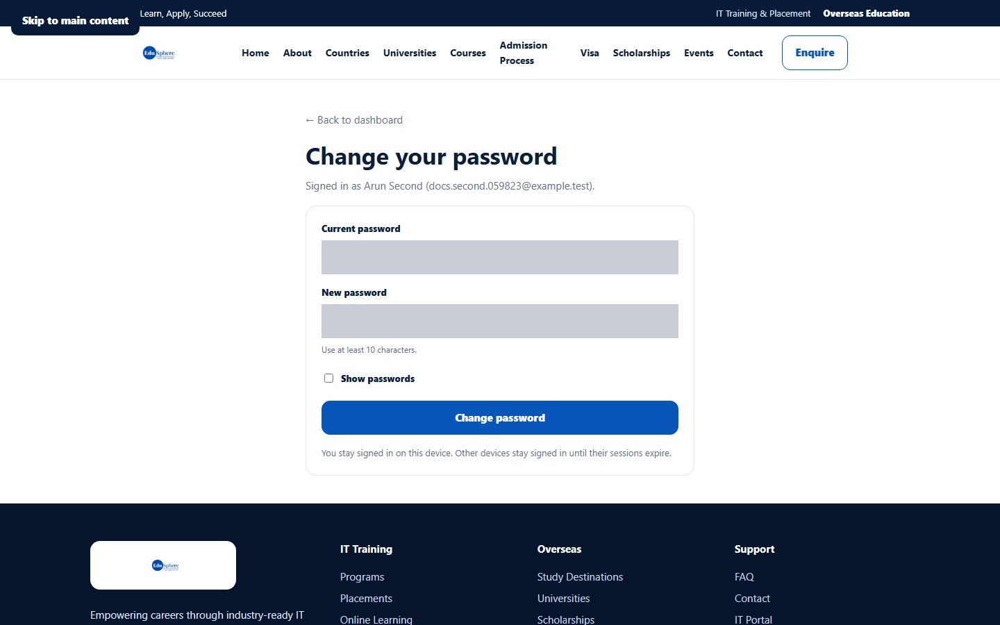
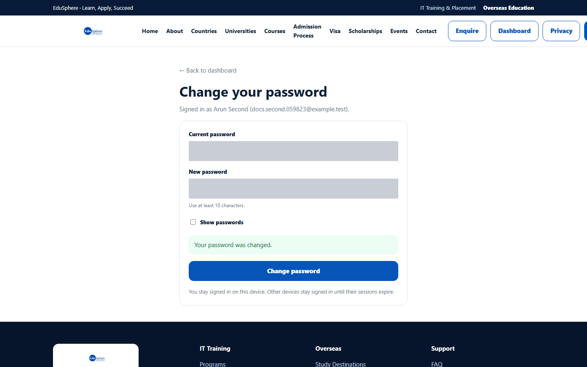
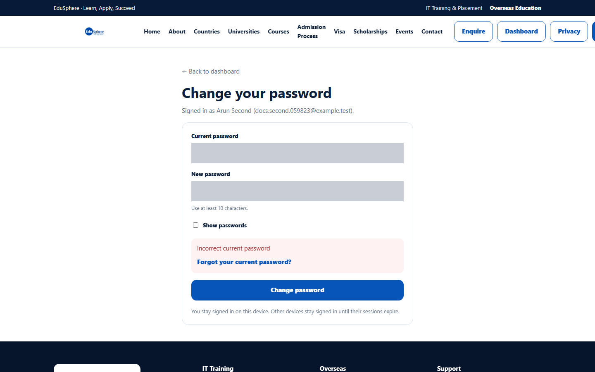

# Change your password

> Doc ID: DOC-AUTH-005 · Verified 2026-10-05 against `main` @ `6a9be770` (docs branch) · Roles: Agency Master, Agency Staff

## Purpose
Change your password while you are signed in, for example after receiving a temporary password or as routine security.

## Who Can Use This Feature
Any signed-in Agency Master or Agency Staff member (this page also works while your agency is pending approval).

## Prerequisites
You know your current password. If you do not, use [Reset your password](auth-004-reset-password.md).

## How to Access
Sidebar (bottom) > **Change password**.

## Steps

### Step 1 — Open Change password
Click **Change password** at the bottom of the sidebar. The page **Change your password** opens and shows
"Signed in as {your name} ({your email})."

### Step 2 — Enter your passwords
1. Enter your **Current password**.
2. Enter a **New password** (at least 10 characters, different from the current one).
3. Optional: tick **Show passwords** to check what you typed.
4. Click **Change password**.

### Step 3 — Check the result
The message **Your password was changed.** appears. You stay signed in on this device; other devices stay signed in
until their sessions expire.

Click **← Back to dashboard** to return to the portal.

## Fields
| Field | Description | Required | Example |
|---|---|---|---|
| Current password | The password you signed in with. | Yes | — |
| New password | The new password, 10–128 characters. | Yes | — |
| Show passwords | Shows both passwords in plain text while you type. | No | ticked |

## Expected Result
Use the new password the next time you sign in.

## Validation Messages
| Message | When |
|---|---|
| Incorrect current password | The current password is wrong. A **Forgot your current password?** link is shown. |
| New password must be different from the current password | The new password is the same as the current one. |
| Too many incorrect attempts. Try again in … | Several wrong current passwords in a row (not reproduced in testing; text from the application). |
| Your session has expired. Sign in again to change your password. | You were signed out before saving. |

## Common Errors
**Problem:** "Incorrect current password".
**Cause:** The current password was typed wrongly.
**Resolution:** Re-type it (use **Show passwords**), or follow **Forgot your current password?**.

## Tips
- Choose a password you do not use on other websites.

## Related Features
- [Reset your password](auth-004-reset-password.md)
- [My profile](auth-006-my-profile.md)
