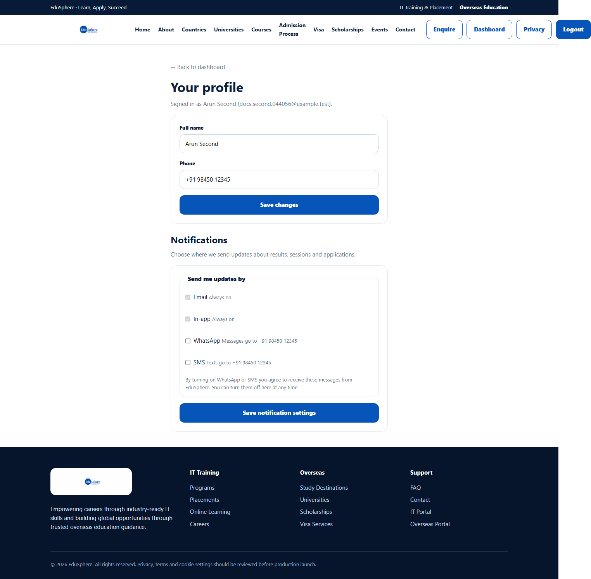
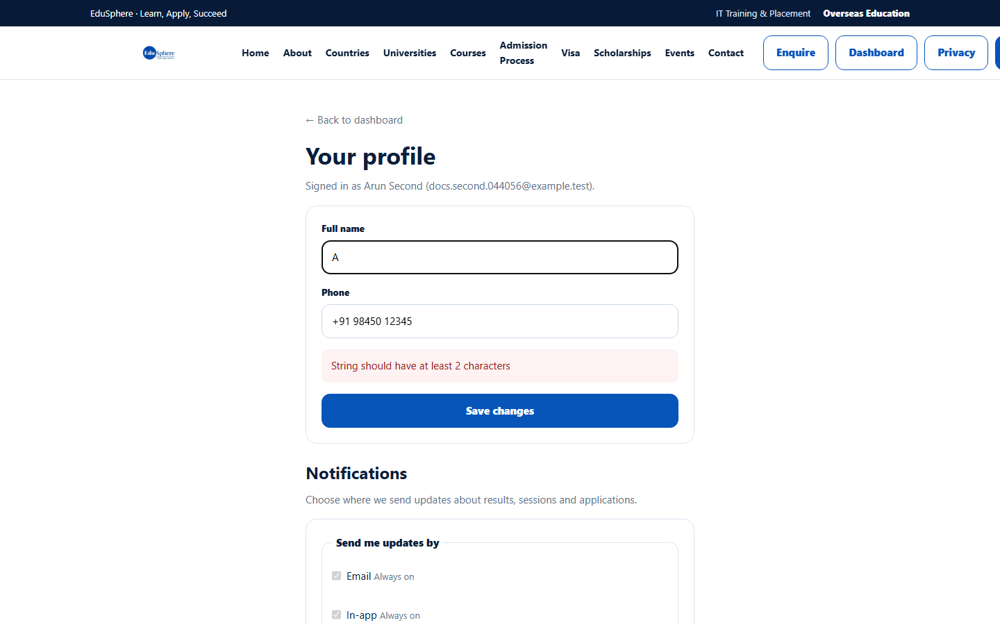

# My profile

> Doc ID: DOC-AUTH-006 · Partly verified 2026-10-05 against `main` @ `6a9be770` (docs branch) · Roles: Agency Master, Agency Staff

## Purpose
Update your name and phone number, and choose which channels EduSphere uses to send you updates.

## Who Can Use This Feature
Any signed-in Agency Master or Agency Staff member.

## Prerequisites
Signed in.

## How to Access
Sidebar (bottom) > **My profile**. The page opens in the EduSphere website layout; use **← Back to dashboard** to
return to the portal.

## Steps

### Step 1 — Open My profile
Click **My profile** at the bottom of the sidebar. The page **Your profile** shows "Signed in as {name} ({email})",
your details, and a **Notifications** section.

### Step 2 — Update your details
1. Change **Full name** (2–160 characters) and/or **Phone** (up to 40 characters).
2. Click **Save changes**.

Expected message: "Your profile was updated." — VERIFICATION REQUIRED (the success message comes from the
application code; it was not captured in testing).

### Step 3 — Choose notification channels
Under **Notifications > Send me updates by**:
- **Email** and **In-app** are **Always on**.
- Tick **WhatsApp** and/or **SMS** to receive updates there too. These need a mobile number in your profile; without
  one, the page says "Add a mobile number in your profile above to turn on WhatsApp or SMS."

Click **Save notification settings**. Expected message: "Notification settings saved." — VERIFICATION REQUIRED.
Whether WhatsApp/SMS messages are actually delivered for agency users is VERIFICATION REQUIRED.

## Fields
| Field | Description | Required | Example |
|---|---|---|---|
| Full name | Your name as shown to your team. 2–160 characters. | Yes | Arun Second |
| Phone | Your mobile number. Needed for WhatsApp/SMS updates. | No | +91 98450 12345 |
| WhatsApp | Also send updates by WhatsApp. | No | ticked |
| SMS | Also send updates by text message. | No | not ticked |

Your email address cannot be changed on this page.

## Expected Result
Your new name appears in the portal (sidebar and top bar).

## Validation Messages
| Message | When |
|---|---|
| String should have at least 2 characters | Full name is shorter than 2 characters. |
| Unable to update your profile. Try again in a moment. | The save failed on the server. |
| Network error. Try again. | Your connection dropped while saving. |
| We couldn't load your notification settings right now. | The Notifications section could not load; click **Try again**. |

## Common Errors
**Problem:** "String should have at least 2 characters" under the form.
**Cause:** Full name is empty or one character.
**Resolution:** Enter your full name and save again.

## Tips
- Keep your phone number up to date if you turn on WhatsApp or SMS.

## Related Features
- [Change your password](auth-005-change-password.md)
