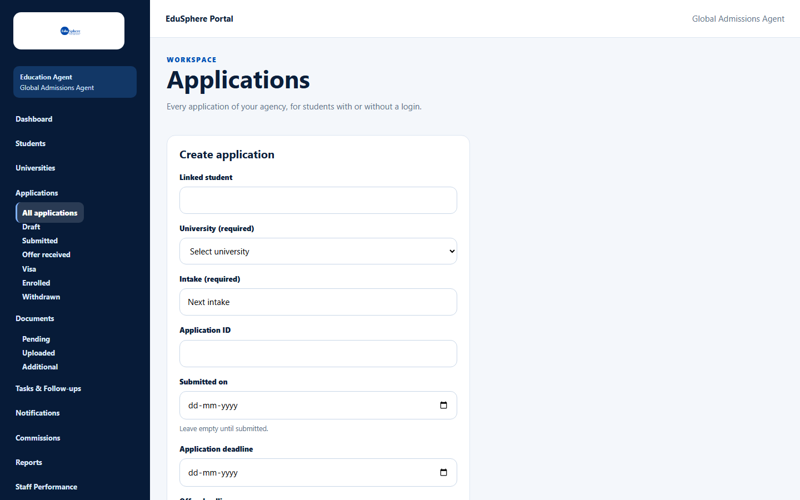
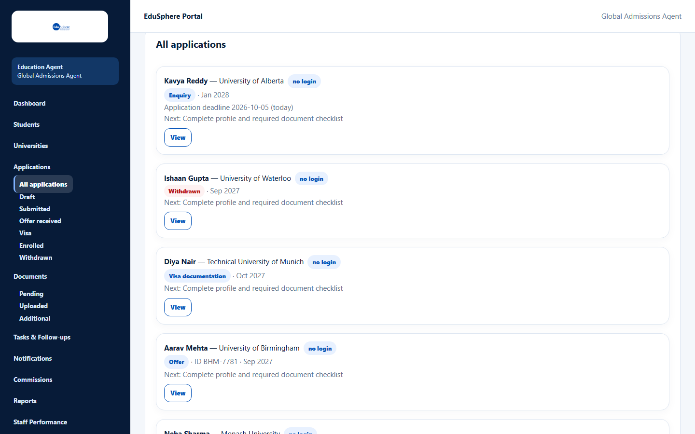
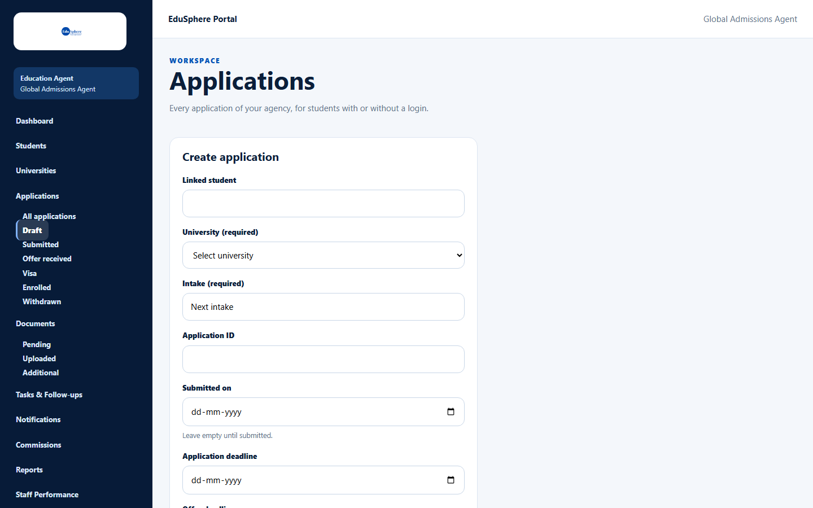
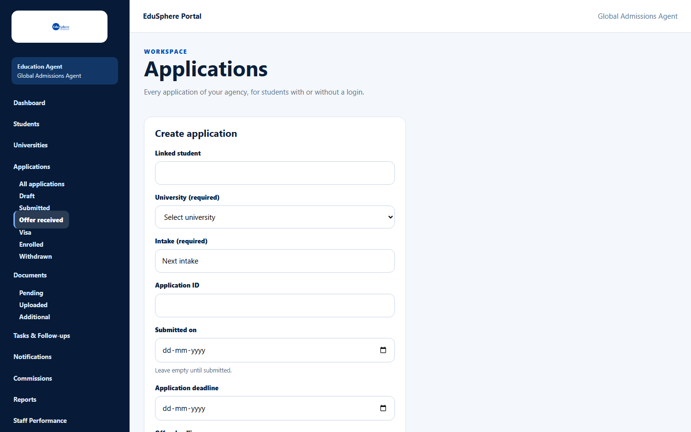
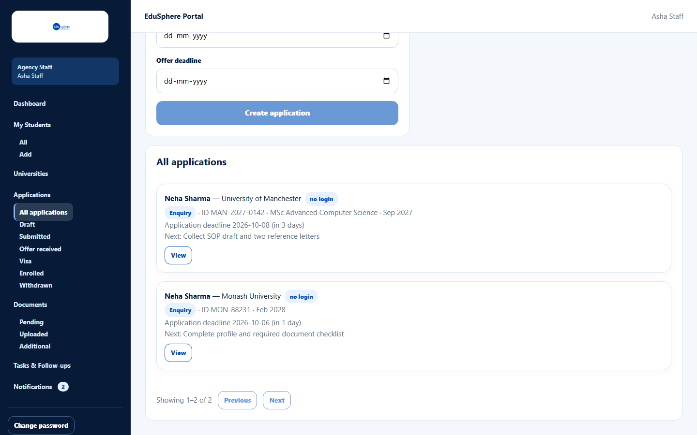

# View and filter applications

> Doc ID: DOC-APP-001 · Verified 2026-10-05 against docs commit `717d6aa8` (`main` @ `6a9be770`) · Roles: Agency Master, Agency Staff

## Purpose
See every university application your agency is handling and find the ones that need attention.

## Who Can Use This Feature
- **Agency Master:** every application of the agency.
- **Agency Staff:** applications of students assigned to them.

## Prerequisites
Your agency is approved.

## How to Access
Sidebar > **Applications** > choose a view: **All applications**, **Draft**, **Submitted**, **Offer received**,
**Visa**, **Enrolled** or **Withdrawn**.

## Steps

### Step 1 — Open Applications
The page shows the **Create application** form at the top and the list of applications below it.

### Step 2 — Read the list
Each card shows the student and university, a **no login** badge for students without an EduSphere login, the
**stage** badge, the application ID, course and intake, the nearest deadline and the **Next** action. Deadlines show
"(today)", "(in N days)" (within a week) or "(past)".

### Step 3 — Use the views in the sidebar
| View | Shows |
|---|---|
| All applications | Every application **except withdrawn ones** |
| Draft | Early stages (Enquiry, Eligibility evaluation, University selection) with no "Submitted on" date |
| Submitted | The same early stages, with a "Submitted on" date |
| Offer received | Stage **Offer** |
| Visa | Stages **Visa documentation** and **Status tracking** |
| Enrolled | Stage **Enrolled** |
| Withdrawn | Withdrawn applications only |

An empty view says "No applications match this filter." with a **Show all applications** link.

### Step 4 — Open an application
Click **View** on a card to open its details (the button changes to **Hide**). See
[Application detail page](app-004-application-detail.md).

## Fields
None.

## Expected Result
The list is sorted by most recently updated, 20 per page, with **Previous** / **Next** below it.

## Validation Messages
| Message | When |
|---|---|
| No applications yet. Use Create application to add the first one. | The agency has no applications. |
| The applications could not be loaded. | Click **Retry**. |

## Common Errors
**Problem:** A withdrawn application is missing from **All applications**.
**Cause:** Withdrawn applications are only listed under **Withdrawn**.
**Resolution:** Open **Applications > Withdrawn**.

## Tips
- Staff only see applications of their assigned students:

## Related Features
- [Create an application](app-002-create-an-application.md)
- [Change status or withdraw](app-005-change-status-or-withdraw.md)
