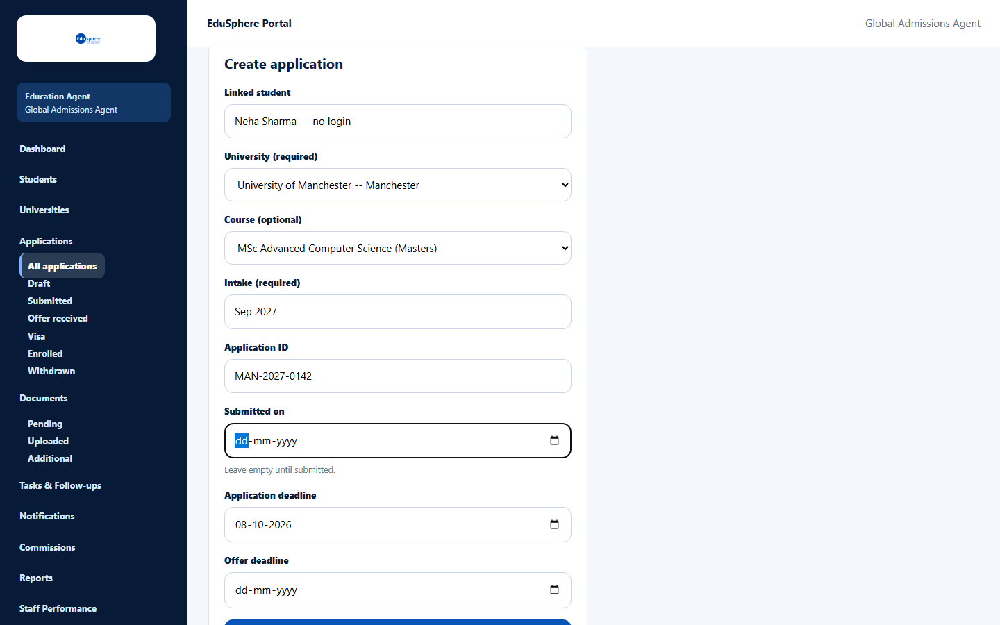
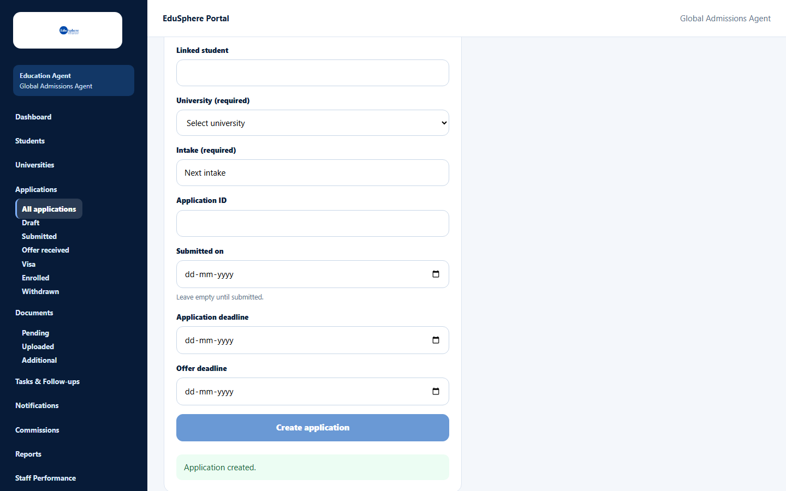
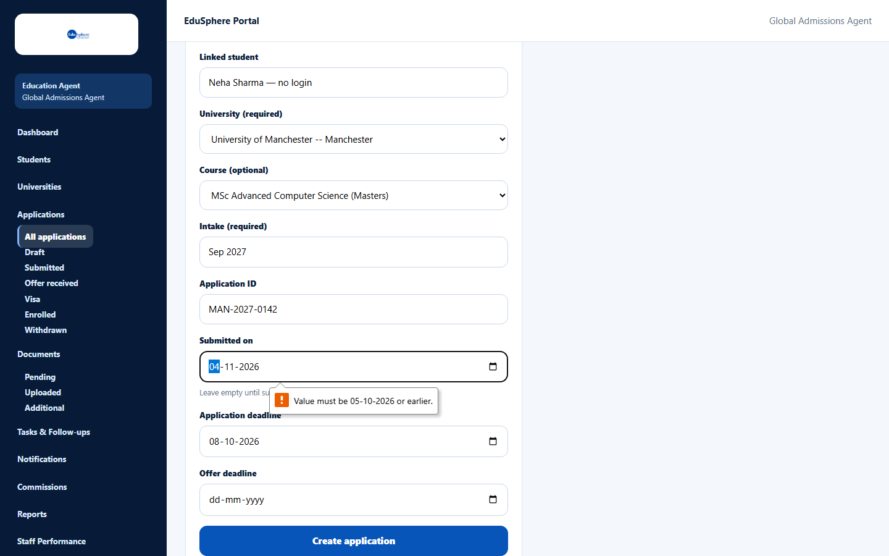
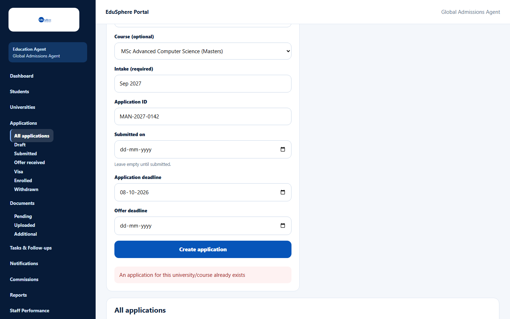

# Create an application

> Doc ID: DOC-APP-002 · Verified 2026-10-05 against docs commit `717d6aa8` (`main` @ `6a9be770`) · Roles: Agency Master, Agency Staff

## Purpose
Record a student's application to a university. Every new application starts at the stage **Enquiry**.

## Who Can Use This Feature
Agency Masters and Agency Staff (staff can only choose their assigned students).

## Prerequisites
- The student exists in your agency and is not archived (see [Add a student](../students/stu-002-add-a-student.md)).

## How to Access
Sidebar > **Applications** > **Create application** (form at the top of the page).

## Steps

### Step 1 — Choose the student and university
1. In **Linked student**, type the student's name and choose them from the list (shown as "{name} — no login" or with
   their email).
2. Choose the **University (required)**.
3. Optional: choose a **Course** ("Undecided / any course" if not decided yet). The course list appears after you
   choose the university.

### Step 2 — Add intake, ID and dates
1. **Intake (required)** starts as "Next intake"; replace it with the real intake (for example "Sep 2027").
2. Optional: **Application ID** (the university's reference), **Submitted on** ("Leave empty until submitted."),
   **Application deadline** and **Offer deadline**.

### Step 3 — Create
Click **Create application**. The message **Application created.** appears and the application is listed at stage
**Enquiry**, with the next action "Complete profile and required document checklist".

## Fields
| Field | Description | Required | Example |
|---|---|---|---|
| Linked student | A student of your agency (staff: assigned students only). | Yes | Neha Sharma — no login |
| University (required) | Catalogue university. Cannot be changed later. | Yes | University of Manchester -- Manchester |
| Course (optional) | A course of that university, or "Undecided / any course". | No | MSc Advanced Computer Science (Masters) |
| Intake (required) | Free text, 1–80 characters. | Yes | Sep 2027 |
| Application ID | The university's application reference, up to 140 characters. | No | MAN-2027-0142 |
| Submitted on | Date the application was submitted. Not in the future. Decides **Draft** vs **Submitted**. | No | 03-10-2026 |
| Application deadline | Between 2000 and 2100. | No | 08-10-2026 |
| Offer deadline | Between 2000 and 2100. Becomes the offer's deadline. | No | 19-11-2026 |

## Expected Result
The application appears in **All applications** and **Draft** (or **Submitted** if you entered a submitted date).

## Validation Messages
| Message | When |
|---|---|
| Value must be {today} or earlier. (browser message) | **Submitted on** is in the future. |
| Intake is required | Intake is empty. |
| An application for this university/course already exists | The student already has an open application for the same university and course. |
| Too many applications created today -- try again later | Your agency created 200 applications in 24 hours. |
| Unarchive this student first | The student is archived. |

## Common Errors
**Problem:** "An application for this university/course already exists".
**Cause:** The student already has an application for that university and course (withdrawn ones don't count).
**Resolution:** Open the existing application, or choose a different course.

## Tips
- To change the university later, withdraw the application and create a new one.

## Related Features
- [View and filter applications](app-001-view-applications.md)
- [Edit an application](app-003-edit-an-application.md)
