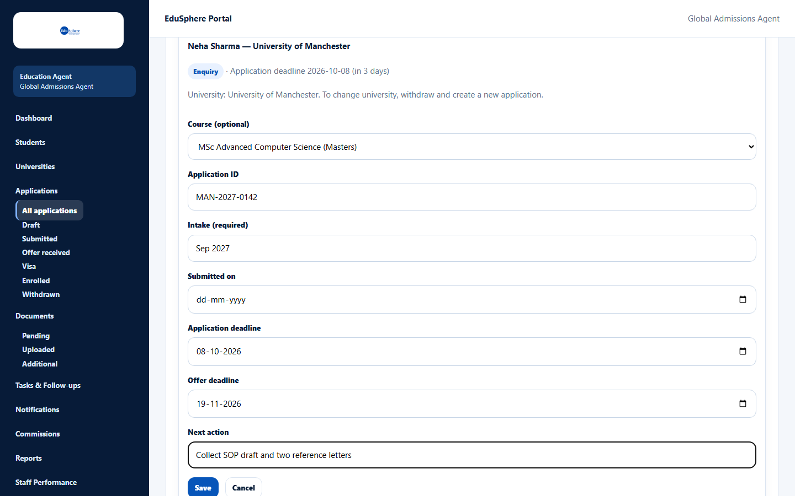

# Edit an application

> Doc ID: DOC-APP-003 · Verified 2026-10-05 against docs commit `717d6aa8` (`main` @ `6a9be770`) · Roles: Agency Master, Agency Staff

## Purpose
Update an application's course, ID, intake, dates or next action as things change.

## Who Can Use This Feature
Agency Masters and Agency Staff (for their assigned students).

## Prerequisites
The application is not withdrawn and the student is not archived.

## How to Access
Applications > card > **View** > **Edit** (under the details).

## Steps

### Step 1 — Open the edit form
Click **Edit**. The form notes "University: {name}. To change university, withdraw and create a new application."

### Step 2 — Change the fields and save
Change any of **Course (optional)**, **Application ID**, **Intake (required)**, **Submitted on**,
**Application deadline**, **Offer deadline** and **Next action**, then click **Save** (or **Cancel**).
The message **Saved.** appears.

## Fields
| Field | Description | Required | Example |
|---|---|---|---|
| Course (optional) | Course at the same university. | No | MSc Advanced Computer Science (Masters) |
| Application ID | Up to 140 characters. | No | MAN-2027-0142 |
| Intake (required) | 1–80 characters; cannot be cleared. | Yes | Sep 2027 |
| Submitted on | Not in the future. | No | 03-10-2026 |
| Application deadline / Offer deadline | Between 2000 and 2100. | No | 19-11-2026 |
| Next action | What happens next, up to 500 characters; shown on the card. | No | Collect SOP draft and two reference letters |

## Expected Result
The detail page shows the new values; a changed **Next action** is also added to the status history.

## Validation Messages
| Message | When |
|---|---|
| Offer deadline cannot be before the offer date | An offer is recorded and the deadline is earlier than the offer date. |
| An application for this university/course already exists | The new course duplicates another application. |
| This application is withdrawn | The application was withdrawn meanwhile. |
| The change could not be confirmed. Reload to see the application. | The save result is unknown; reload the page. |

## Common Errors
**Problem:** No **Edit** button.
**Cause:** The application is withdrawn or the student is archived.
**Resolution:** Withdrawn applications cannot be changed; unarchive archived students first.

## Tips
- Saving without changing anything simply closes the form.

## Related Features
- [Application detail page](app-004-application-detail.md)
