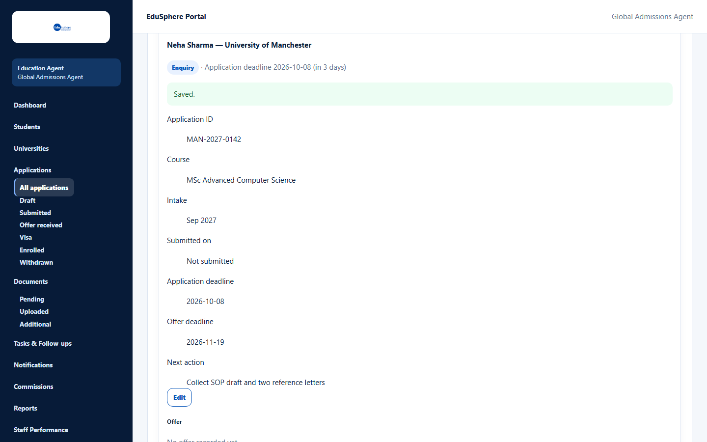
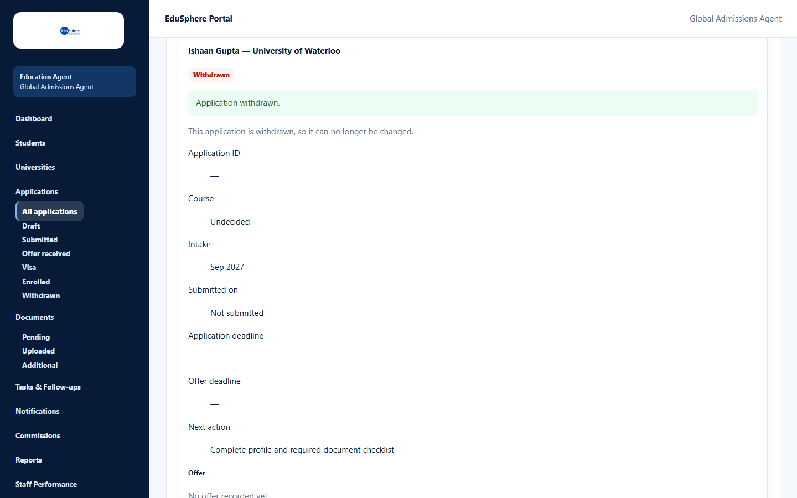

# Application detail page

> Doc ID: DOC-APP-004 · Partly verified 2026-10-05 against docs commit `717d6aa8` (`main` @ `6a9be770`) · Roles: Agency Master, Agency Staff

## Purpose
One place for everything about an application: its details, offer, deposit, visa, enrollment, stage changes and
history.

## Who Can Use This Feature
Agency Masters and Agency Staff (for their assigned students).

## Prerequisites
The application exists and is in your scope.

## How to Access
Applications > card > **View**. The details open inside the card; **Hide** or **Close** closes them.

## Steps

### Step 1 — Read the header and details
The header shows "{student} — {university}", the stage badge and the nearest deadline. Below are **Application ID**,
**Course** ("Undecided"), **Intake**, **Submitted on** ("Not submitted"), **Application deadline**,
**Offer deadline** and **Next action**, with an **Edit** button.

### Step 2 — Use the sections
| Section | What you can do | Guide |
|---|---|---|
| Offer | Record or edit the university's offer | DOC-APP-006 (later session) |
| Deposit | Record deposit terms and pay the deposit | DOC-APP-007 (later session) |
| Visa | Run the visa case (from the Offer stage) | DOC-APP-008 (later session) |
| Enrollment | Confirm enrollment (Masters) | DOC-APP-009 (later session) |
| Change status | Move the application forward or withdraw it | [Change status or withdraw](app-005-change-status-or-withdraw.md) |
| Status history | Every stage change: "{stage} · {who} · {date, time}" and notes | — |

Only one form is open at a time.

## Fields
None on this page (see the section guides).

## Expected Result
You see the application's full state.

## Validation Messages
| Message | When |
|---|---|
| This application is withdrawn, so it can no longer be changed. | The application is withdrawn (read-only). |
| This student is archived. Unarchive them on the Students page to change this application. | The student is archived. |
| This application is no longer available. | It was removed from your scope. |

## Common Errors
**Problem:** Buttons are missing on the detail page.
**Cause:** The application is withdrawn, or the student is archived.
**Resolution:** See the read-only note at the top of the details.

## Tips
- Visa and Enrollment sections appear once the application reaches the stages that allow them (VERIFICATION
  REQUIRED — covered in the offer/deposit/visa/enrollment session).

## Related Features
- [Edit an application](app-003-edit-an-application.md)
- [Change status or withdraw](app-005-change-status-or-withdraw.md)
