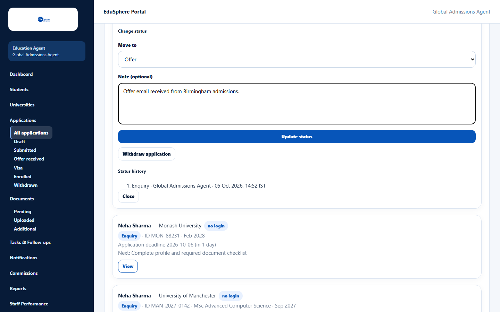
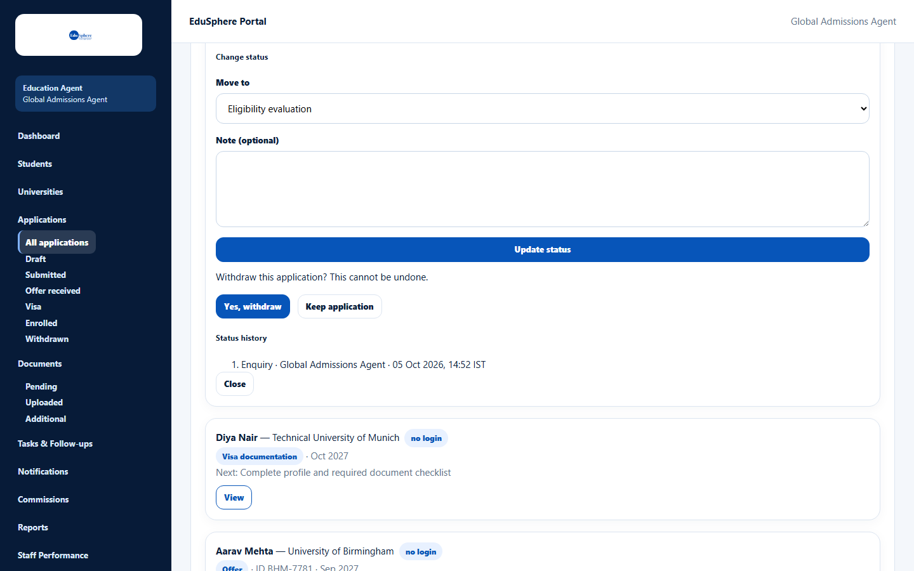

# Change status or withdraw

> Doc ID: DOC-APP-005 · Verified 2026-10-05 against docs commit `717d6aa8` (`main` @ `6a9be770`) · Roles: Agency Master, Agency Staff

## Purpose
Move an application forward through its stages as it progresses, or withdraw it when the student stops.

## Who Can Use This Feature
Agency Masters and Agency Staff (for their assigned students).

## Prerequisites
The application is not withdrawn or enrolled, and the student is not archived.

## How to Access
Applications > card > **View** > **Change status**.

## Steps

### Move the application forward
1. In **Move to**, choose a later stage. Only later stages are offered, up to **Status tracking**; you can skip stages.
2. Optional: add a **Note (optional)** (up to 2000 characters).
3. Click **Update status**. The message "Status updated to {stage}." appears and the change is added to the
   status history.

| Stage | Meaning |
|---|---|
| Enquiry | Starting stage of every new application |
| Eligibility evaluation | Checking the student's eligibility |
| University selection | Choosing the university and course |
| Offer | The university has made an offer (also set automatically when you record an offer) |
| Visa documentation | Preparing the visa |
| Status tracking | Following up until enrollment — the furthest stage you can set here |
| Enrolled | Set only by **Enroll student** (Masters), not here |
| Withdrawn | Set by **Withdraw application**; final |

### Withdraw the application
1. Click **Withdraw application**.
2. Read "Withdraw this application? This cannot be undone." and click **Yes, withdraw** (or **Keep application**).

The message **Application withdrawn.** appears. The application becomes read-only and moves to the **Withdrawn** view.

## Fields
| Field | Description | Required | Example |
|---|---|---|---|
| Move to | A later stage. | Yes | Offer |
| Note (optional) | Why the stage changed. | No | Offer email received from Birmingham admissions. |

## Expected Result
The stage badge changes, the application moves to the matching view, and the student's assignee (or the Masters,
if the student is unassigned) is notified "Application status changed".

## Validation Messages
| Message | When |
|---|---|
| This application changed since you opened it -- reload to see its current status | Someone else changed it; reload. |
| Cannot move from '{stage}' to '{stage}' -- an agent can only move an application forward | You tried to move backwards. |
| An enrolled application cannot be withdrawn | The application is already enrolled. |

## Common Errors
**Problem:** **Enrolled** is not in the **Move to** list.
**Cause:** Enrollment is confirmed separately by an agency Master.
**Resolution:** Use **Enroll student** in the Enrollment section (Masters).

## Tips
- Withdrawing cannot be undone — to restart, create a new application.

## Related Features
- [View and filter applications](app-001-view-applications.md)
- [Application detail page](app-004-application-detail.md)
