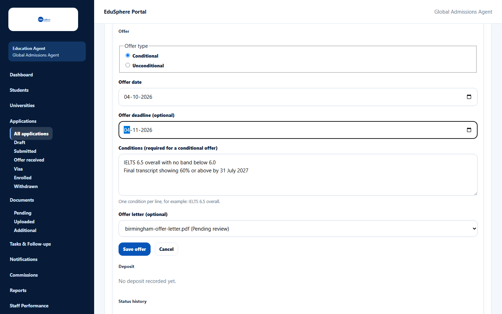
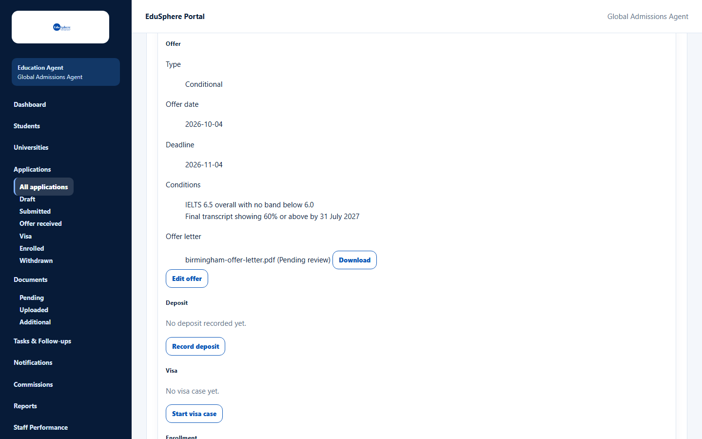
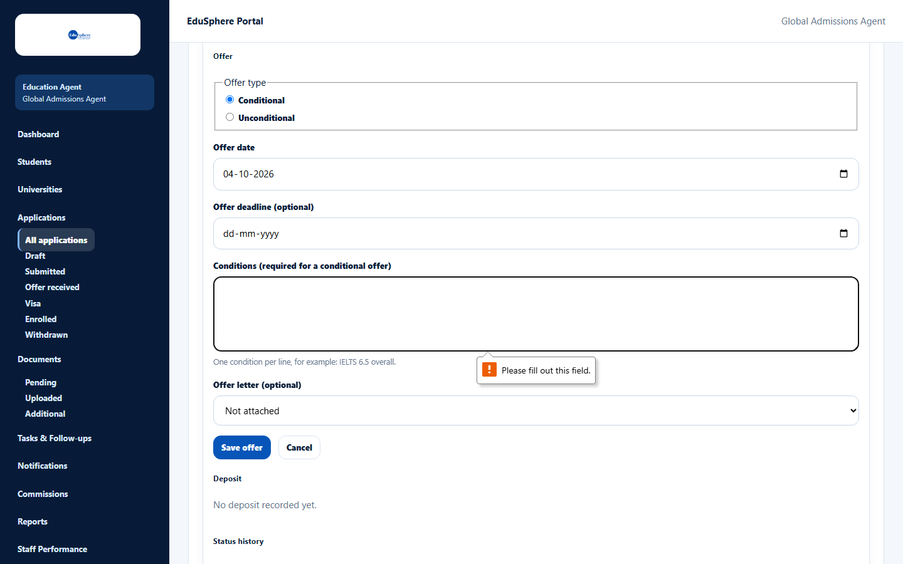

# Record an offer

> Doc ID: DOC-APP-006 · Verified 2026-10-05 against docs commit `717d6aa8` (`main` @ `6a9be770`) · Roles: Agency Master, Agency Staff

## Purpose
Record the university's offer — conditional or unconditional — with its dates, conditions and offer letter.

## Who Can Use This Feature
Agency Masters and Agency Staff (for their assigned students).

## Prerequisites
- The application is not withdrawn and the student is not archived.
- To attach the offer letter: upload it first under **Documents** with Document type **Offer letter** and this
  application selected (see Documents guide, DOC-DOC-002).

## How to Access
Applications > card > **View** > **Offer** > **Record offer** (or **Edit offer**).

## Steps

### Step 1 — Open the offer form
Click **Record offer**. If no offer letter is uploaded yet, the form says "No offer letter is uploaded for this
application yet. Upload it in Documents with the type “Offer letter” and this application selected, then attach it
here."

### Step 2 — Fill in the offer
1. Choose the **Offer type**: **Conditional** or **Unconditional**.
2. Enter the **Offer date** and, optionally, the **Offer deadline (optional)**.
3. For a conditional offer, enter the **Conditions** — one per line (for example "IELTS 6.5 overall.").
4. Optional: choose the **Offer letter**. Uploaded letters are listed as "{file name} ({status})".

### Step 3 — Save
Click **Save offer**. The message **Offer saved.** appears. The offer shows its type, dates, conditions and the offer
letter with a **Download** button.

If the application was at an earlier stage, it moves to **Offer** automatically. The status history records
"Offer recorded: …" with the details.

## Fields
| Field | Description | Required | Example |
|---|---|---|---|
| Offer type | Conditional or Unconditional. | Yes | Conditional |
| Offer date | Date of the offer; not in the future. | Yes | 04-10-2026 |
| Offer deadline (optional) | Date by which the student must accept; not before the offer date. Same value as the application's Offer deadline. | No | 04-11-2026 |
| Conditions (required for a conditional offer) | One condition per line, up to 2000 characters. Leave empty for an unconditional offer. | Conditional only | IELTS 6.5 overall with no band below 6.0 |
| Offer letter (optional) | An "Offer letter" document uploaded for this application. | No | birmingham-offer-letter.pdf (Pending review) |

## Expected Result
The offer is recorded, the application is at stage **Offer** (or later), and the dashboard's **Offers** count
includes it.

## Validation Messages
| Message | When |
|---|---|
| Please fill out this field. (browser message) | A conditional offer has no conditions. |
| A conditional offer needs its conditions | Same check on the server. |
| An unconditional offer has no conditions | Conditions were entered for an unconditional offer. |
| Offer date cannot be in the future | The offer date is after today. |
| Offer deadline cannot be before the offer date | The deadline is earlier than the offer date. |
| Choose an offer letter uploaded for this application | The chosen letter belongs to another application. |

## Common Errors
**Problem:** The offer letter is not in the list.
**Cause:** It was uploaded with another document type, or without selecting this application.
**Resolution:** Upload it again under Documents with type **Offer letter** and this application selected.

## Tips
- You can record the offer before or after moving the stage — recording it moves the stage to Offer for you.

## Related Features
- [Deposit and payment](app-007-deposit-and-payment.md)
- [Application detail page](app-004-application-detail.md)
