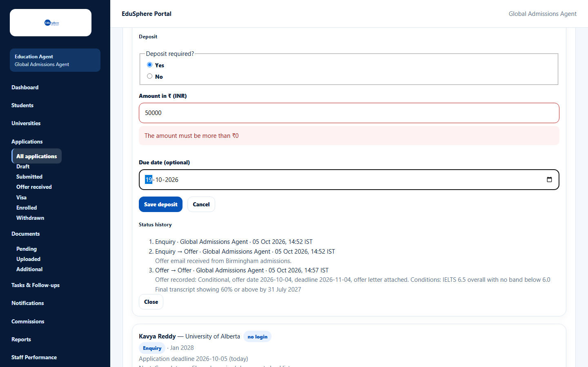
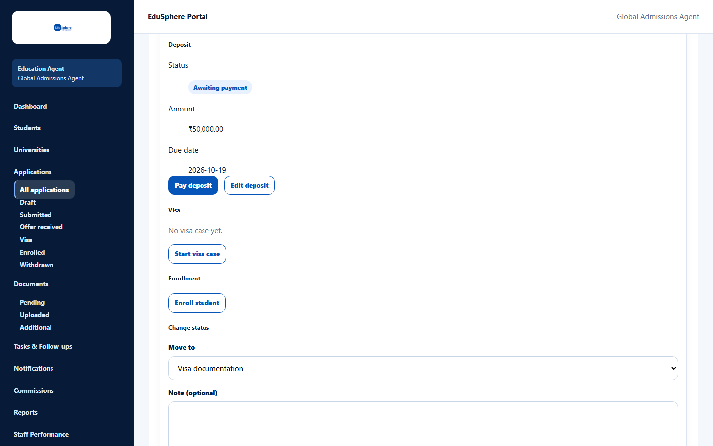
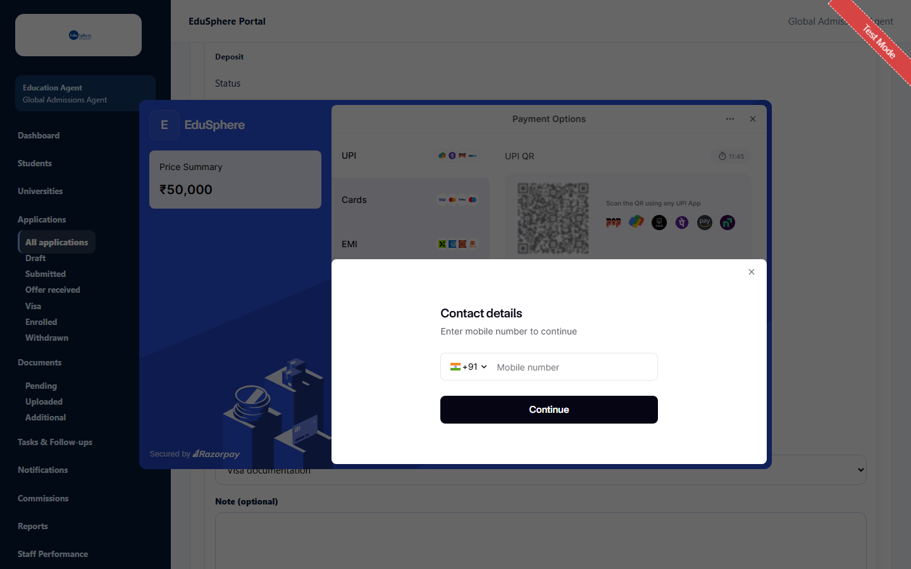
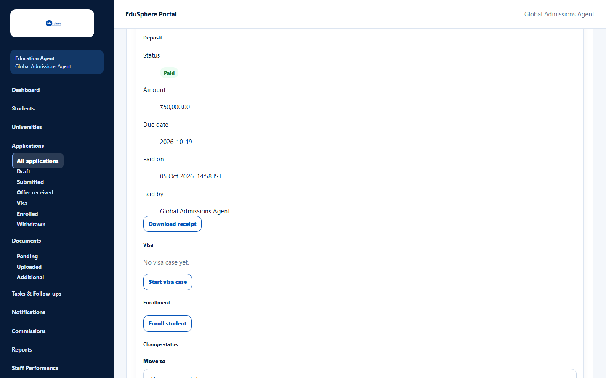
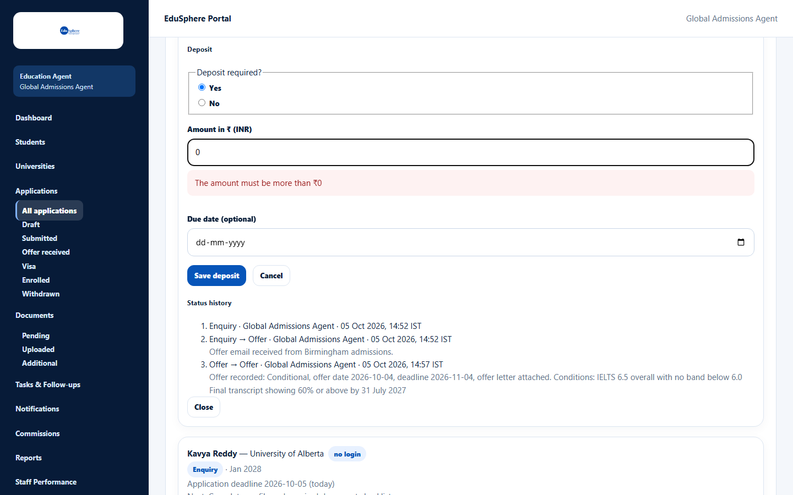

# Deposit and payment

> Doc ID: DOC-APP-007 · Partly verified 2026-10-05 against docs commit `717d6aa8` (`main` @ `6a9be770`) · Roles: Agency Master, Agency Staff

## Purpose
Record whether the university needs a deposit, and pay it online through EduSphere (Razorpay). EduSphere's Overseas
team then sends the money on to the university.

## Who Can Use This Feature
Agency Masters and Agency Staff (for their assigned students).

## Prerequisites
- The application is not withdrawn and the student is not archived.
- Online payment must be set up by EduSphere; otherwise the page says "Online payment is unavailable right now.
  Nothing has been charged."

## How to Access
Applications > card > **View** > **Deposit** > **Record deposit** (or **Edit deposit**).

## Steps

### Step 1 — Record the deposit terms
1. Click **Record deposit**.
2. **Deposit required?** — choose **Yes** (or **No** if the university needs no deposit).
3. For **Yes**: enter the **Amount in ₹ (INR)** and optionally a **Due date (optional)**.
4. Click **Save deposit**. The message **Deposit saved.** appears.

The deposit shows the status **Awaiting payment** and a **Pay deposit** button. ("No" shows **Not required**.)

### Step 2 — Pay the deposit
1. Click **Pay deposit** ("Opening checkout…").
2. The Razorpay payment window opens, showing **EduSphere** and the amount. Choose a payment method (UPI, Cards, EMI,
   Netbanking, Wallet, Pay Later) and follow Razorpay's steps.

3. After paying, EduSphere shows "Payment received. Confirming…" and then "If you were charged, the payment will
   appear here shortly." with a **Refresh** button.

The steps inside the Razorpay window belong to Razorpay and were not exercised in testing (VERIFICATION REQUIRED).
In testing the payment was confirmed the way Razorpay confirms a real payment (a signed payment notification to
EduSphere).

### Step 3 — Check the paid deposit
When the payment is confirmed, the deposit shows **Paid**, **Paid on**, **Paid by** and **Download receipt**.

Later, when EduSphere's Overseas Admin forwards the money or records a refund, the deposit shows
"Remitted on {date} · Ref. {reference}" or "Refunded ₹{amount} on {date}" (see the admin guide, DOC-ADM-005).

## Fields
| Field | Description | Required | Example |
|---|---|---|---|
| Deposit required? | Yes / No. | Yes | Yes |
| Amount in ₹ (INR) | More than ₹0, at most ₹99,999,999.99, up to 2 decimals. Rupees only. | When Yes | 50000 |
| Due date (optional) | When the deposit must be paid. | No | 19-10-2026 |

## Expected Result
| Status | Meaning |
|---|---|
| Not required | No deposit for this application |
| Awaiting payment | Deposit recorded; not paid yet |
| Paid | Paid through EduSphere; read-only |
| Remitted to the university | EduSphere has forwarded the money |
| Refunded | EduSphere has refunded the deposit |

## Validation Messages
| Message | When |
|---|---|
| The amount must be more than ₹0 | Amount is 0. |
| Enter the deposit amount | Yes chosen without an amount. |
| Enter an amount in rupees with up to 2 decimals, for example 50000.50 | Wrong number format. |
| The amount can be at most ₹99,999,999.99 | Amount too large. |
| A deposit that is not required has no amount or due date | No chosen with an amount or date. |

## Common Errors
**Problem:** "Payment not completed. You can try again."
**Cause:** The Razorpay window was closed before paying (message from the application code — VERIFICATION REQUIRED).
**Resolution:** Click **Pay deposit** again.

**Problem:** "Online payment is unavailable right now. Nothing has been charged."
**Cause:** Online payment is not set up on this EduSphere installation.
**Resolution:** Contact EduSphere Overseas Admin.

**Problem:** "Another team member is paying this deposit -- try again in a few minutes".
**Cause:** Someone else in your agency opened the payment window for the same deposit.
**Resolution:** Wait 15 minutes or check with your team.

**Problem:** "Too many payment attempts for this deposit -- try again later".
**Cause:** More than 10 payment attempts in an hour.
**Resolution:** Wait and try again later.

## Tips
- Once paid, the deposit can no longer be edited. Changing the amount before paying cancels any open payment window.

## Related Features
- [Record an offer](app-006-record-an-offer.md)
- Admin: Agent deposits — remittance and refund (DOC-ADM-005, written in a later session)
