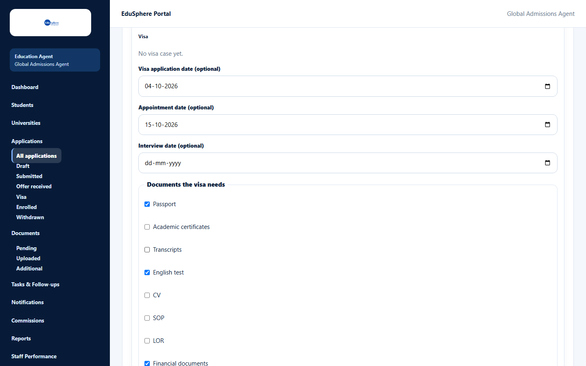
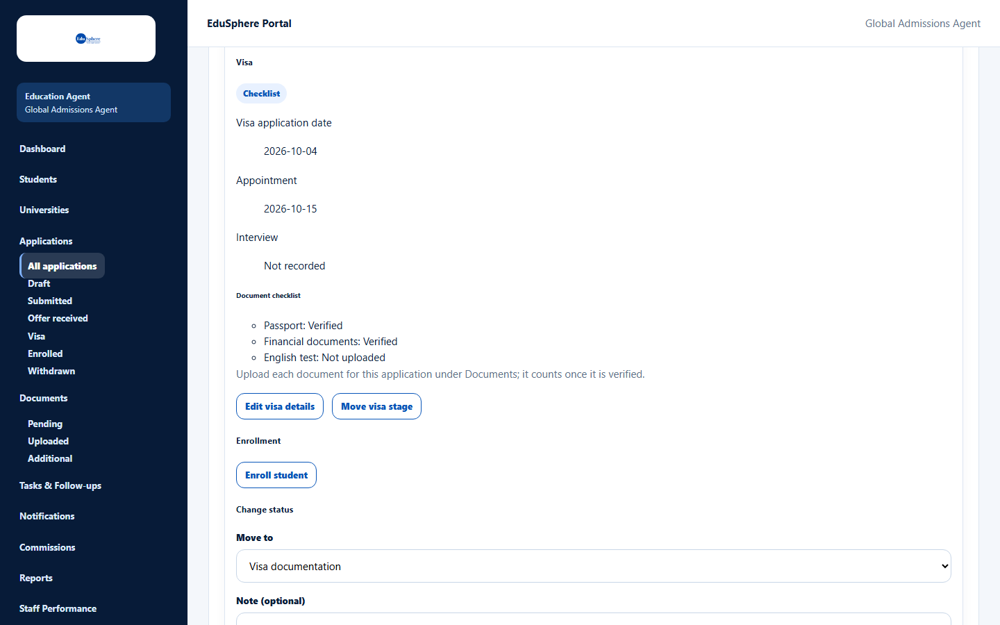
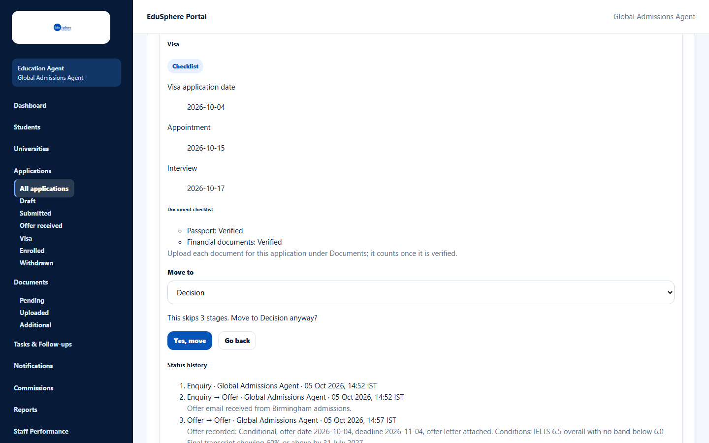
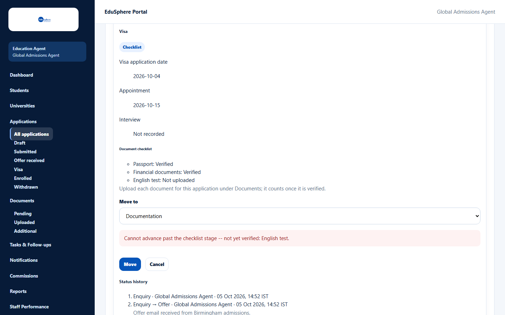
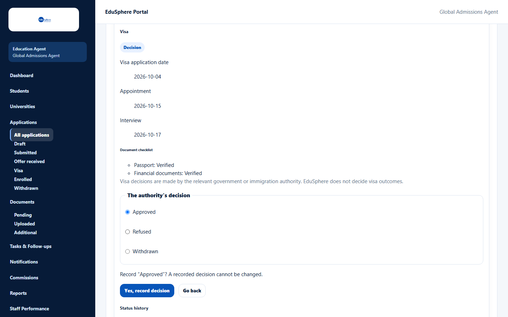
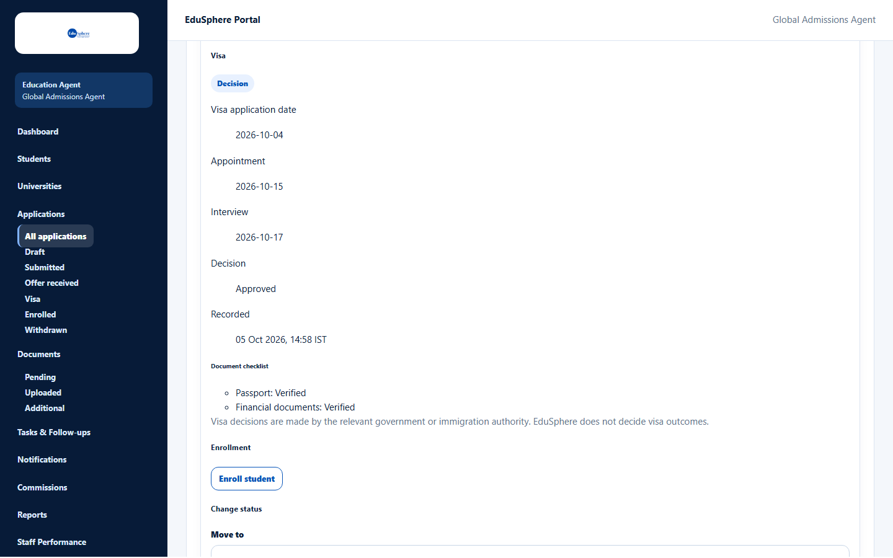

# Run the visa case

> Doc ID: DOC-APP-008 · Verified 2026-10-05 against docs commit `717d6aa8` (`main` @ `6a9be770`) · Roles: Agency Master, Agency Staff

## Purpose
Track the student's visa: the documents it needs, the key dates, its progress through the visa stages, and the final
decision.

## Who Can Use This Feature
Agency Masters and Agency Staff (for their assigned students).

## Prerequisites
- The application has an offer (stage **Offer**, **Visa documentation** or **Status tracking**), is not withdrawn or
  enrolled, and the student is not archived.
- One visa case per application.

## How to Access
Applications > card > **View** > **Visa** > **Start visa case**.

## Steps

### Step 1 — Start the visa case
1. Click **Start visa case**.
2. Optional: enter the **Visa application date**, **Appointment date** and **Interview date**.
3. Under **Documents the visa needs**, tick each document type the visa requires.
4. Click **Start visa case**. The message **Visa case started.** appears.

### Step 2 — Get the checklist verified
The **Document checklist** shows each required document and its status ("Not uploaded", "Pending review",
"Verified"…). A document counts only when it is uploaded **for this application** under Documents and **verified**.

### Step 3 — Move the visa stage
1. Click **Move visa stage**, choose a later stage in **Move to** and click **Move**.
2. If you skip stages, confirm "This skips N stage(s). Move to {stage} anyway?" with **Yes, move**.

You cannot leave **Checklist** until every checklist item is verified:

| Stage | Meaning |
|---|---|
| Checklist | Collecting the documents (checklist can only be changed here) |
| Documentation | Preparing the visa application |
| Interview prep | Preparing for the interview |
| Tracking | Waiting for the outcome |
| Decision | Ready to record the authority's decision |

### Step 4 — Edit visa details
**Edit visa details** changes the dates (and the checklist, while at Checklist). Click **Save visa details**;
the message "Visa details saved." appears.

### Step 5 — Record the decision
At stage **Decision**:
1. Click **Record decision** and choose **The authority's decision**: **Approved**, **Refused** or **Withdrawn**.
2. Click **Record decision**, then confirm "Record “{decision}”? A recorded decision cannot be changed." with
   **Yes, record decision**.

The message **Visa decision recorded.** appears. The case shows the decision and when it was recorded, with the note
"Visa decisions are made by the relevant government or immigration authority. EduSphere does not decide visa
outcomes."

## Fields
| Field | Description | Required | Example |
|---|---|---|---|
| Visa application date (optional) | Between 2000 and 2100. | No | 04-10-2026 |
| Appointment date (optional) | Visa appointment. | No | 15-10-2026 |
| Interview date (optional) | Not before the visa application date. | No | 17-10-2026 |
| Documents the visa needs | Up to 8 named document types (Passport, Academic certificates, Transcripts, English test, CV, SOP, LOR, Financial documents). | No | Passport, Financial documents |
| Move to | A later visa stage. | For a move | Documentation |
| The authority's decision | Approved, Refused or Withdrawn. Final. | For a decision | Approved |

## Expected Result
The visa case moves forward to a final decision. The visa case does **not** change the application's own stage.

## Validation Messages
| Message | When |
|---|---|
| Cannot advance past the checklist stage -- not yet verified: {items}. | Checklist items are missing or not verified. |
| An offer is needed before a visa case | The application has no offer yet. |
| The interview date cannot be before the visa application date | Dates in the wrong order. |
| A visa case can only move forward | You chose an earlier stage. |
| The visa decision is recorded, so this case can no longer be changed | The decision is already recorded. |
| The checklist can only be changed at the checklist stage | You tried to change the checklist later. |

## Common Errors
**Problem:** The checklist says "Not uploaded" although the document exists.
**Cause:** The document was uploaded without selecting this application, or under another type.
**Resolution:** Upload it under Documents with this application selected, then verify it.

## Tips
- Upload and verify the checklist documents before trying to leave the Checklist stage.

## Related Features
- [Record an offer](app-006-record-an-offer.md)
- [Confirm enrollment](app-009-confirm-enrollment.md)
