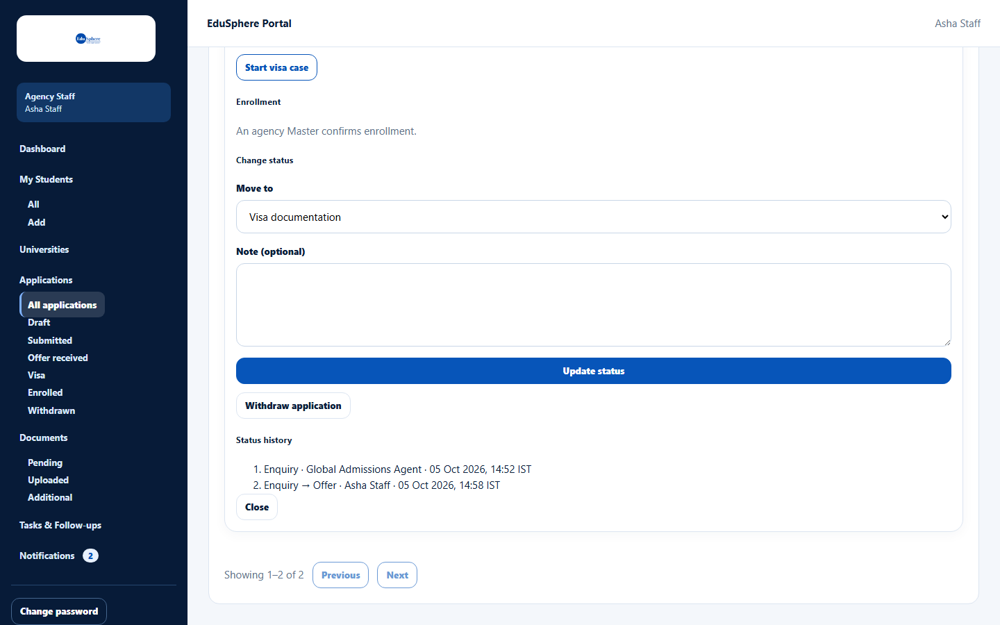
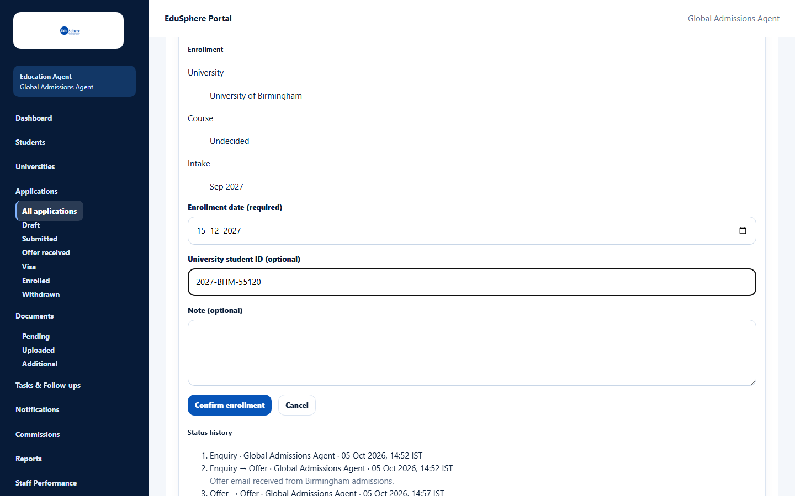
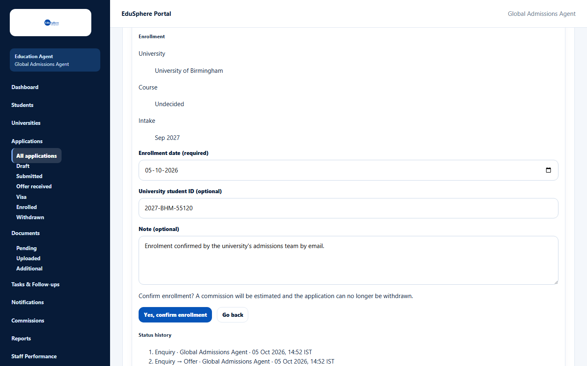
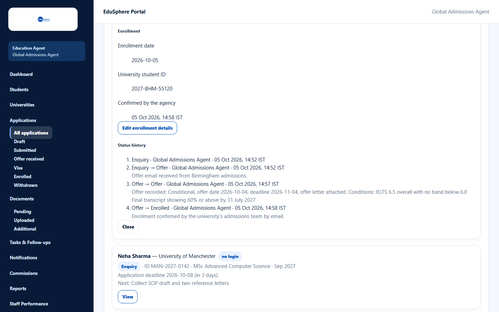
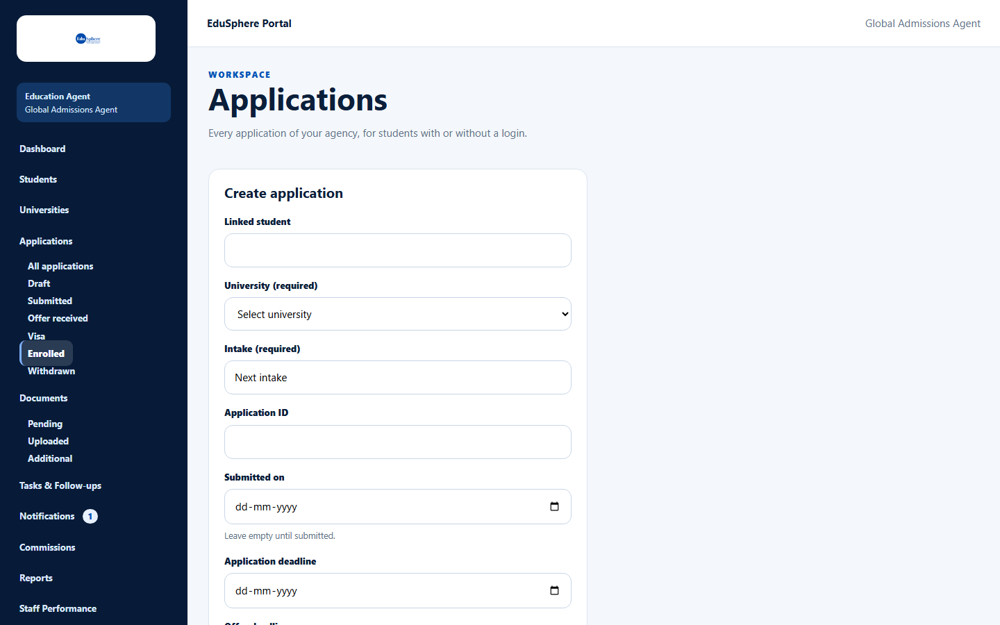

# Confirm enrollment

> Doc ID: DOC-APP-009 · Verified 2026-10-05 against docs commit `717d6aa8` (`main` @ `6a9be770`) · Roles: Agency Master

## Purpose
Confirm that the student has enrolled at the university. This completes the application and creates an estimated
commission for your agency.

## Who Can Use This Feature
**Agency Masters only.** Staff see "An agency Master confirms enrollment." in the Enrollment section.

## Prerequisites
- The application is at stage **Offer**, **Visa documentation** or **Status tracking** (it has an offer).
- The application is not withdrawn and the student is not archived.

## How to Access
Applications > card > **View** > **Enrollment** > **Enroll student**.

## Steps

### Step 1 — Open the enrollment form
Click **Enroll student**. The form shows the **University**, **Course** and **Intake** for checking.

### Step 2 — Fill in the details
Enter the **Enrollment date (required)**, and optionally the **University student ID (optional)** and a
**Note (optional)**. Click **Confirm enrollment**.

### Step 3 — Confirm
Read "Confirm enrollment? A commission will be estimated and the application can no longer be withdrawn." and click
**Yes, confirm enrollment** (or **Go back**).

The message **Enrollment confirmed.** appears. The stage becomes **Enrolled**, the details show
**Enrollment date**, **University student ID** and **Confirmed by the agency**, and the status history records the
change with your note.

### Step 4 — Correct details later (if needed)
Click **Edit enrollment details**, change the date or student ID and save ("Enrollment details saved."). This does
not create a second commission.

## Fields
| Field | Description | Required | Example |
|---|---|---|---|
| Enrollment date (required) | Date the student enrolled (2000–2100). | Yes | 05-10-2026 |
| University student ID (optional) | The university's student number, up to 60 characters. | No | 2027-BHM-55120 |
| Note (optional) | Up to 2000 characters; added to the status history (first confirmation only). | No | Enrolment confirmed by email. |

## Expected Result
- The application moves to **Applications > Enrolled**.
- One commission is created with status **Estimated** (see [View and claim commissions](../commissions/comm-001-commissions.md)).

## Validation Messages
| Message | When |
|---|---|
| Only an agency Master can confirm enrollment | A staff member tried to confirm. |
| An offer is needed before enrollment | The application has no offer. |
| The enrollment date is in the future and after the intake month. Check the date. | Warning only — you can still confirm (from the application code; not captured in testing — VERIFICATION REQUIRED). |
| The intake is not a month and year, so the enrollment date was not checked against it. | The intake is free text such as "Next intake" (warning only). |

## Common Errors
**Problem:** No **Enroll student** button.
**Cause:** You are a staff member, or the application has not reached the Offer stage.
**Resolution:** Ask an agency Master; record the offer first.

## Tips
- After enrollment the application can no longer be withdrawn.

## Related Features
- [Record an offer](app-006-record-an-offer.md)
- [View and claim commissions](../commissions/comm-001-commissions.md)
