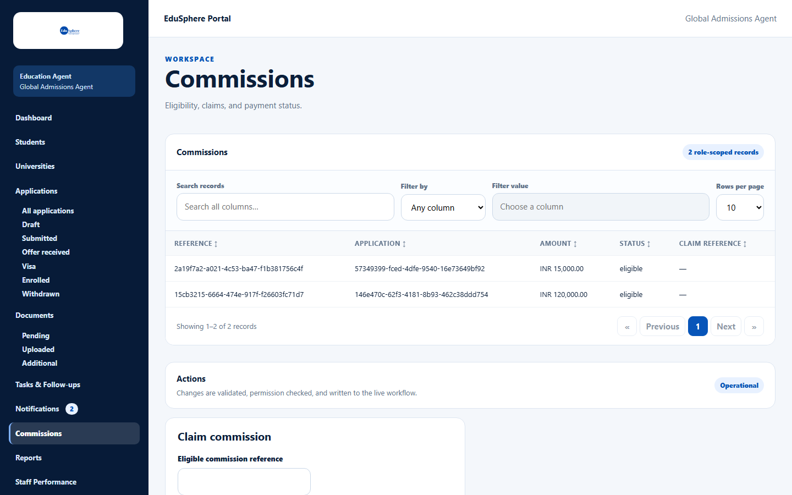
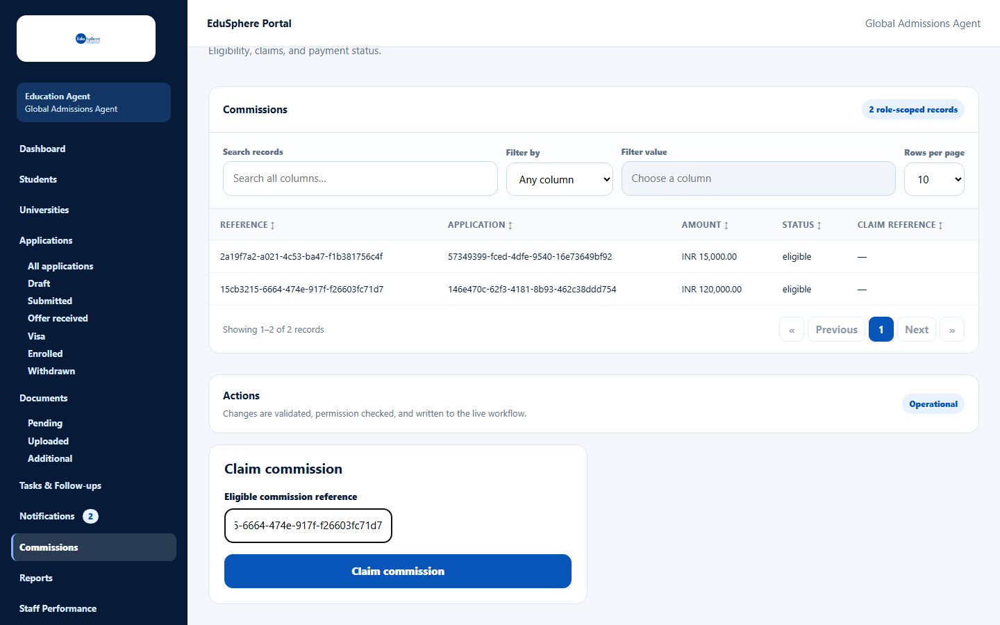
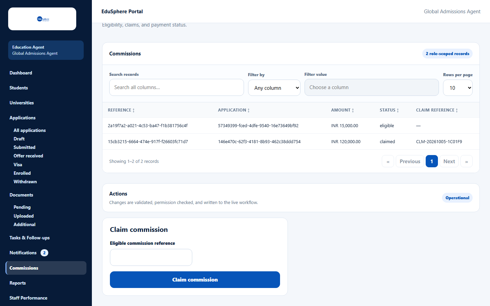

# View and claim commissions

> Doc ID: DOC-COMM-001 · Verified 2026-10-05 against docs commit `717d6aa8` (`main` @ `6a9be770`) · Roles: Agency Master

## Purpose
See the commissions EduSphere owes your agency and claim them once they are eligible.

## Who Can Use This Feature
**Agency Masters only.** Staff do not see Commissions; typing its address shows "Only an agency Master can open this page".

## Prerequisites
A commission exists (created automatically when you [confirm an enrollment](../applications/app-009-confirm-enrollment.md))
and EduSphere has set its amount.

## How to Access
Sidebar > **Commissions**.

## Steps

### Step 1 — Read the commissions table
The table **Commissions** ("Eligibility, claims, and payment status.") lists each commission: **Reference**,
**Application**, **Amount**, **Status** and **Claim reference**. It has **Search records**, **Filter by**, sortable
headings and **Rows per page**.

| Status (as shown) | Meaning | Next step |
|---|---|---|
| estimated | Created at enrollment; waiting for EduSphere to set the amount | Wait |
| eligible | Amount set; you can claim it | Claim |
| claimed | You claimed it (a claim reference is shown) | Wait for payout |
| payout_pending / paid | EduSphere is paying / has paid it | — |

### Step 2 — Claim an eligible commission
1. Copy the commission's **Reference** from the table.
2. In **Claim commission**, paste it into **Eligible commission reference**.
3. Click **Claim commission**. The message **Commission claimed.** appears.

The row shows **claimed** and a claim reference such as "CLM-20261005-1C01F9".

## Fields
| Field | Description | Required | Example |
|---|---|---|---|
| Eligible commission reference | The commission's Reference from the table. | Yes | 15cb3215-6664-474e-917f-f26603fc71d7 |

## Expected Result
EduSphere's Overseas Admin approves the payout and the status becomes **paid**. Paid commissions count as
**Revenue** on the dashboard and in **Reports > Commission**.

## Validation Messages
| Message | When |
|---|---|
| Commission not found | The reference is wrong. |
| Commission cannot be claimed in its current status | The commission is not eligible (for example still estimated or already claimed). |

## Common Errors
**Problem:** "Commission cannot be claimed in its current status".
**Cause:** The amount has not been set yet (status **estimated**) or it was already claimed.
**Resolution:** Wait until the status is **eligible**.

## Tips
- Only commissions with status **eligible** can be claimed.

## Related Features
- [Confirm enrollment](../applications/app-009-confirm-enrollment.md)
- [Commission report](../reports/rpt-003-commission-report.md)
- Admin: [Commission amounts and payouts](../../admin-manual/adm-006-commissions.md)
