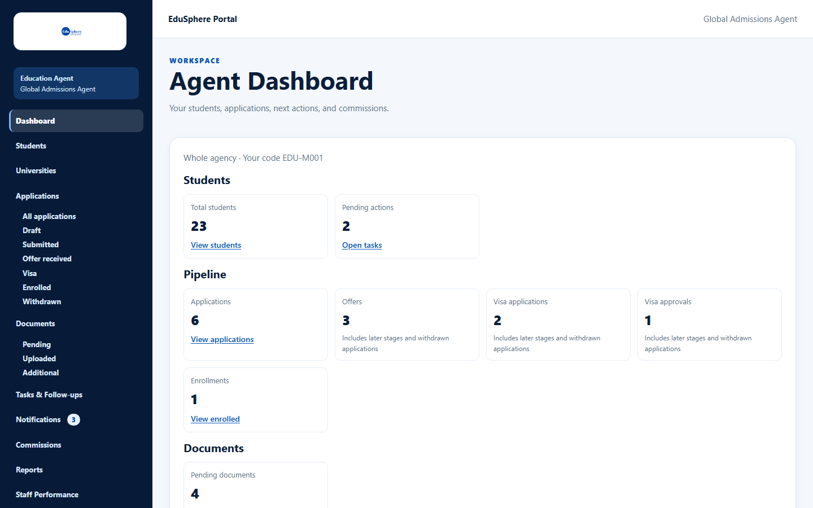
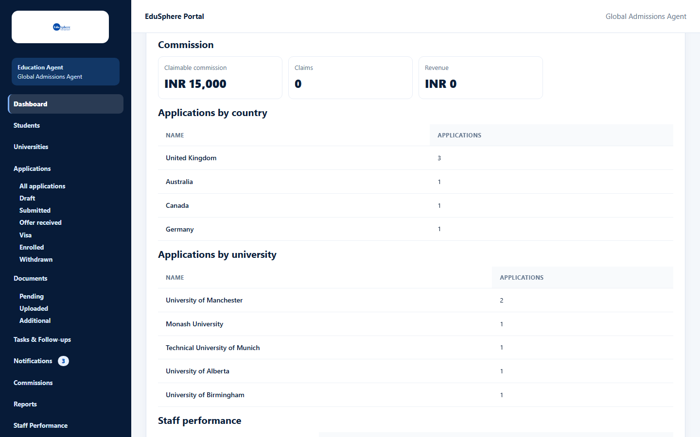
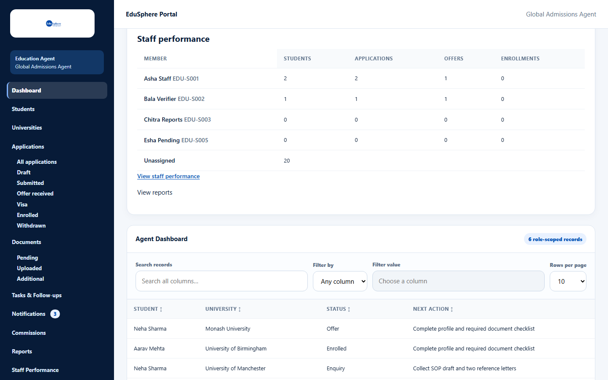

# Agency dashboard (Master)

> Doc ID: DOC-DASH-001 · Verified 2026-10-05 against docs commit `717d6aa8` (`main` @ `6a9be770`) · Roles: Agency Master

## Purpose
See your whole agency at a glance: students, the application pipeline, documents waiting for review, commission and
how each staff member is doing.

## Who Can Use This Feature
**Agency Masters.** Staff see a smaller version (see [Agency dashboard (Staff)](dash-002-staff-dashboard.md)).

## Prerequisites
Your agency is approved.

## How to Access
Sidebar > **Dashboard** (the page you land on after signing in).

## Steps

### Step 1 — Read the figures
The line "Whole agency · Your code {code}" confirms you are seeing the whole agency. The figures are grouped:

| Group | Figures | Link |
|---|---|---|
| Students | Total students (active), Pending actions (open tasks) | View students, Open tasks |
| Pipeline | Applications (not withdrawn), Offers, Visa applications, Visa approvals, Enrollments | View applications, View enrolled |
| Documents | Pending documents | Review pending |
| Commission | Claimable commission, Claims, Revenue (per currency) | — |

Offers and visa figures carry the note "Includes later stages and withdrawn applications".

### Step 2 — Breakdowns and staff table
- **Applications by country** and **Applications by university** — top 10 plus "Other".
- **Staff performance** — each staff member's Students, Applications, Offers and Enrollments, plus an **Unassigned**
  row, with links **View staff performance** and **View reports**.
- Below: a table of open applications (Student, University, Status, Next action) with **Search records**,
  **Filter by**, sortable headings and **Rows per page**.

## Fields
None — the dashboard has no date filter.

## Expected Result
The figures reflect the agency's data at the time the page was opened; reload to refresh.

## Validation Messages
| Message | When |
|---|---|
| Dashboard figures are unavailable right now. | Loading failed; click **Try again**. |
| No applications yet | No applications for the breakdowns. |
| No staff yet — add staff from Team | No staff members. |

## Common Errors
**Problem:** The commission figures show several amounts, such as "INR 15,000 · USD 2,000".
**Cause:** Each currency is shown separately; amounts in different currencies are never added together.
**Resolution:** None needed. "Claimable" includes estimated commissions (amount not yet set).

## Tips
- Click a figure's link to go straight to the matching list.

## Related Features
- [Staff performance](../staff-performance/perf-001-staff-performance.md)
- [Reports](../reports/rpt-001-agency-reports.md)
