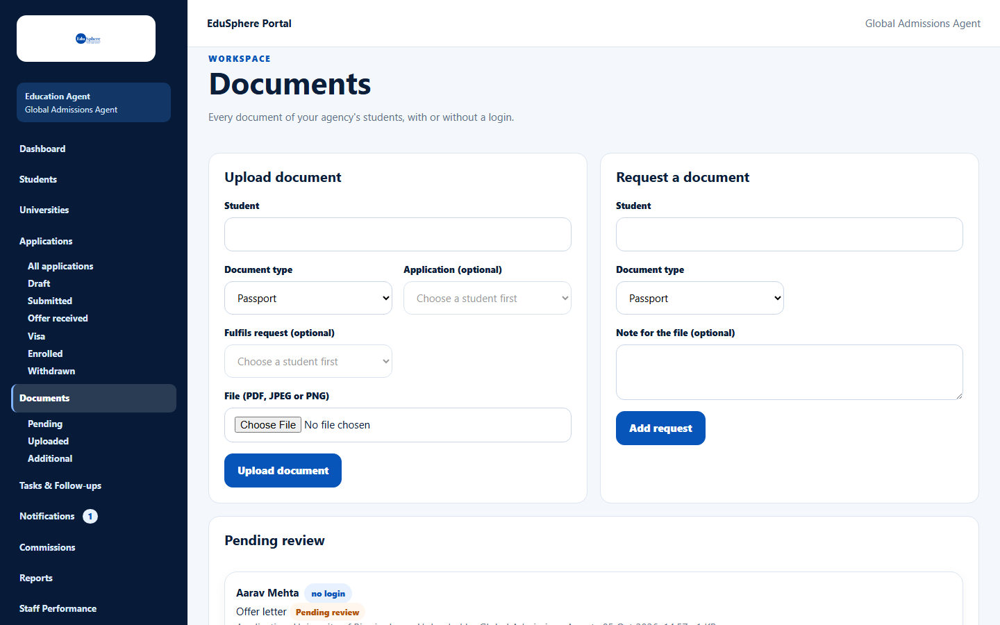
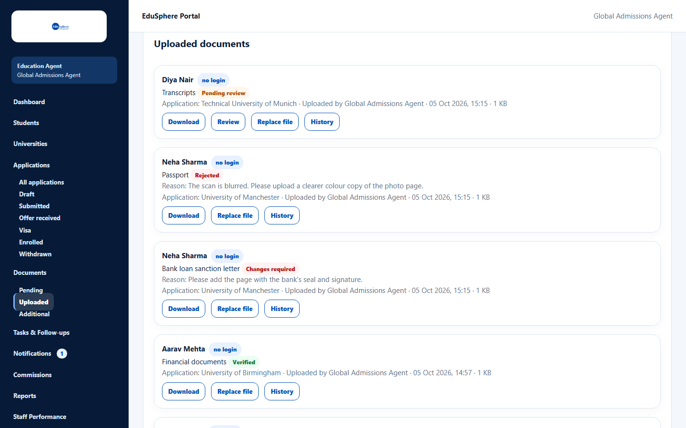

# Browse and download documents

> Doc ID: DOC-DOC-001 · Verified 2026-10-05 against docs commit `717d6aa8` (`main` @ `6a9be770`) · Roles: Agency Master, Agency Staff

## Purpose
See the documents of your agency's students — what is waiting for review and everything already uploaded — and open
or download them.

## Who Can Use This Feature
- **Agency Master:** every document of the agency ("Every document of your agency's students, with or without a login.").
- **Agency Staff:** documents of their assigned students ("Documents of students assigned to you, with or without a login.").

## Prerequisites
None.

## How to Access
Sidebar > **Documents** > **Pending**, **Uploaded** or **Additional**. The top of the page always has the
**Upload document** and **Request a document** forms.

## Steps

### Step 1 — Pending review
**Documents > Pending** lists documents waiting for a decision, under **Pending review**.

### Step 2 — Uploaded documents
**Documents > Uploaded** lists every uploaded document with its status. Rejected documents and documents needing
changes show **Reason:** with the reviewer's explanation.

### Step 3 — Read a document card
Each card shows the student (with a **no login** badge where relevant), the document name and status, the
**Application** it belongs to, who uploaded it, when, and the file size. Buttons:

| Button | What it does | Guide |
|---|---|---|
| Download | Opens the file in a new tab | — |
| Review | Verify, reject or ask for changes (pending documents only, when you are allowed) | [Review a document](doc-004-review-a-document.md) |
| Replace file | Upload a new version | [Replace a file](doc-003-replace-a-file.md) |
| History | Everything that happened to the document | [Document history](doc-005-document-history.md) |

| Status | Meaning |
|---|---|
| Pending review | Uploaded or replaced; waiting for a decision |
| Verified | Accepted |
| Rejected | Not accepted; a reason is shown |
| Changes required | Needs a corrected version; a reason is shown |

## Fields
None.

## Expected Result
Newest documents first, 20 per page with **Previous** / **Next**. Every download is recorded in the document's
history ("Downloaded").

## Validation Messages
| Message | When |
|---|---|
| No documents are waiting for review. | Pending is empty (with a link to show all uploaded documents). |
| No documents uploaded yet. Use Upload document to add the first one. | Nothing uploaded. |
| The documents could not be loaded. / The document could not be opened. | Loading or download failed. |
| Document is outside your assigned scope | A staff member tried to open another staff member's document. |

## Common Errors
**Problem:** A staff member cannot see a student's documents.
**Cause:** The student is not assigned to them.
**Resolution:** A Master assigns the student.

## Tips
- The page has no student search; use the Uploaded view and scan by student name (the list is newest first).

## Related Features
- [Upload a document](doc-002-upload-a-document.md)
- [Request a document](doc-006-request-a-document.md)
