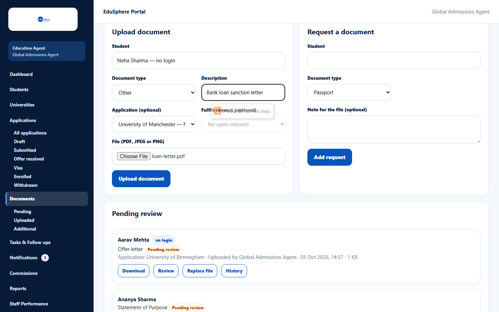
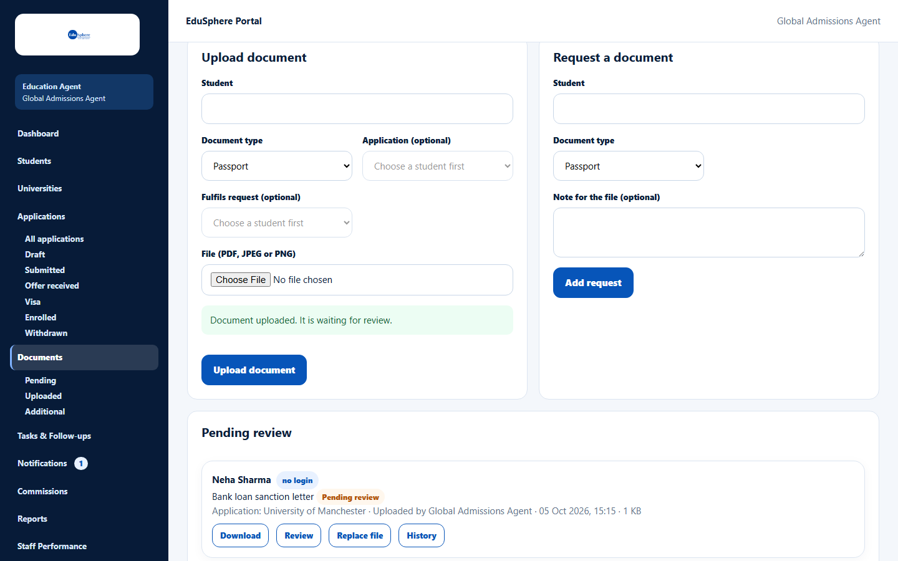
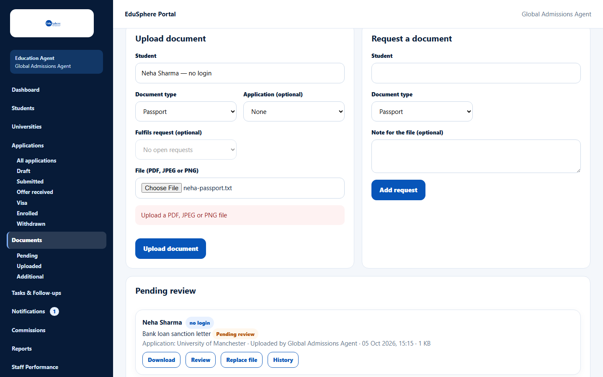

# Upload a document

> Doc ID: DOC-DOC-002 · Verified 2026-10-05 against docs commit `717d6aa8` (`main` @ `6a9be770`) · Roles: Agency Master, Agency Staff

## Purpose
Upload a student's document (passport, transcripts, SOP, offer letter…) so it can be reviewed and used for
applications, offers and visas.

## Who Can Use This Feature
Agency Masters and Agency Staff (staff: their assigned students).

## Prerequisites
- The student exists and is not archived.
- The file is a PDF, JPEG or PNG (20 MB maximum by default).

## How to Access
Sidebar > **Documents** > **Upload document** (top of the page).

## Steps

### Step 1 — Choose the student and document type
1. In **Student**, type and choose the student.
2. Choose the **Document type**. For **Other**, a **Description** field appears and is required.
3. Choose the **Application** this document belongs to (optional for most types; **required for an Offer letter** —
   the field is then labelled "Application (required for an offer letter)").
4. If the document answers an open request, choose it in **Fulfils request (optional)**.

### Step 2 — Choose the file and upload
Choose the **File (PDF, JPEG or PNG)** and click **Upload document**. The message
**Document uploaded. It is waiting for review.** appears and the document is listed under Pending review.

## Fields
| Field | Description | Required | Example |
|---|---|---|---|
| Student | Student of your agency. | Yes | Neha Sharma — no login |
| Document type | Passport, Academic certificates, Transcripts, English test, CV, SOP, LOR, Financial documents, Other, Offer letter. | Yes | Other |
| Description | Only for **Other**: 2–80 characters; becomes the document's name. | For Other | Bank loan sanction letter |
| Application | One of the student's applications. Needed for visa checklists and offer letters. | For Offer letter | University of Manchester |
| Fulfils request (optional) | An open request for this student. | No | SOP |
| File (PDF, JPEG or PNG) | The file; checked by its content, not its name. | Yes | passport.pdf |

## Expected Result
The document appears with status **Pending review**; a chosen request is marked fulfilled.

## Validation Messages
| Message | When |
|---|---|
| Please fill out this field. (browser message) | **Other** chosen without a Description. (For an Offer letter the Application field becomes required in the same way.) |
| Upload a PDF, JPEG or PNG file | The file is another type (for example a .txt or .docx). |
| The file must be at most 20 MB | The file is too large (limit set by EduSphere). |
| The file is empty | The file has no content. |
| Too many documents uploaded today -- try again later | Your agency uploaded 500 files in 24 hours. |

## Common Errors
**Problem:** The visa checklist still says "Not uploaded".
**Cause:** The document was uploaded without choosing the application.
**Resolution:** Upload it again with the right **Application** selected.

## Tips
- Photo metadata (such as location) is removed from images when they are uploaded (from the application code).

## Related Features
- [Review a document](doc-004-review-a-document.md)
- [Record an offer](../applications/app-006-record-an-offer.md)
- [Run the visa case](../applications/app-008-visa-case.md)
