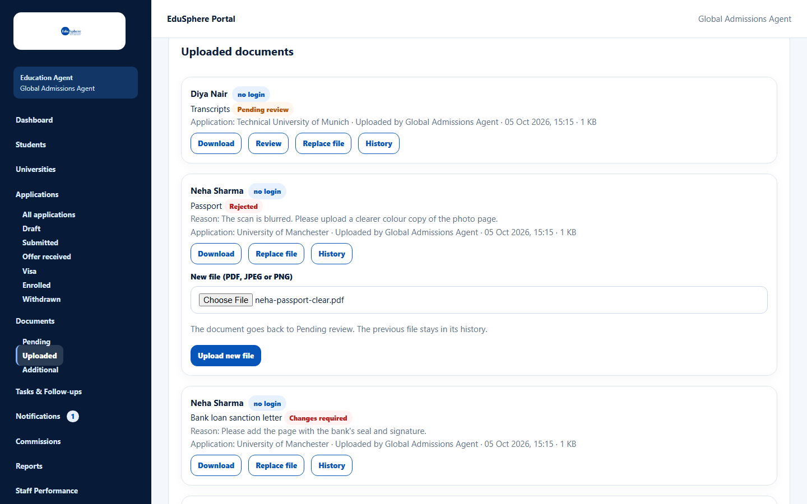
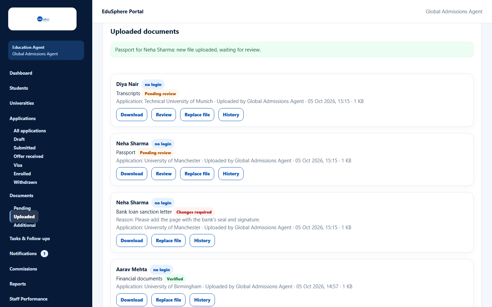

# Replace a document file

> Doc ID: DOC-DOC-003 · Verified 2026-10-05 against docs commit `717d6aa8` (`main` @ `6a9be770`) · Roles: Agency Master, Agency Staff

## Purpose
Upload a corrected or clearer version of a document — for example after it was rejected or changes were requested.

## Who Can Use This Feature
Agency Masters and Agency Staff (for their assigned students).

## Prerequisites
The document was uploaded by your agency and has not been decided by an EduSphere counselor or administrator.

## How to Access
Documents > a document card > **Replace file**.

## Steps

### Step 1 — Choose the new file
Click **Replace file** and choose the file in **New file (PDF, JPEG or PNG)**.

### Step 2 — Upload
Click **Upload new file**. The message "{document} for {student}: new file uploaded, waiting for review." appears and
the status goes back to **Pending review**.

## Fields
| Field | Description | Required | Example |
|---|---|---|---|
| New file (PDF, JPEG or PNG) | The new version; same rules as uploading. | Yes | passport-clear.pdf |

## Expected Result
The document keeps its name and history; the history records "File replaced".

## Validation Messages
| Message | When |
|---|---|
| Only documents your agency uploaded can be replaced | The document came from somewhere else (for example the student). |
| A counselor or administrator has reviewed this document, so it can't be replaced | EduSphere staff already decided on it. |
| Upload a PDF, JPEG or PNG file | Wrong file type. |

## Common Errors
None beyond the messages above.

## Tips
- Replace the file rather than uploading a new document, so the history stays in one place.

## Related Features
- [Review a document](doc-004-review-a-document.md)
- [Document history](doc-005-document-history.md)
