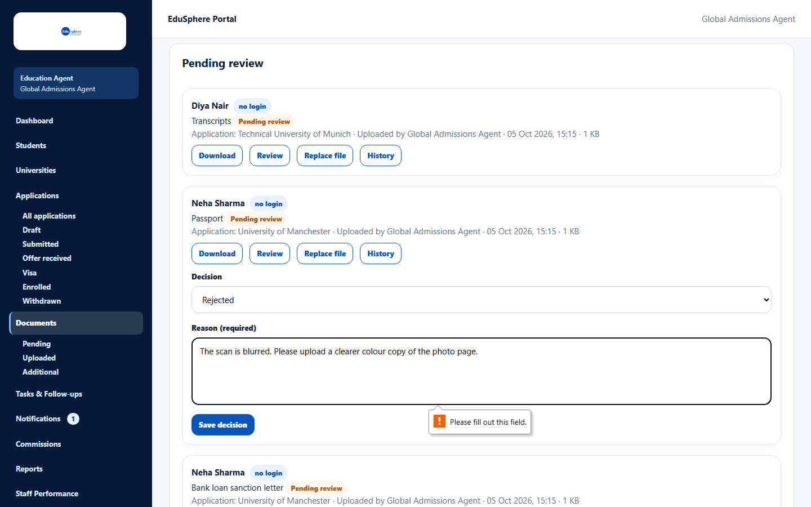
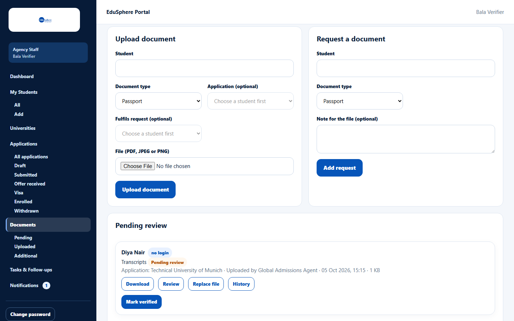
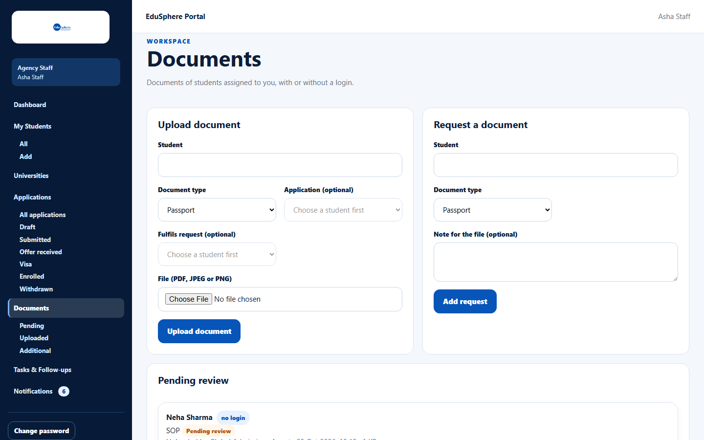

# Review a document

> Doc ID: DOC-DOC-004 · Verified 2026-10-05 against docs commit `717d6aa8` (`main` @ `6a9be770`) · Roles: Agency Master; Agency Staff with *Verify documents*

## Purpose
Decide on a pending document: accept it, reject it, or ask for a corrected version.

## Who Can Use This Feature
| Role | Can do |
|---|---|
| Agency Master | Verified, Rejected, Changes required |
| Staff with **Verify documents** | **Mark verified** only (their assigned students) |
| Staff without the permission | Nothing — no Review button is shown |

## Prerequisites
The document's status is **Pending review**.

## How to Access
Documents > **Pending** > a document card > **Review**.

## Steps

### Master — choose a decision
1. Click **Review**.
2. Choose the **Decision**: **Verified**, **Rejected** or **Changes required**.
3. For **Rejected** or **Changes required**, enter the **Reason (required)**. For Verified you can add a
   **Note (optional)**.
4. Click **Save decision**. The message "{document} for {student}: verified." / "…: rejected." /
   "…: changes required." appears.

### Staff with Verify documents
Click **Review**, then **Mark verified**. The message "{document} for {student}: verified." appears.

Staff without the permission see the documents but no **Review** button:

## Fields
| Field | Description | Required | Example |
|---|---|---|---|
| Decision | Verified, Rejected or Changes required. | Yes | Rejected |
| Reason (required) | Why it was rejected / what to change, up to 2000 characters. Shown on the card as "Reason:". | For Rejected / Changes required | The scan is blurred. |
| Note (optional) | Note when verifying. | No | Checked against original. |

## Expected Result
The status changes. For Rejected or Changes required, the student's assignee (or the Masters, if unassigned) is
notified "Document needs attention".

## Validation Messages
| Message | When |
|---|---|
| Please fill out this field. (browser message) | Reject / Changes required without a reason. |
| Give a reason when you reject a document or ask for changes | Same check on the server. |
| Only an agency Master can reject documents or request changes | A staff member tried to reject. |
| Your agency Master hasn't given you permission to verify documents | A staff member without the permission tried to verify. |
| This document has already been reviewed | Someone else decided first; reload. |

## Common Errors
**Problem:** A staff member has no **Review** button.
**Cause:** Their Master has not given them **Verify documents**.
**Resolution:** A Master turns it on in Team > Permissions.

## Tips
- Verified documents count towards the visa checklist.

## Related Features
- [Set staff permissions](../team/team-004-staff-permissions.md)
- [Replace a file](doc-003-replace-a-file.md)
