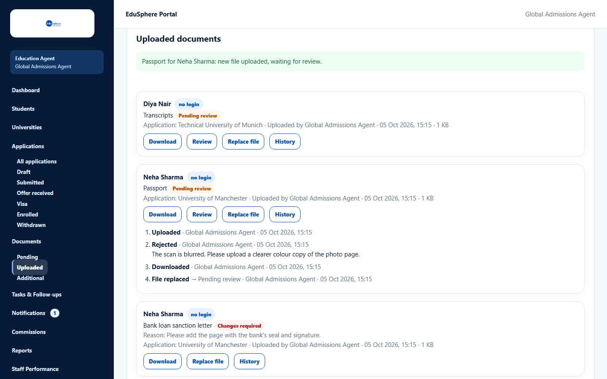

# Document history

> Doc ID: DOC-DOC-005 · Verified 2026-10-05 against docs commit `717d6aa8` (`main` @ `6a9be770`) · Roles: Agency Master, Agency Staff

## Purpose
See everything that happened to a document: uploads, decisions with reasons, downloads and replaced files.

## Who Can Use This Feature
Agency Masters and Agency Staff (for their assigned students).

## Prerequisites
None.

## How to Access
Documents > a document card > **History**.

## Steps

### Step 1 — Open the history
Click **History**. A numbered list opens inside the card, oldest first, for example:
1. **Uploaded** · {who} · {date, time}
2. **Rejected** · {who} · {date, time} — with the reason
3. **Downloaded** · {who} · {date, time}
4. **File replaced** → Pending review · {who} · {date, time}

## Fields
None.

## Expected Result
| Event | When it is recorded |
|---|---|
| Uploaded / File replaced | A file is uploaded or replaced |
| Verified / Rejected / Changes requested | A decision is saved (with the note or reason) |
| Requested / Request fulfilled / Request cancelled | A document request changes |
| Downloaded | Someone downloads the file |

## Validation Messages
| Message | When |
|---|---|
| No history recorded yet. Documents uploaded before history was kept start with their next action. | Older documents. |
| The history could not be loaded. | Loading failed. |

## Common Errors
None observed.

## Tips
- Use the history to see who downloaded a document and when.

## Related Features
- [Review a document](doc-004-review-a-document.md)
