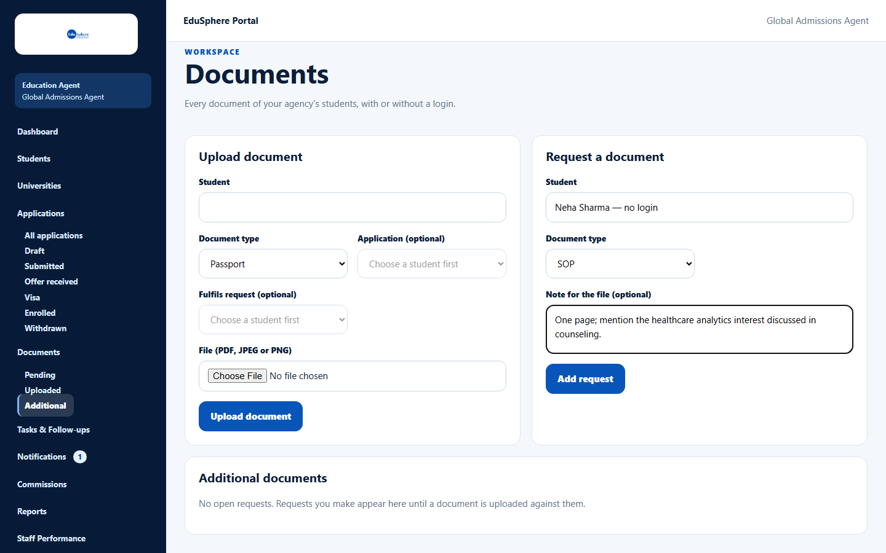
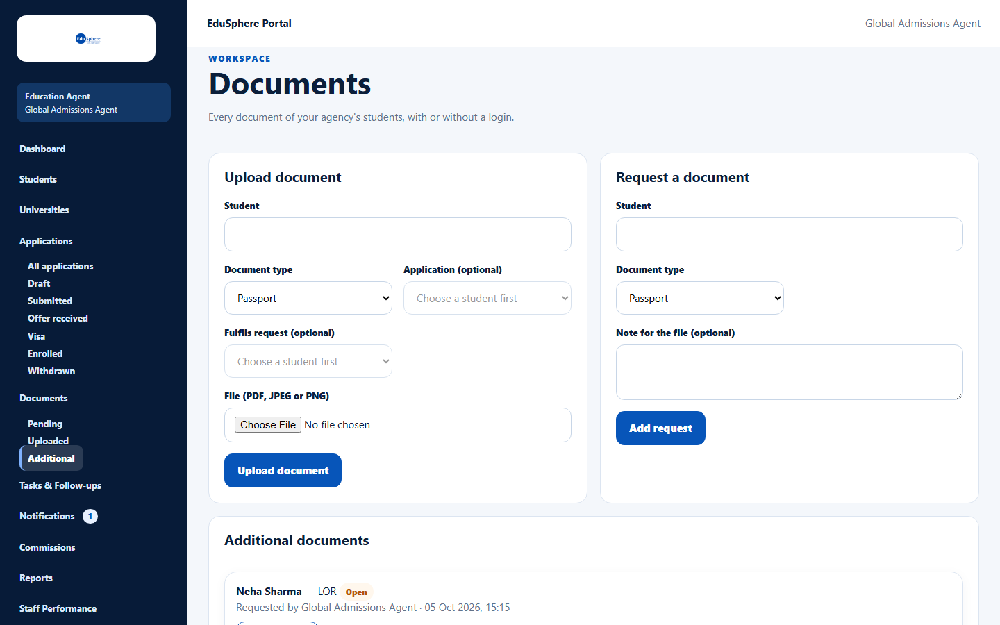
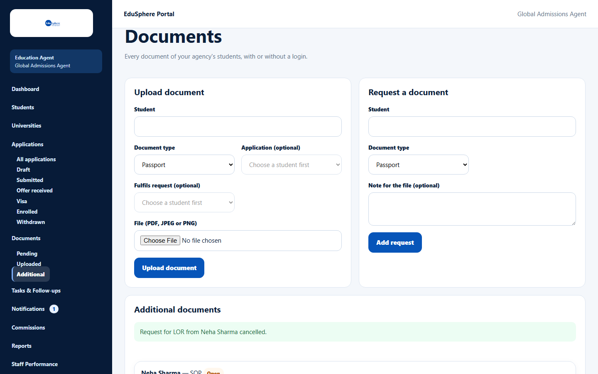

# Request a document

> Doc ID: DOC-DOC-006 · Verified 2026-10-05 against docs commit `717d6aa8` (`main` @ `6a9be770`) · Roles: Agency Master, Agency Staff

## Purpose
Keep track of documents you still need from a student. Open requests are listed under **Additional** until a
document is uploaded against them.

## Who Can Use This Feature
Agency Masters and Agency Staff (for their assigned students).

## Prerequisites
The student is active.

## How to Access
Sidebar > **Documents** > **Request a document** (form at the top); open requests under **Documents > Additional**.

## Steps

### Step 1 — Add a request
1. In **Request a document**, choose the **Student**.
2. Choose the **Document type** (Offer letter is not offered here).
3. Optional: add a **Note for the file (optional)**.
4. Click **Add request**. The message "Request added to Additional documents." appears.

### Step 2 — See open requests
**Documents > Additional** lists open requests as "{student} — {document} **Open**", with who requested it and when.

### Step 3 — Fulfil or cancel
- **Fulfil:** when uploading the document, choose the request in **Fulfils request (optional)**. The request leaves the
  Additional list.
- **Cancel:** click **Cancel request**. The message "Request for {document} from {student} cancelled." appears.

## Fields
| Field | Description | Required | Example |
|---|---|---|---|
| Student | Student of your agency. | Yes | Neha Sharma |
| Document type | Any type except Offer letter; Other needs a description. | Yes | SOP |
| Note for the file (optional) | Up to 1000 characters. | No | One page; mention healthcare analytics. |

## Expected Result
The request is listed under Additional until fulfilled or cancelled; the student's assignee (or the Masters, if
unassigned) is notified "Document requested".

## Validation Messages
| Message | When |
|---|---|
| An open request for this document already exists | The same document is already requested for the student. |
| Too many document requests today -- try again later | 200 requests in 24 hours. |
| This request has already been fulfilled or cancelled | Someone else closed it first. |
| No open requests. Requests you make appear here until a document is uploaded against them. | The Additional view is empty. |

## Common Errors
**Problem:** The request is still open after uploading the document.
**Cause:** The request was not chosen in **Fulfils request** when uploading.
**Resolution:** Cancel the request, or upload again choosing the request.

## Tips
- Requests notify only your agency (the student's assignee, or the Masters if unassigned); students with their own
  EduSphere login are not notified.

## Related Features
- [Upload a document](doc-002-upload-a-document.md)
