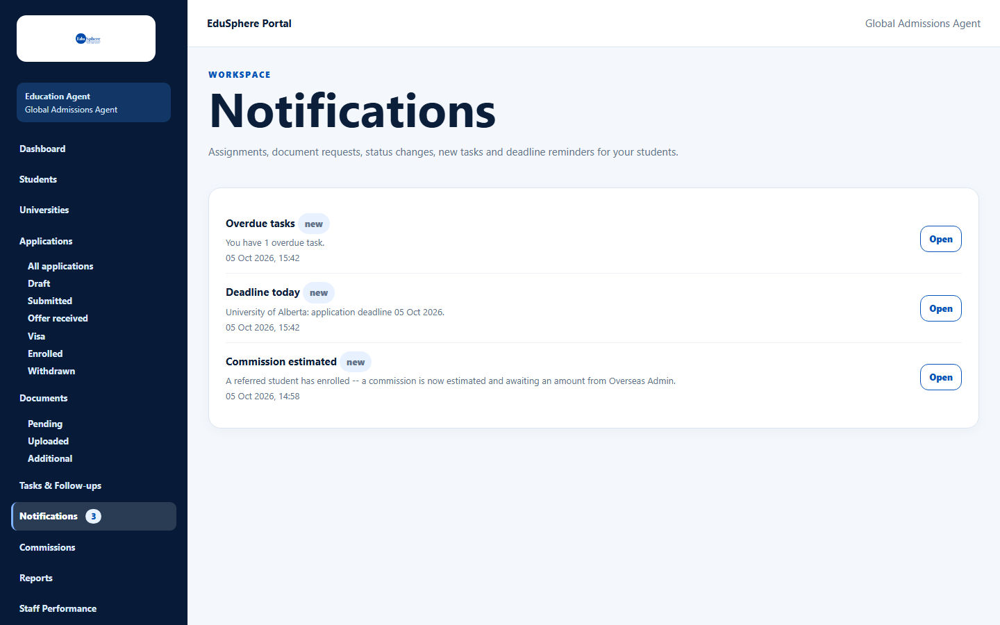
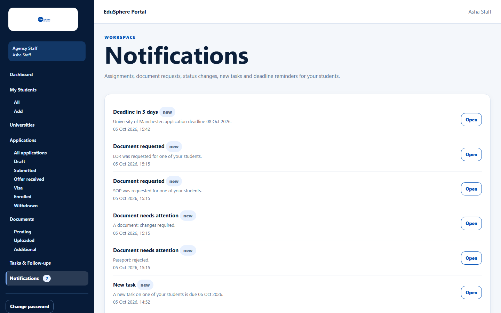

# Notifications

> Doc ID: DOC-NOTIF-001 · Verified 2026-10-05 against docs commit `717d6aa8` (`main` @ `6a9be770`) · Roles: Agency Master, Agency Staff

## Purpose
Stay informed about your students: assignments, document requests, status changes, new tasks, commissions and
deadline reminders.

## Who Can Use This Feature
Agency Masters and Agency Staff — each sees only their own notifications.

## Prerequisites
None.

## How to Access
Sidebar > **Notifications**. The number next to **Notifications** is how many you have not read yet (shown as 99+
above 99).

## Steps

### Step 1 — Read the list
Each notification shows its title (with a **new** badge while unread), a short message and the time.

### Step 2 — Open a notification
Click **Open** to go to the related page (for example **Overdue tasks** opens Tasks). Opening it marks it as read and
the sidebar number goes down. There is no "mark all as read" button.

## Fields
None.

## Expected Result
| Notification | When | Who receives it |
|---|---|---|
| Student assigned to you | A Master assigns you a student | The new assignee |
| Document requested | A document is requested for a student | Student's assignee, or the Masters if unassigned |
| Document needs attention | A document is rejected or needs changes | Same |
| Application status changed | An application's stage changes | Same |
| New task | A task is created for a student | Same |
| Commission estimated | An enrolled student creates a commission | Masters |
| Deadline today / Deadline in 3 days / Deadline tomorrow | Daily reminder for application/offer deadlines | Same as above |
| Overdue tasks | Daily summary, "You have N overdue task(s)." | Same as above |

The person who made a change is not notified about their own change. Daily reminders are sent once a day at
08:00 India time.

## Validation Messages
| Message | When |
|---|---|
| No notifications yet. You'll be told here about assignments, document requests, status changes, new tasks and upcoming deadlines. | Nothing yet. |
| Showing your latest 100 notifications. | You have more than 100. |

## Common Errors
**Problem:** No deadline reminders arrive.
**Cause:** Reminders are sent once a day (08:00 India time) and only when a deadline is exactly 3 days, 1 day or 0 days away.
**Resolution:** Check again after 08:00; make sure deadlines are entered on the application.

## Tips
- Agency notifications are also sent by email. WhatsApp/SMS settings in My profile do not apply to them, except
  "Commission estimated" (from the application code).

## Related Features
- [Tasks](../tasks/task-001-view-tasks.md)
- [My profile](../account-access/auth-006-my-profile.md) — choose WhatsApp/SMS in addition to in-app and email
