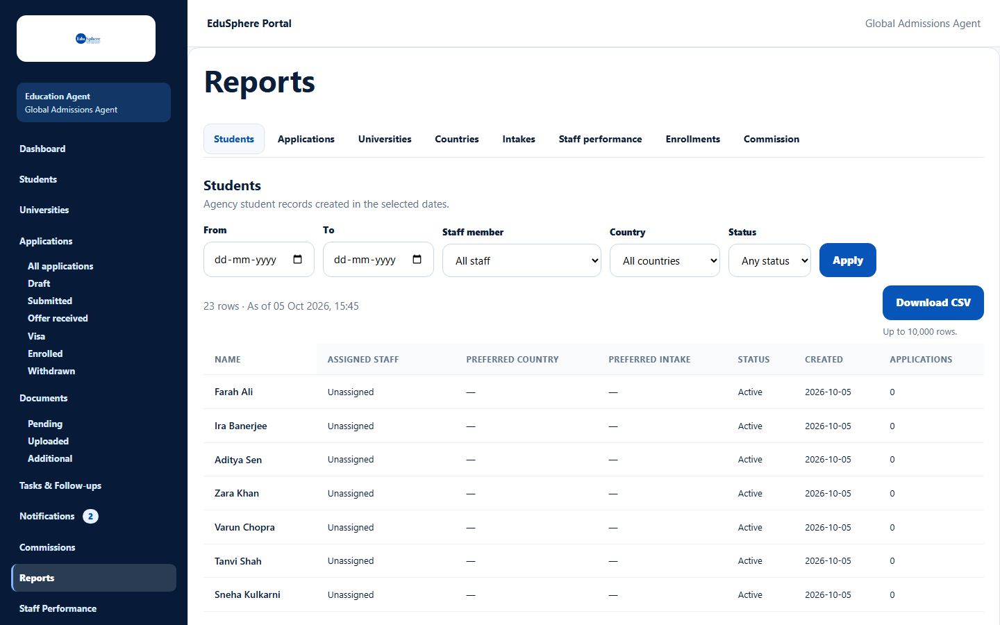
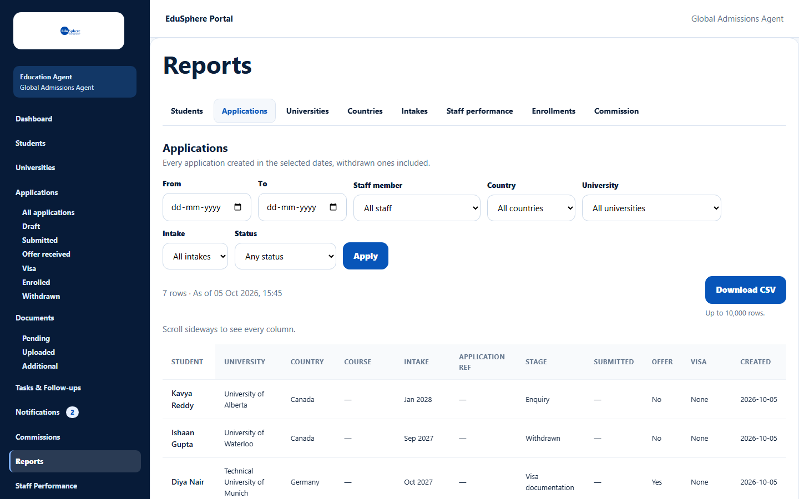
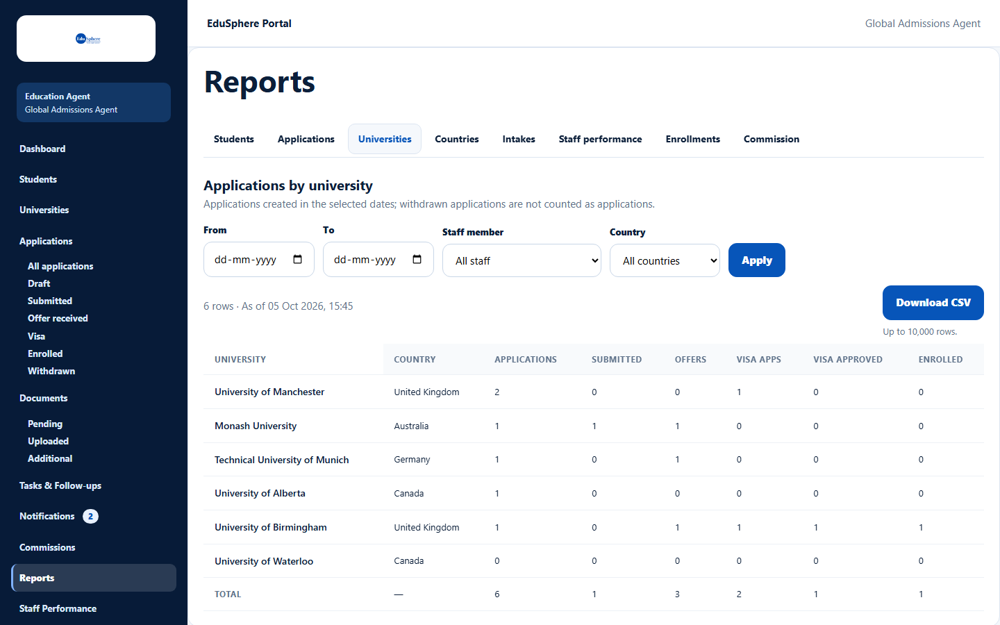
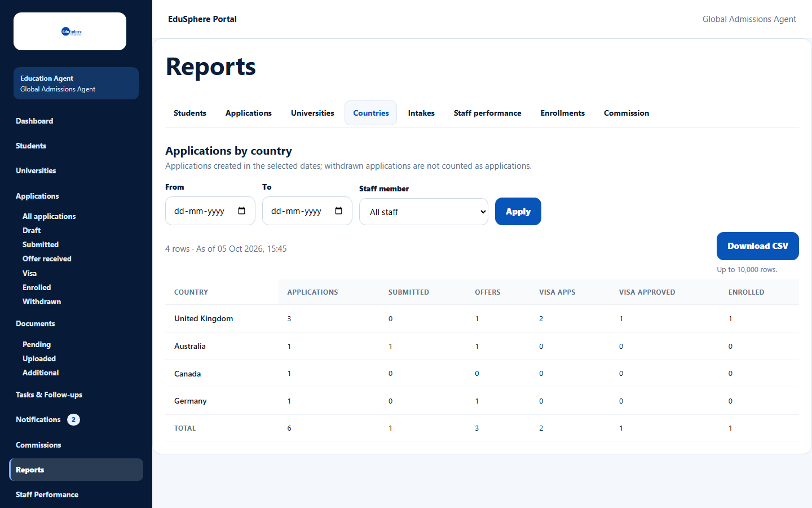
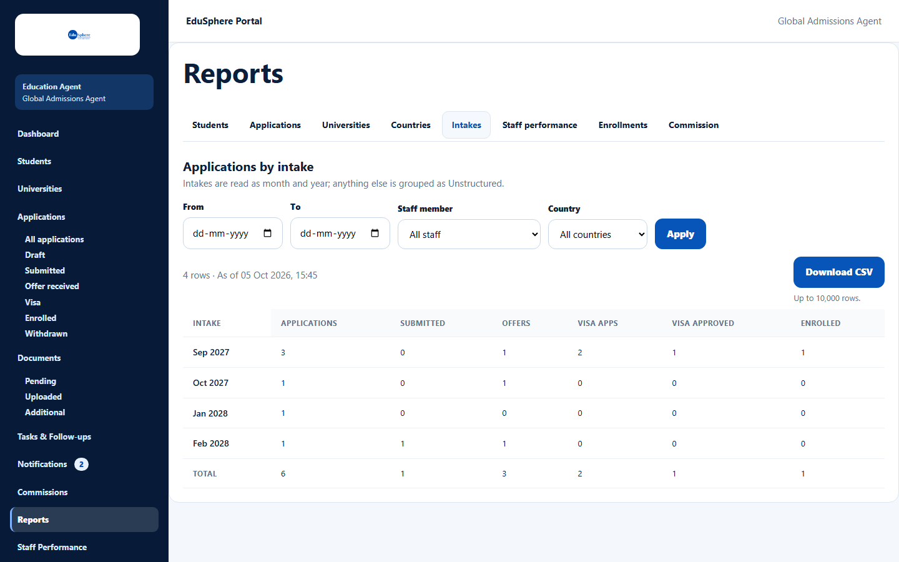
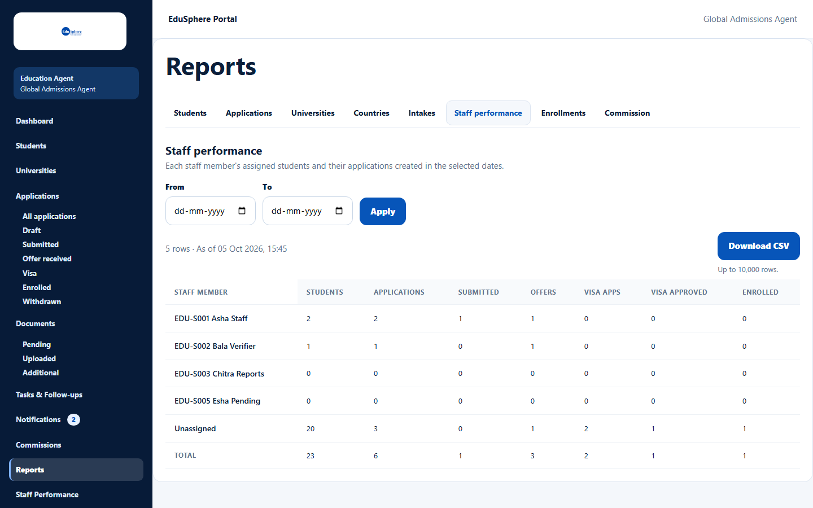
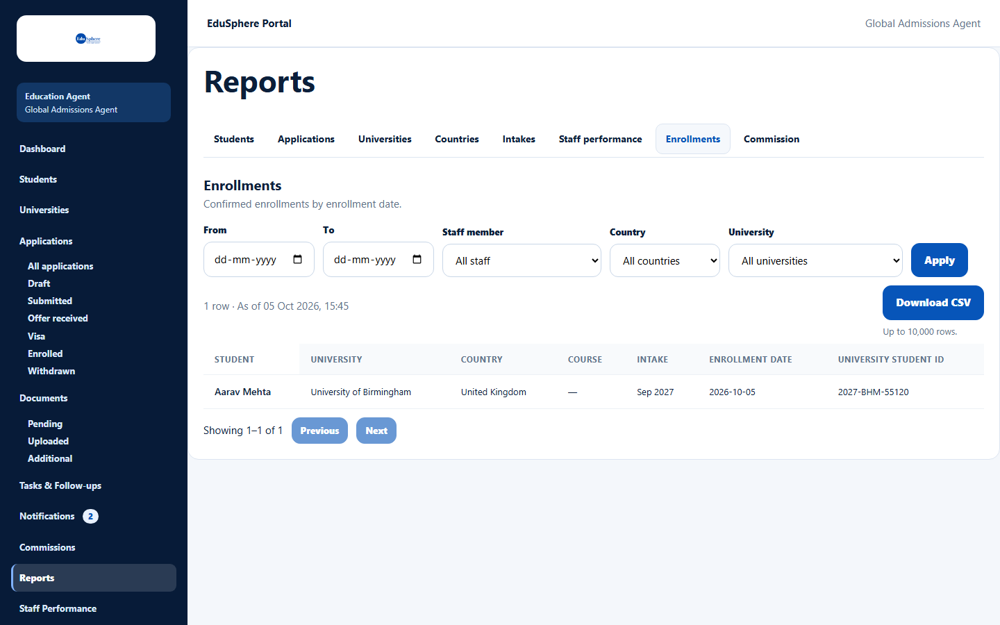
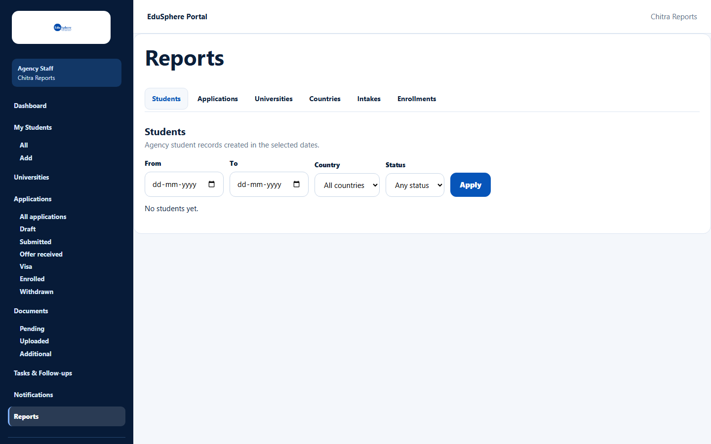
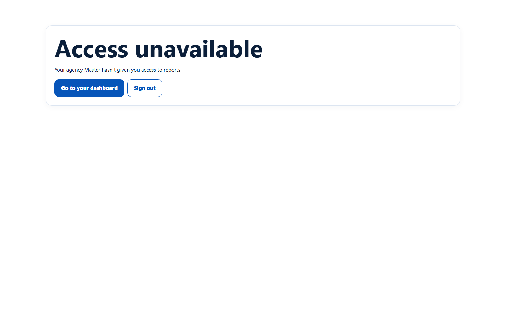

# Agency reports

> Doc ID: DOC-RPT-001 · Verified 2026-10-05 against docs commit `717d6aa8` (`main` @ `6a9be770`) · Roles: Agency Master; Agency Staff with *View reports*

## Purpose
Analyse your agency's students, applications and enrollments by date, staff member, country, university and intake.

## Who Can Use This Feature
| Role | Sees |
|---|---|
| Agency Master | All tabs, whole agency, **Staff member** filter |
| Staff with **View reports** | Students, Applications, Universities, Countries, Intakes, Enrollments — for their own students; no Staff performance or Commission tab, no Staff member filter |
| Staff without the permission | "Access unavailable — Your agency Master hasn't given you access to reports" |

## Prerequisites
None.

## How to Access
Sidebar > **Reports**.

## Steps

### Step 1 — Choose a report tab
| Tab | Shows |
|---|---|
| Students | Agency student records created in the selected dates |
| Applications | Every application created in the dates, withdrawn ones included |
| Universities | Applications by university, with stage columns and a total |
| Countries | Applications by country |
| Intakes | Applications by intake month/year ("Unstructured" for free-text intakes) |
| Staff performance | Per staff member (Masters only) |
| Enrollments | Enrolled applications with enrollment date and university student ID |
| Commission | See [Commission report](rpt-003-commission-report.md) (Masters only) |

### Step 2 — Filter
Set **From** / **To** (creation dates) and the dropdowns shown for that tab — **Staff member**, **Country**,
**University**, **Intake**, **Status** — then click **Apply**. The line "{N} rows · As of {time}" shows the result
size. The chosen report and filters are kept in the page address, so you can bookmark or share the view.

### Step 3 — Read the table
List reports show 50 rows per page with **Previous** / **Next**. Wide tables say "Scroll sideways to see every column."

### Staff views

## Fields
| Field | Description | Required | Example |
|---|---|---|---|
| From / To | Creation date range (inclusive). | No | 01-01-2026 – 31-12-2026 |
| Staff member | Masters only: one staff member, Unassigned or All staff. | No | EDU-S001 Asha Staff |
| Country / University / Intake / Status | Narrow the report (shown where relevant). | No | United Kingdom |

## Expected Result
The report shows matching rows; summary reports end with a **Total** row.

## Validation Messages
| Message | When |
|---|---|
| No records match these filters. | Nothing matches. |
| date_to must be on or after date_from | To is before From. |
| Couldn't load this report. | Loading failed; click **Try again**. |

## Common Errors
**Problem:** A staff member sees "Access unavailable" on Reports.
**Cause:** Their Master has not given them **View reports**.
**Resolution:** A Master turns it on in Team > Permissions.

## Tips
- Use [Export to CSV](rpt-002-export-csv.md) to work with the data in a spreadsheet.

## Related Features
- [Export a report to CSV](rpt-002-export-csv.md)
- [Staff performance](../staff-performance/perf-001-staff-performance.md)
