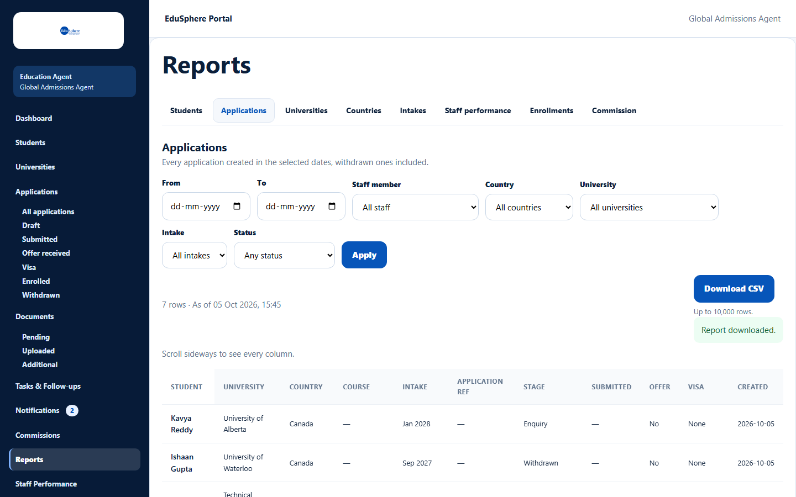

# Export a report to CSV

> Doc ID: DOC-RPT-002 · Verified 2026-10-05 against docs commit `717d6aa8` (`main` @ `6a9be770`) · Roles: Agency Master; Agency Staff with *View reports*

## Purpose
Download the report you are looking at as a CSV file for Excel or Google Sheets.

## Who Can Use This Feature
Anyone who can open the report (see [Agency reports](rpt-001-agency-reports.md)).

## Prerequisites
The report and filters you want are selected.

## How to Access
Reports > a tab > **Download CSV** (next to the row count).

## Steps

### Step 1 — Download
Click **Download CSV** ("Preparing CSV…"). Your browser saves a file named like
`agency-applications-all-to-all.csv` (report name, then the From and To dates, or "all").

## Fields
None.

## Expected Result
A UTF-8 CSV file with the same columns as on screen and, for summary reports, a Total row at the end.

## Validation Messages
| Message | When |
|---|---|
| This report has more than 10,000 rows; narrow the filters | The export would exceed 10,000 rows ("Up to 10,000 rows."). |
| You've downloaded a lot of reports in a short time. Try again in a few minutes. | More than 30 downloads in 10 minutes. |

## Common Errors
**Problem:** The download is refused for being too large.
**Cause:** More than 10,000 rows.
**Resolution:** Use From/To or other filters to split the export.

## Tips
- Every download is recorded by EduSphere.

## Related Features
- [Agency reports](rpt-001-agency-reports.md)
