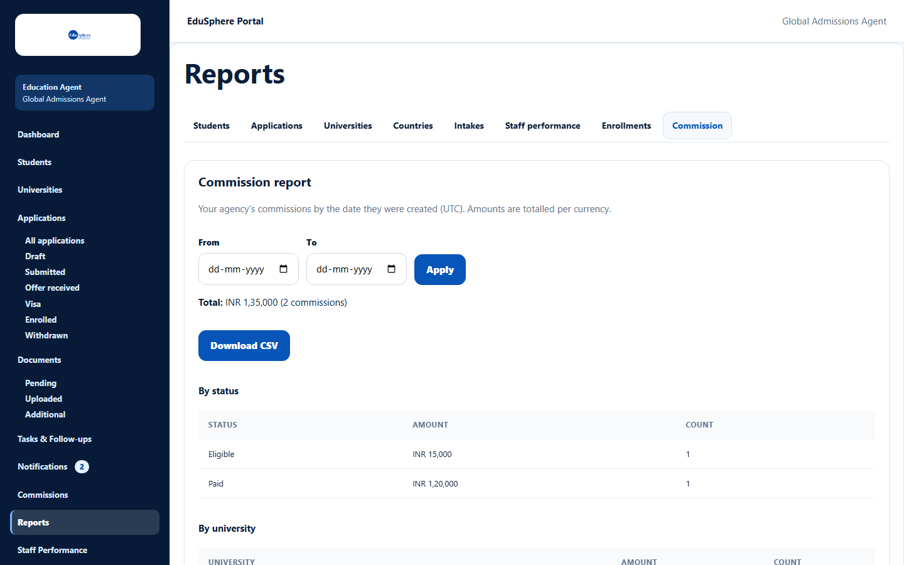

# Commission report

> Doc ID: DOC-RPT-003 · Verified 2026-10-05 against docs commit `717d6aa8` (`main` @ `6a9be770`) · Roles: Agency Master

## Purpose
See your agency's commission totals by status, university, country and intake — always totalled per currency.

## Who Can Use This Feature
**Agency Masters only** (staff never see this tab).

## Prerequisites
At least one commission exists.

## How to Access
Sidebar > **Reports** > **Commission** tab.

## Steps

### Step 1 — Read the report
"Your agency's commissions by the date they were created (UTC). Amounts are totalled per currency." The report shows
a **Total** (for example "INR 1,35,000 (2 commissions)") and tables **By status**, **By university**, **By country**
and **By intake** (Amount, Count).

### Step 2 — Filter and download
Set **From** / **To** and click **Apply**. **Download CSV** saves the report.

## Fields
| Field | Description | Required | Example |
|---|---|---|---|
| From / To | Creation date range of the commissions. | No | 01-04-2026 – 31-03-2027 |

## Expected Result
Totals per currency; amounts in different currencies are never added together.

## Validation Messages
| Message | When |
|---|---|
| No commissions in this period. | Nothing in the date range. |
| Your agency has no commissions yet. | No commissions at all. |

## Common Errors
None observed.

## Tips
- Intakes are grouped exactly as typed (for example "Sep 2027" and "September 2027" appear as two rows).

## Related Features
- [View and claim commissions](../commissions/comm-001-commissions.md)
