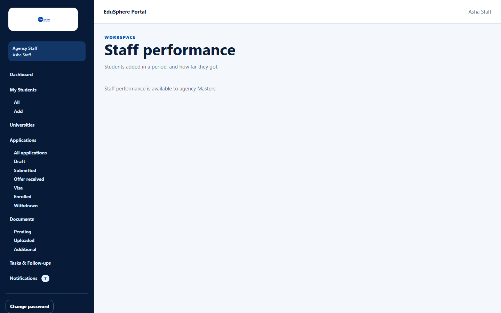
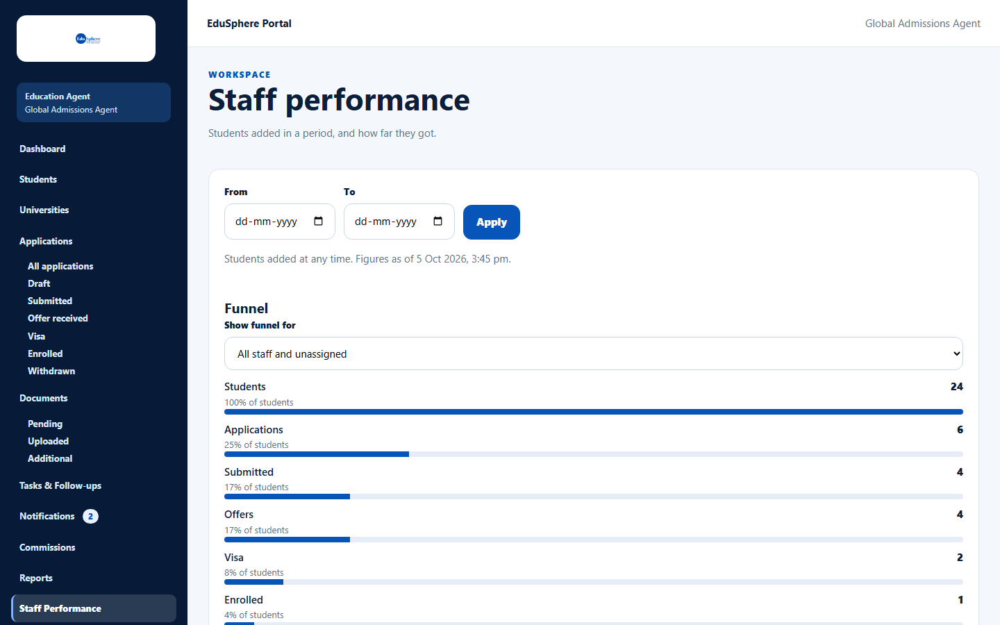
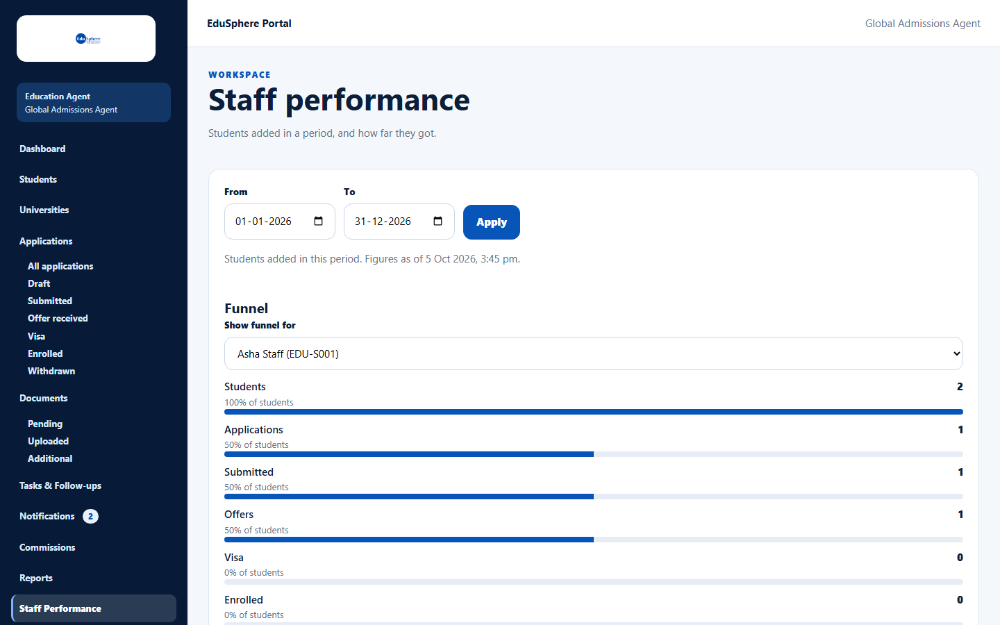
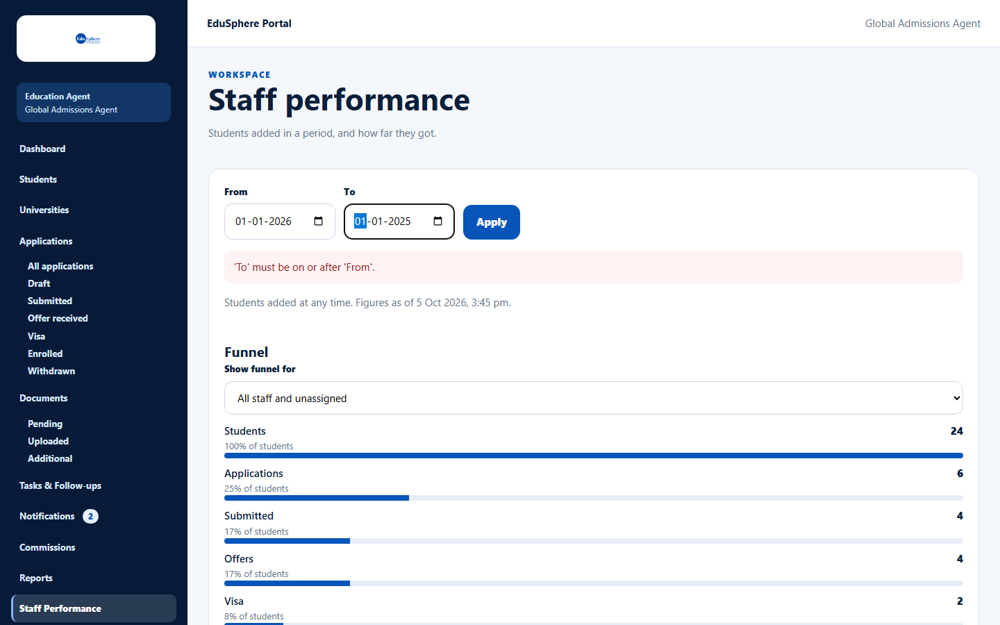

# Staff performance

> Doc ID: DOC-PERF-001 · Verified 2026-10-05 against docs commit `717d6aa8` (`main` @ `6a9be770`) · Roles: Agency Master

## Purpose
Compare how far each staff member's students get — from student record to enrollment — for students added in a
period.

## Who Can Use This Feature
**Agency Masters only.** Staff do not see the link; opening the address shows "Staff performance is available to
agency Masters."

## Prerequisites
None.

## How to Access
Sidebar > **Staff Performance**, or Dashboard > **View staff performance**.

## Steps

### Step 1 — Choose the period (optional)
Enter **From** and/or **To** and click **Apply**. Only students **added** in that period are counted. Without dates the
page says "Students added at any time." and shows "Figures as of {time}".

### Step 2 — Read the funnel
The **Funnel** shows Students → Applications → Submitted → Offers → Visa → Enrolled, each with a count and
"% of students". Use **Show funnel for** to see one staff member or **Unassigned**. The note says "Includes archived
students and withdrawn applications. A student counts at every stage up to the furthest one reached."

### Step 3 — Compare staff
The table **By staff member** lists Students, Applications, Offers, Visa applications, Visa approvals and Enrollments
for each staff member (deactivated people are marked **Deactivated**), plus **Unassigned** and a total.

## Fields
| Field | Description | Required | Example |
|---|---|---|---|
| From / To | Period in which students were added. | No | 01-01-2026 – 31-12-2026 |
| Show funnel for | All staff and unassigned, one staff member, or Unassigned. | No | Asha Staff (EDU-S001) |

## Expected Result
Counts for the chosen period and person.

## Validation Messages
| Message | When |
|---|---|
| 'To' must be on or after 'From'. | The dates are in the wrong order. |
| No students were added in this period. | Nothing in the period. |
| Couldn't load staff performance. | Loading failed; click **Try again**. |

## Common Errors
**Problem:** The funnel's Students figure is higher than the dashboard's Total students.
**Cause:** The funnel includes archived students; the dashboard counts active students only.
**Resolution:** None needed — the figures measure different things.

## Tips
- Use [Staff activity](../team/team-005-staff-activity.md) to see what a person actually did.

## Related Features
- [Agency dashboard (Master)](../dashboard/dash-001-master-dashboard.md)
- [Agency reports](../reports/rpt-001-agency-reports.md)
