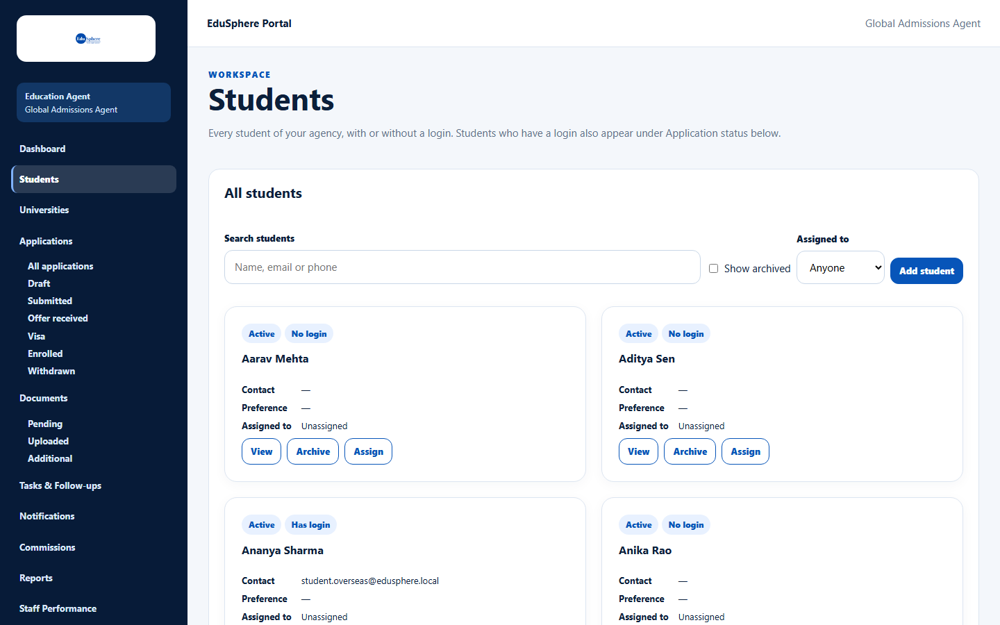
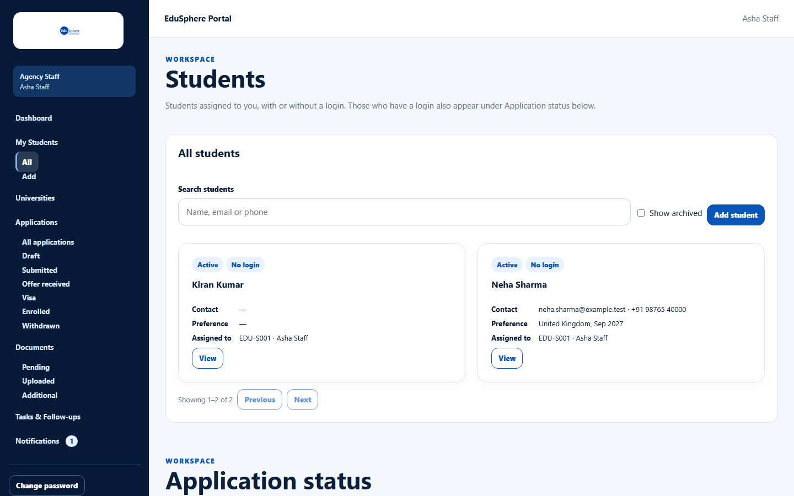
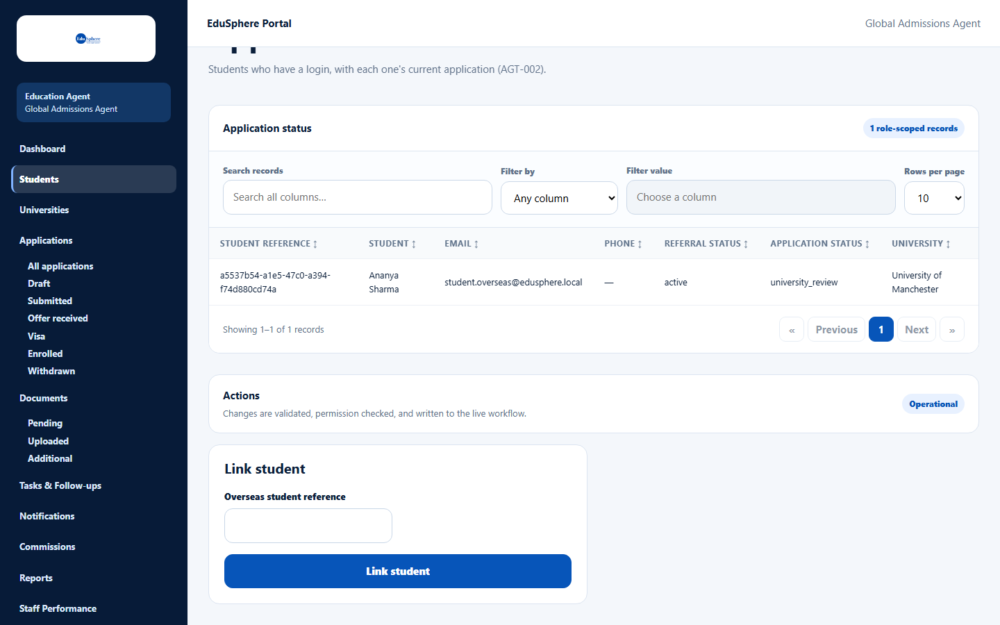
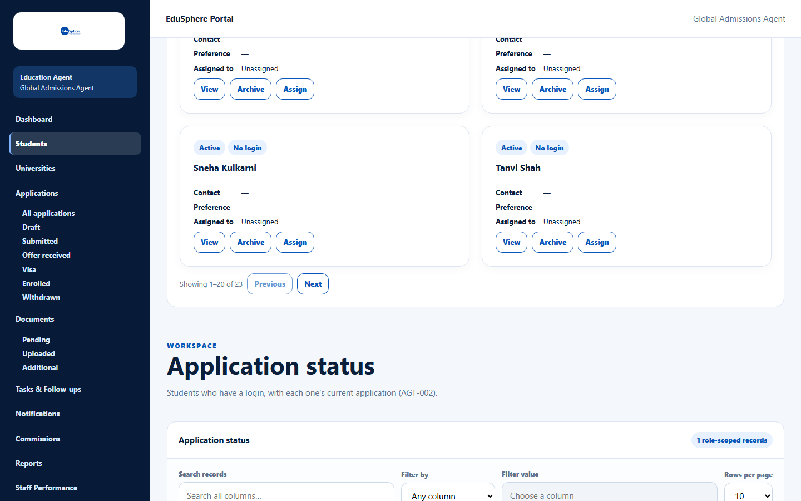

# Find students

> Doc ID: DOC-STU-001 · Verified 2026-10-05 against docs commit `717d6aa8` (`main` @ `6a9be770`) · Roles: Agency Master, Agency Staff

## Purpose
The **Students** page lists your agency's students — both students you recorded yourself (**No login**) and students
who have their own EduSphere account (**Has login**). Use it to find a student and open their record.

## Who Can Use This Feature
- **Agency Master:** every student of the agency.
- **Agency Staff:** only students assigned to them (sidebar shows **My Students**).

## Prerequisites
Your agency is approved.

## How to Access
- Master: Sidebar > **Students**.
- Staff: Sidebar > **My Students** > **All**.

## Steps

### Step 1 — Open the list
The **All students** card shows one card per student with badges (**Active** / **Archived**, **Has login** /
**No login**), **Contact**, **Preference**, **Assigned to**, and buttons **View**, **Archive** and **Assign**
(Archive and Assign are Master-only).

Staff see only their assigned students and no Archive, Assign or "Assigned to" filter:

### Step 2 — Search and filter
- **Search students** — type part of a name, email or phone ("Name, email or phone"). Results update as you type.
- **Show archived** — tick to include archived students.
- **Assigned to** (Master only) — **Anyone** or **Unassigned**.

If nothing matches, the list says **No students match.** — click **Clear filters** to reset.

### Step 3 — Move between pages
The list shows 20 students per page, sorted by name. Use **Previous** / **Next** under the list
("Showing 1–20 of 24").

### Step 4 — Open a student
Click **View** on a card to open the student record above the list (see [View and edit a student](stu-003-view-and-edit-a-student.md)).

## Fields
| Field | Description | Required | Example |
|---|---|---|---|
| Search students | Part of a name, email or phone (up to 100 characters). | No | Neha |
| Show archived | Include archived students. | No | ticked |
| Assigned to | Master only: Anyone / Unassigned. | No | Unassigned |

## Expected Result
The list shows the matching students. Your search, the archived setting and the page are kept in the page address,
so you can bookmark or share the view.

## Validation Messages
| Message | When |
|---|---|
| No students yet. Use Add student to record the first one. | The agency has no students. |
| No students match. | No student matches the search/filter. |
| Unable to load students. | The list could not load; click **Retry**. |

## Common Errors
**Problem:** A staff member cannot find a student.
**Cause:** Staff only see students assigned to them.
**Resolution:** A Master assigns the student to them (see [Assign a student](stu-005-assign-a-student.md)).

## Tips
- Further down the page, **Application status** lists students who have their own EduSphere login together with
  their current application. That table has its own **Search records**, **Filter by**, sortable headings and
  **Rows per page**.

## Related Features
- [Add a student](stu-002-add-a-student.md)
- [Link an existing student account](stu-009-link-a-student-account.md)
