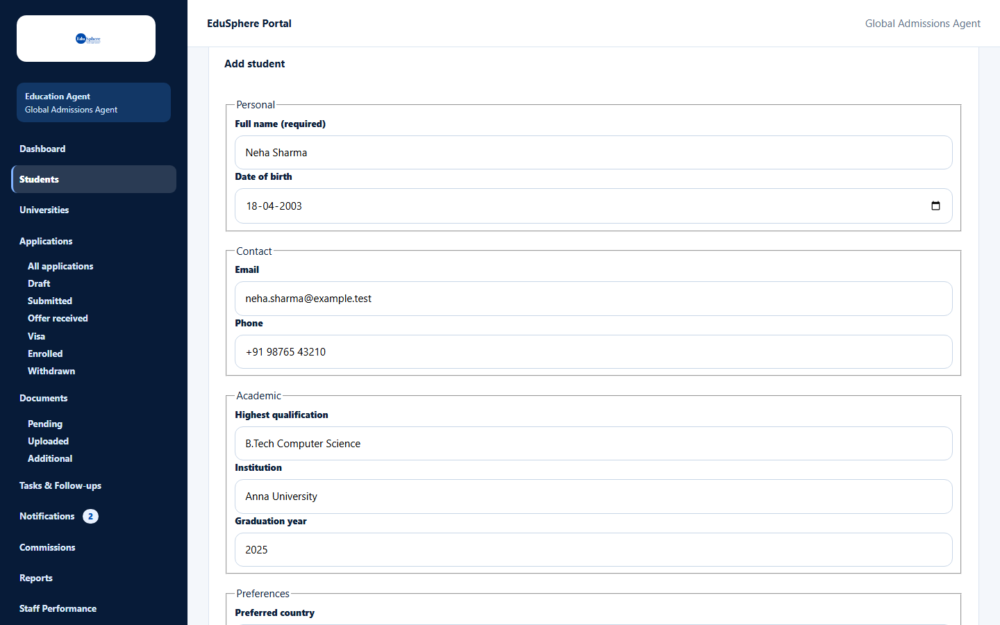
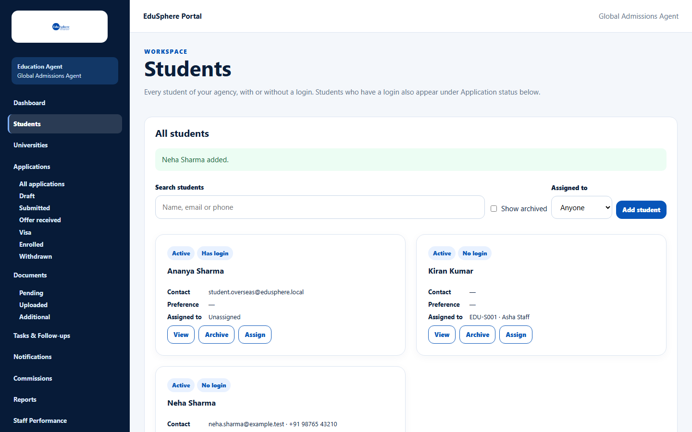
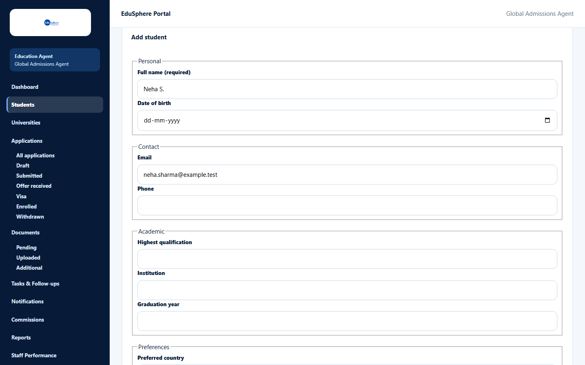
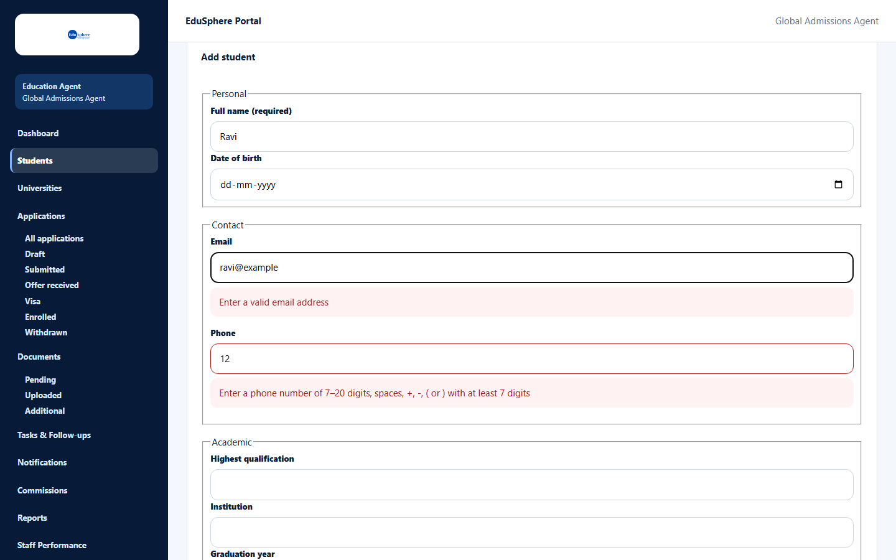

# Add a student

> Doc ID: DOC-STU-002 · Verified 2026-10-05 against docs commit `717d6aa8` (`main` @ `6a9be770`) · Roles: Agency Master, Agency Staff

## Purpose
Record a new student who does not have an EduSphere login. You can then counsel them, build a shortlist, upload
documents and create applications for them.

## Who Can Use This Feature
Agency Masters and Agency Staff. A student added by a **staff member** is automatically assigned to that staff member;
a student added by a **Master** starts **Unassigned**.

## Prerequisites
Your agency is approved.

## How to Access
- Master: Sidebar > **Students** > **Add student**.
- Staff: Sidebar > **My Students** > **Add** (or **Add student** on the page).

## Steps

### Step 1 — Open the form
Click **Add student**. The **Add student** form opens with the sections **Personal**, **Contact**, **Academic** and
**Preferences**, plus **Notes**.

### Step 2 — Fill in the details
Only **Full name** is required. Fill in what you know.

### Step 3 — Save
Click **Save student**. The message **"{name} added."** appears and the student is listed.

### If a possible duplicate is found
If another student in your agency has the same email or phone, the form shows **"A student with this email or phone
already exists in your agency"** and lists the match (for example "Neha Sharma — no login, active, same email").
- Click **Go back** to correct the details, or
- Click **Save anyway** if this really is a different person.

## Fields
| Field | Description | Required | Example |
|---|---|---|---|
| Full name (required) | Student's full name (up to 160 characters). | Yes | Neha Sharma |
| Date of birth | Between 1900 and today. | No | 18/04/2003 |
| Email | A valid email address. | No | neha.sharma@example.test |
| Phone | 7–20 digits; spaces, +, -, ( ) allowed. | No | +91 98765 43210 |
| Highest qualification | Up to 200 characters. | No | B.Tech Computer Science |
| Institution | Up to 200 characters. | No | Anna University |
| Graduation year | From 1950 to six years ahead. | No | 2025 |
| Preferred country | Free text, up to 120 characters. | No | United Kingdom |
| Preferred course | Up to 200 characters. | No | MSc Data Science |
| Preferred intake (e.g. Sep 2027) | Free text, up to 40 characters. | No | Sep 2027 |
| Notes | Up to 2000 characters (a counter shows "n / 2000"). | No | Met at the Chennai education fair. |

## Expected Result
The student appears in the list with the badges **Active** and **No login**, and a student record you can open.

## Validation Messages
| Message | When |
|---|---|
| Full name is required | Full name is empty. |
| Enter a valid email address | The email is not valid. |
| Enter a phone number of 7–20 digits, spaces, +, -, ( or ) with at least 7 digits | The phone number is too short or has other characters. |
| Enter a year from 1950 to 2032 | Graduation year outside the allowed range (the upper year moves each year). |
| Date of birth must be between 1900 and today | Date of birth is in the future or before 1900. |
| Must be N characters or fewer | A field is too long. |

## Common Errors
**Problem:** You click **Cancel** and the browser asks "You have unsaved changes to this student. Leave without saving?"
**Cause:** You typed something into the form.
**Resolution:** Click **OK** to discard, or **Cancel** to keep editing.

**Problem:** "Unable to save this student."
**Cause:** The save failed on the server.
**Resolution:** Try again; if it continues, contact your agency Master or EduSphere.

## Tips
- Add an email or phone number — it helps EduSphere warn you about duplicates.

## Related Features
- [Find students](stu-001-find-students.md)
- [View and edit a student](stu-003-view-and-edit-a-student.md)
- [Assign a student](stu-005-assign-a-student.md)
