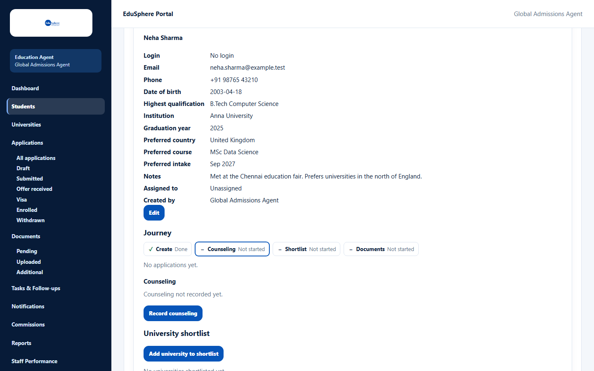
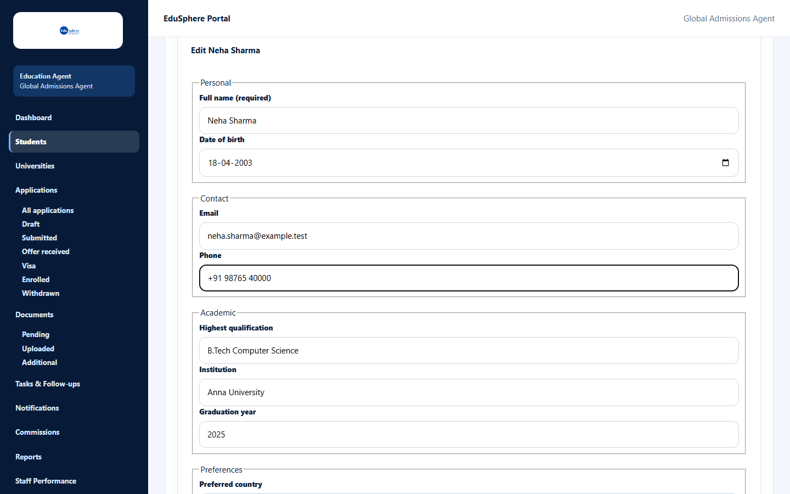
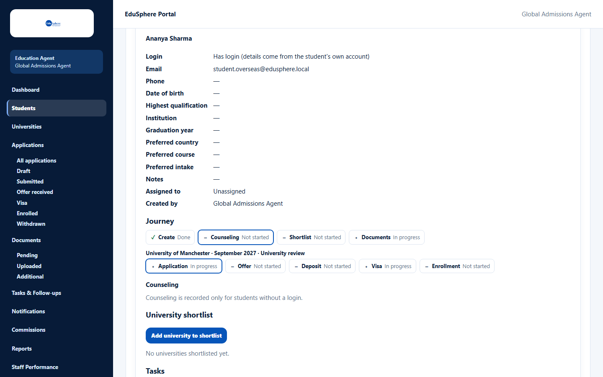

# View and edit a student

> Doc ID: DOC-STU-003 · Verified 2026-10-05 against docs commit `717d6aa8` (`main` @ `6a9be770`) · Roles: Agency Master, Agency Staff

## Purpose
Open a student's full record to see their details and everything your agency has done for them, and correct their
details.

## Who Can Use This Feature
Agency Masters (all students) and Agency Staff (their assigned students).

## Prerequisites
The student exists and is in your scope.

## How to Access
Students > a student's card > **View**.

## Steps

### Step 1 — Open the record
Click **View** on the student's card. The record opens above the list and shows: **Login**, **Email**, **Phone**,
**Date of birth**, **Highest qualification**, **Institution**, **Graduation year**, **Preferred country**,
**Preferred course**, **Preferred intake**, **Notes**, **Assigned to** and **Created by**. Below the details are the
sections **Journey**, **Counseling**, **University shortlist**, **Tasks** and **Show history**.

### Step 2 — Edit the details
1. Click **Edit** (under the details).
2. Change the fields in the form **Edit {name}**.
3. Click **Save changes**. The message "{name} saved." appears.

### Step 3 — Close the record
Click **Close** at the bottom of the record (or press Escape).

## Fields
Same fields as [Add a student](stu-002-add-a-student.md).

## Expected Result
The updated details show in the record and on the student's card. The change is recorded in the student's history.

## Validation Messages
Same as [Add a student](stu-002-add-a-student.md), plus:

| Message | When |
|---|---|
| Linked students are edited in their own account | You tried to edit a student who has their own EduSphere login. |
| Unarchive this student first | The student is archived. |
| This student is no longer available. | The student was archived, reassigned or removed from your scope while you were viewing. |

## Common Errors
**Problem:** There is no **Edit** button.
**Cause:** The student has their own EduSphere login (badge **Has login**) — they keep their own details up to date —
or the student is archived.
**Resolution:** Ask the student to update their profile, or unarchive the student first.

## Tips
- Use **Show history** to see who changed what and when.

## Related Features
- [Record counseling](stu-006-record-counseling.md)
- [Build a university shortlist](stu-007-university-shortlist.md)
- [Journey and history](stu-008-journey-and-history.md)
