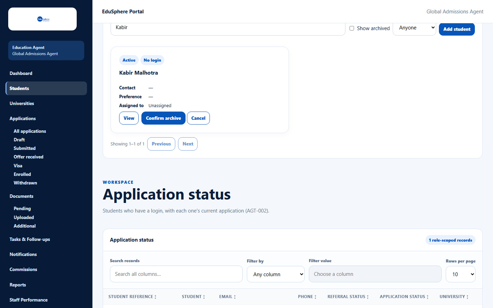
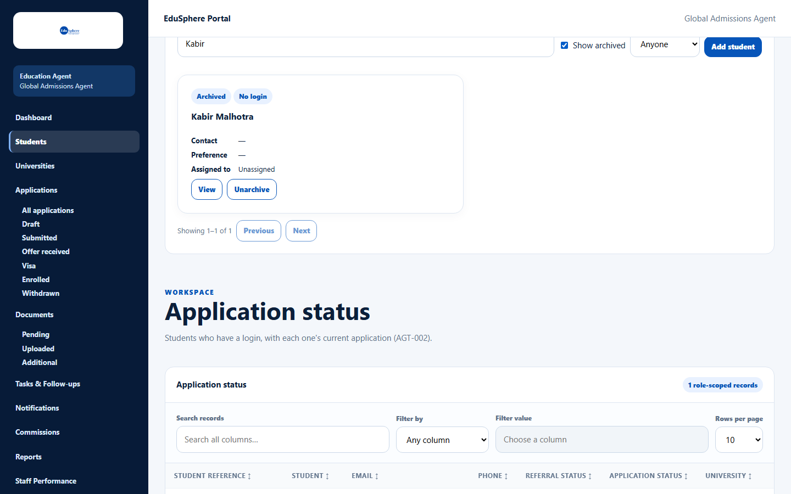

# Archive or unarchive a student

> Doc ID: DOC-STU-004 · Verified 2026-10-05 against docs commit `717d6aa8` (`main` @ `6a9be770`) · Roles: Agency Master

## Purpose
Archive students you are no longer working with. Archived students are hidden from the normal list and become
read-only, but nothing is deleted.

## Who Can Use This Feature
**Agency Masters only.** Staff do not see the Archive button.

## Prerequisites
The student is active.

## How to Access
Students > a student's card > **Archive**.

## Steps

### Step 1 — Archive
1. Click **Archive** on the student's card.
2. Click **Confirm archive** (or **Cancel**).

The message "{name} archived." appears and the student disappears from the normal list.

### Step 2 — See archived students
Tick **Show archived**. Archived students show the badge **Archived** and an **Unarchive** button.

### Step 3 — Unarchive
Click **Unarchive**, then **Confirm unarchive**. The message "{name} restored." appears (from the application code;
not captured in testing).

## Fields
None.

## Expected Result
An archived student's record, shortlist, applications, documents and tasks can be viewed but not changed until the
student is unarchived.

## Validation Messages
| Message | When |
|---|---|
| Already archived / Already active | Someone else already made the change; reload the page. |
| Only an agency Master can archive students | A staff member tried to archive. |

## Common Errors
**Problem:** "Unarchive this student first" when editing a student, application, document or task.
**Cause:** The student is archived.
**Resolution:** A Master unarchives the student.

## Tips
- Archive instead of deleting — the history is kept.

## Related Features
- [Find students](stu-001-find-students.md)
