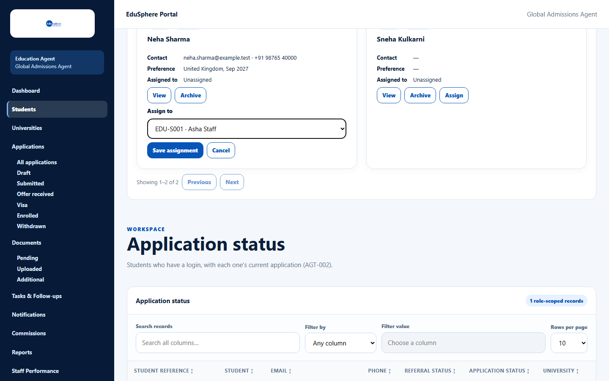
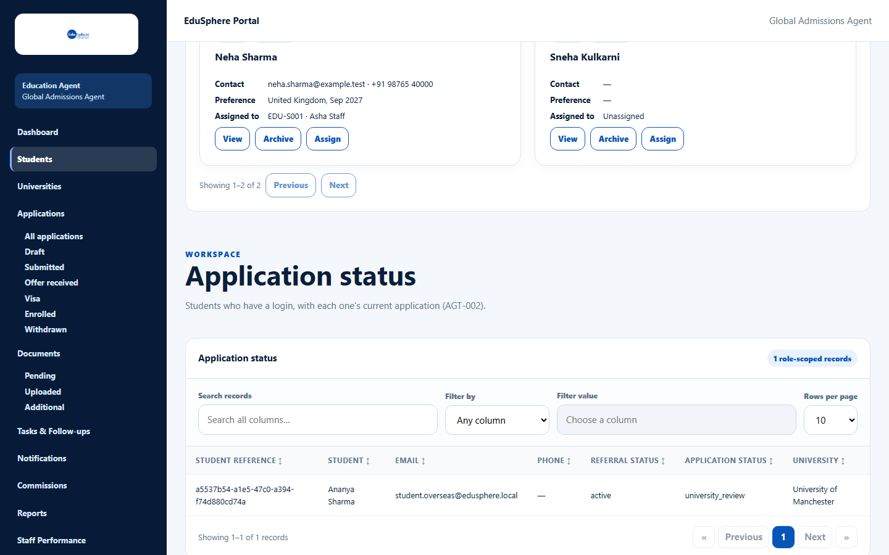

# Assign a student to a staff member

> Doc ID: DOC-STU-005 · Verified 2026-10-05 against docs commit `717d6aa8` (`main` @ `6a9be770`) · Roles: Agency Master

## Purpose
Give a student to a staff member. Staff can only see and work on the students assigned to them.

## Who Can Use This Feature
**Agency Masters only.**

## Prerequisites
- The student is active (not archived).
- The staff member exists and is active (see [Create a staff login](../team/team-002-create-staff.md)).

## How to Access
Students > a student's card > **Assign**.

## Steps

### Step 1 — Choose the staff member
1. Click **Assign** on the student's card.
2. In **Assign to**, choose a staff member (shown as "{code} · {name}", for example "EDU-S001 · Asha Staff") or
   **Unassigned**.

### Step 2 — Save
Click **Save assignment** (it is enabled once you change the choice). The message
**"{student} assigned to {code} · {staff name}."** appears and the card shows the new **Assigned to**.

## Fields
| Field | Description | Required | Example |
|---|---|---|---|
| Assign to | An active staff member, or Unassigned. | Yes | EDU-S001 · Asha Staff |

## Expected Result
- The staff member now sees the student under **My Students** and receives the notification
  "Student assigned to you".
- The student's open tasks move to the new assignee.

## Validation Messages
| Message | When |
|---|---|
| Choose an active Staff member of this agency | The chosen person is not an active staff member. |
| Unarchive this student first | The student is archived. |
| Couldn't load your staff. | The staff list could not load; click **Retry**. |

## Common Errors
**Problem:** A deactivated staff member still shows as assigned.
**Cause:** Deactivating staff does not move their students; in the list they appear as "(deactivated)" and cannot be
chosen again.
**Resolution:** Assign the student to an active staff member.

## Tips
- Staff members who have not set their password yet can already be chosen.

## Related Features
- [Create a staff login](../team/team-002-create-staff.md)
- [Find students](stu-001-find-students.md)
