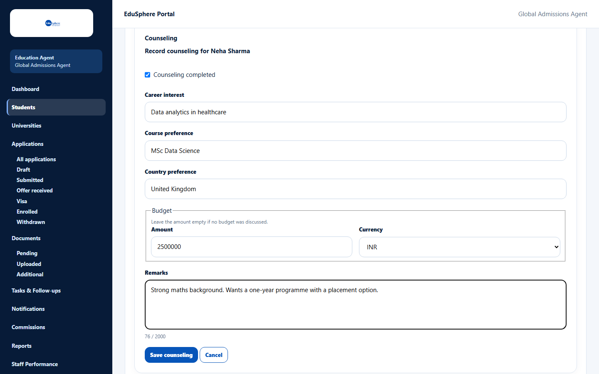
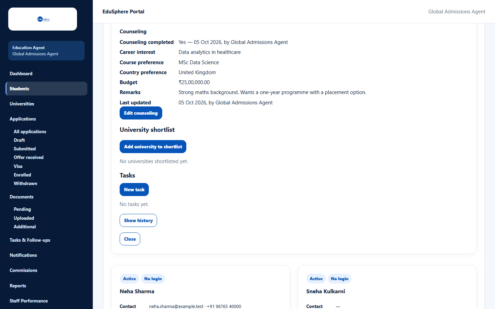
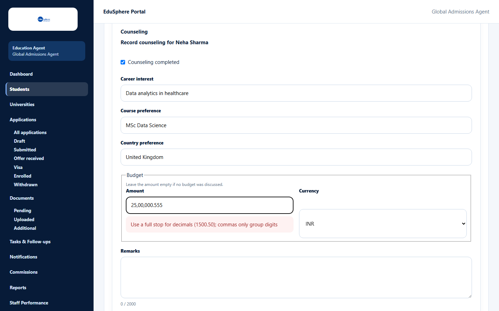

# Record counseling

> Doc ID: DOC-STU-006 · Verified 2026-10-05 against docs commit `717d6aa8` (`main` @ `6a9be770`) · Roles: Agency Master, Agency Staff

## Purpose
Keep a record of your counseling session with a student: their interests, preferences and budget. Completing
counseling also marks the **Counseling** step of the student's journey as done.

## Who Can Use This Feature
Agency Masters and Agency Staff (for their assigned students).

## Prerequisites
The student is active and has **no** EduSphere login ("Counseling is recorded only for students without a login.").

## How to Access
Students > **View** on the student > **Counseling** > **Record counseling** (or **Edit counseling**).

## Steps

### Step 1 — Open the form
Click **Record counseling**. The form **Record counseling for {name}** opens.

### Step 2 — Fill in the counseling details
Tick **Counseling completed** when the session is done, and fill in the other fields.

### Step 3 — Save
Click **Save counseling**. The message "Counseling saved for {name}." appears and the section shows what you
recorded, including "Counseling completed — Yes — {date}, by {name}" and **Last updated**.

## Fields
| Field | Description | Required | Example |
|---|---|---|---|
| Counseling completed | Tick when the counseling session is finished. | No | ticked |
| Career interest | Up to 200 characters. | No | Data analytics in healthcare |
| Course preference | Up to 200 characters. | No | MSc Data Science |
| Country preference | Up to 120 characters. | No | United Kingdom |
| Budget — Amount | Leave empty if no budget was discussed. Use a full stop for decimals; commas only group digits. Up to 99,999,999.99. | No | 2500000 |
| Budget — Currency | INR, USD, GBP, EUR, CAD, AUD or NZD (default INR). | With an amount | INR |
| Remarks | Up to 2000 characters. | No | Strong maths background. |

## Expected Result
The counseling record is saved and shown in the student's record; the journey shows **Counseling Done** when
"Counseling completed" is ticked.

## Validation Messages
| Message | When |
|---|---|
| Use a full stop for decimals (1500.50); commas only group digits | The amount is written with a comma as decimal point or has more than two decimals. |
| Budget cannot be negative | The amount is below zero. |
| Enter an amount up to 99,999,999.99 with at most 2 decimals | The amount is too large. |

## Common Errors
**Problem:** No **Record counseling** button.
**Cause:** The student has their own EduSphere login, or is archived.
**Resolution:** Counseling is only recorded for students without a login; unarchive archived students first.

## Tips
- Amounts like 25,00,000 are fine (commas group digits); write decimals with a full stop.

## Related Features
- [Journey and history](stu-008-journey-and-history.md)
- [Build a university shortlist](stu-007-university-shortlist.md)
