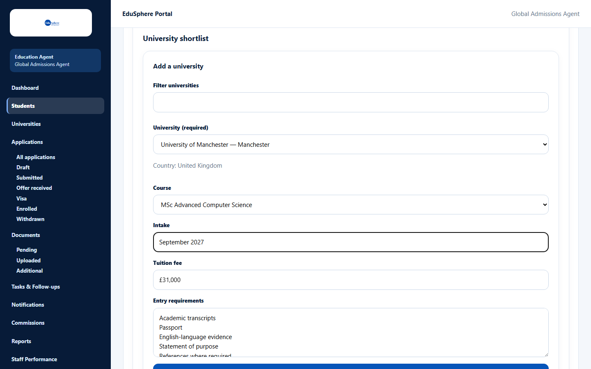
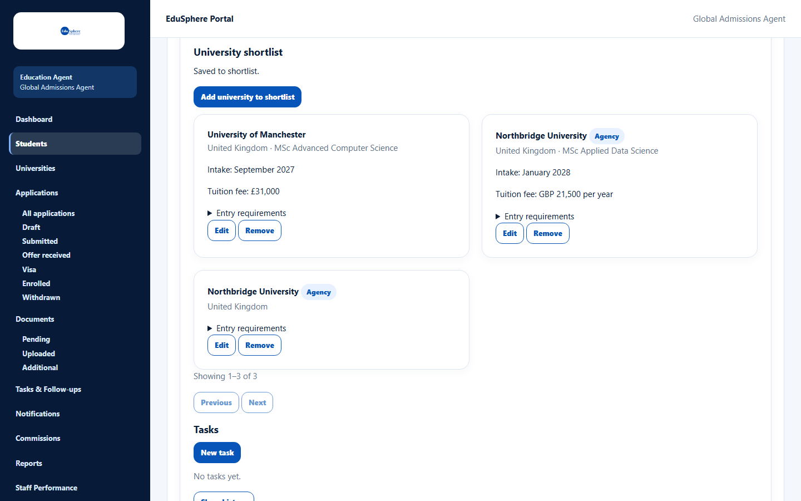
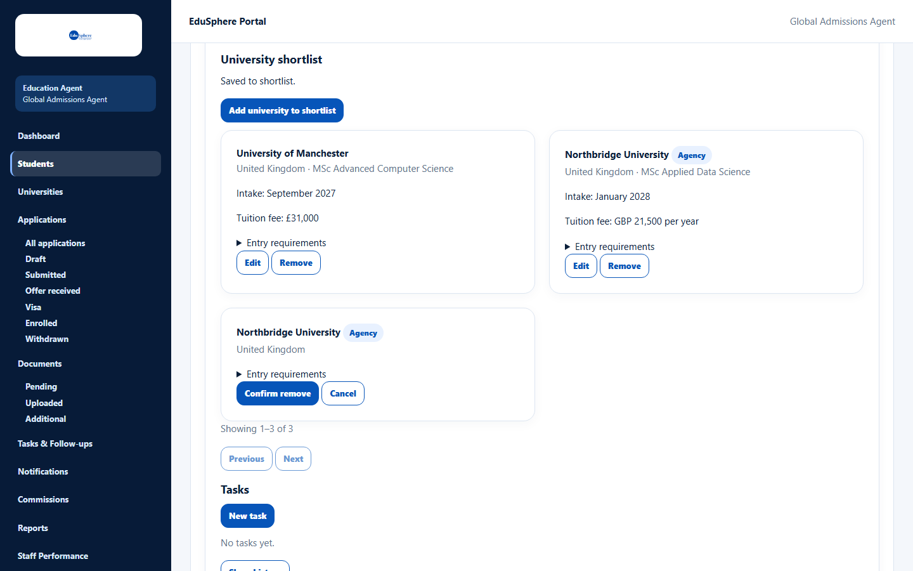

# Build a university shortlist

> Doc ID: DOC-STU-007 · Verified 2026-10-05 against docs commit `717d6aa8` (`main` @ `6a9be770`) · Roles: Agency Master, Agency Staff

## Purpose
Keep a list of universities and courses a student is considering, with intake, tuition fee and entry requirements.

## Who Can Use This Feature
Agency Masters and Agency Staff (for their assigned students).

## Prerequisites
- The student is active.
- Universities come from the EduSphere **catalogue** or from your agency's own list (see
  [Agency universities](../universities/uni-001-agency-universities.md)).

## How to Access
Students > **View** on the student > **University shortlist** > **Add university to shortlist**.

## Steps

### Step 1 — Choose a university and course
1. Click **Add university to shortlist**.
2. Optional: type in **Filter universities** to narrow the list.
3. Choose a **University (required)**. Catalogue universities are listed with their city; your agency's own
   universities are listed separately.
4. For a catalogue university, choose a **Course** from the catalogue (or "— No course —", or
   "Other (type a course)"). For an agency university, type the course.

### Step 2 — Check intake, fee and requirements
**Intake**, **Tuition fee** and **Entry requirements** are filled in from the catalogue course or the agency university
where available. Change them if needed.

### Step 3 — Save
Click **Save to shortlist**. The message "Saved to shortlist." appears and a card is added. Agency universities carry
the badge **Agency**.

### Step 4 — Edit or remove an entry
- **Edit** opens the same form for that entry.
- **Remove** asks for confirmation; click **Confirm remove**. The message "{university} removed from the shortlist."
  appears.

## Fields
| Field | Description | Required | Example |
|---|---|---|---|
| Filter universities | Narrows the university list. | No | Manch |
| University (required) | A catalogue university or one of your agency's universities. | Yes | University of Manchester — Manchester |
| Course | Catalogue course, "Other (type a course)", or typed course for agency universities (up to 200 characters). | No | MSc Advanced Computer Science |
| Intake | Up to 120 characters. | No | September 2027 |
| Tuition fee | Free text, up to 120 characters. | No | GBP 21,500 per year |
| Entry requirements | Up to 2000 characters. | No | IELTS 6.5 overall |

## Expected Result
The shortlist shows up to 20 entries per page (oldest first) and the journey's **Shortlist** step shows **Done**.

## Validation Messages
| Message | When |
|---|---|
| Choose a university. | No university was chosen. |
| This student's shortlist is full (50 entries) | The student already has 50 entries. |
| Course does not belong to selected university | The course belongs to another university. |
| This entry was removed by someone else. | The entry was removed in another window. |
| This student is archived; the shortlist is read-only. | The student is archived. |

## Common Errors
**Problem:** The same university appears twice.
**Cause:** EduSphere allows the same university more than once (for example for two courses).
**Resolution:** Remove the entry you do not need.

## Tips
- Add your agency's partner universities once on the **Universities** page; everyone in the agency can then pick them.

## Related Features
- [Agency universities](../universities/uni-001-agency-universities.md)
- [Journey and history](stu-008-journey-and-history.md)
