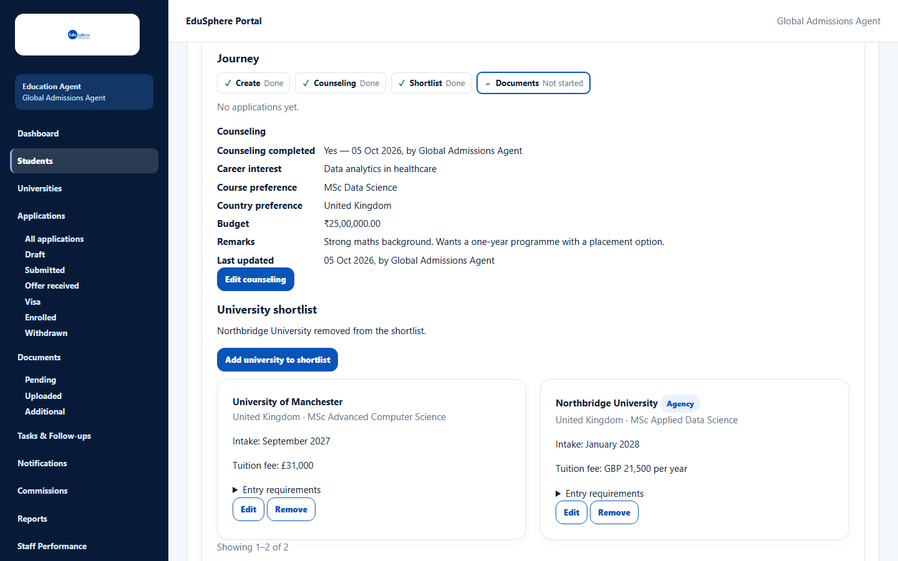
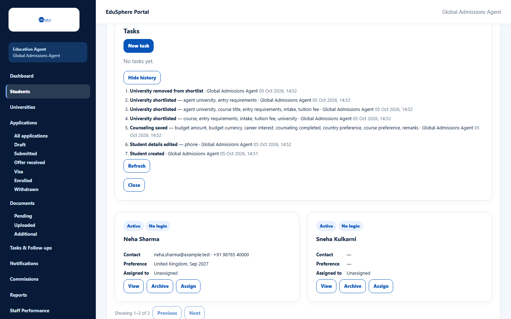

# Journey and history

> Doc ID: DOC-STU-008 · Partly verified 2026-10-05 against docs commit `717d6aa8` (`main` @ `6a9be770`) · Roles: Agency Master, Agency Staff

## Purpose
See at a glance how far a student has progressed (the **Journey**), and look back at every recorded change (the
**History**).

## Who Can Use This Feature
Agency Masters and Agency Staff (for their assigned students).

## Prerequisites
The student exists and is in your scope.

## How to Access
Students > **View** on the student > **Journey** (always shown) and **Show history**.

## Steps

### Step 1 — Read the journey
The Journey shows a row of steps, each with a status. Before any application exists it shows **Create**,
**Counseling**, **Shortlist** and **Documents**, plus "No applications yet."

| Status | Meaning |
|---|---|
| Done ✓ | The step is complete. |
| Not started | Nothing recorded for this step yet. |
| In progress, Not required, Refunded, Refused, Withdrawn | Used by the later application steps. |

Once the student has applications, the journey repeats the steps up to **Enrollment** (Application, Offer, Deposit,
Visa, Enrollment) for each application. — VERIFICATION REQUIRED (shown in the Applications session).

### Step 2 — Show the history
Click **Show history**. A numbered list shows the newest changes first. Each entry names the event (for example
"Student created", "Student details edited — phone", "Counseling saved", "University shortlisted",
"University removed from shortlist"), who did it and when. Use **Refresh** to reload and **Hide history** to close it.

## Fields
None.

## Expected Result
You can see the student's current position and a full record of changes.

## Validation Messages
| Message | When |
|---|---|
| No history yet. | Nothing has been recorded. |
| Unable to load the journey. / Unable to load history. | The section could not load; click **Try again**. |

## Common Errors
None observed.

## Tips
- The history shows 20 entries per page; use **Previous** / **Next** for older entries.

## Related Features
- [Record counseling](stu-006-record-counseling.md)
- [Build a university shortlist](stu-007-university-shortlist.md)
