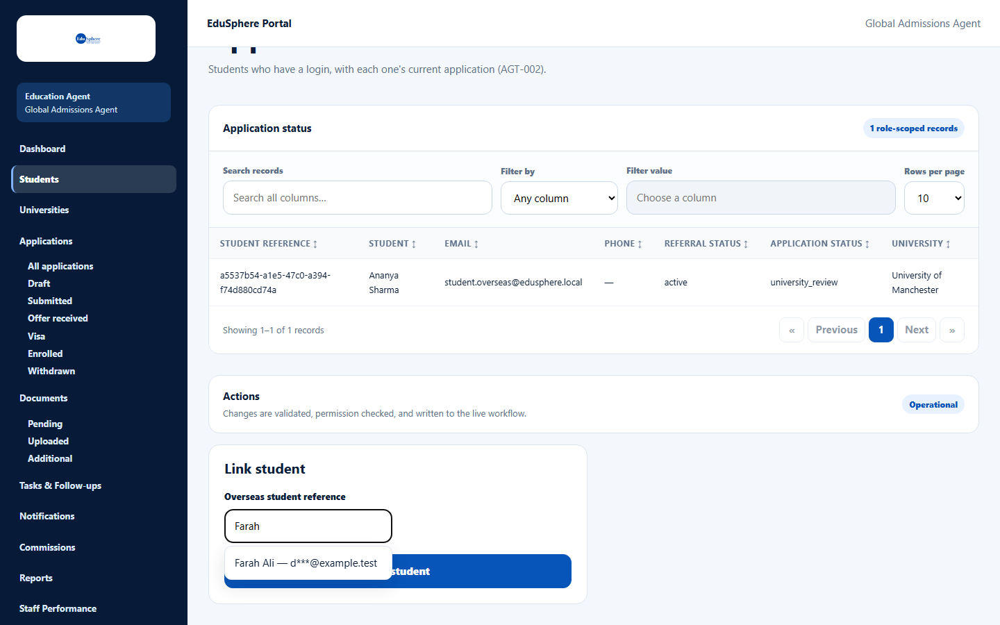
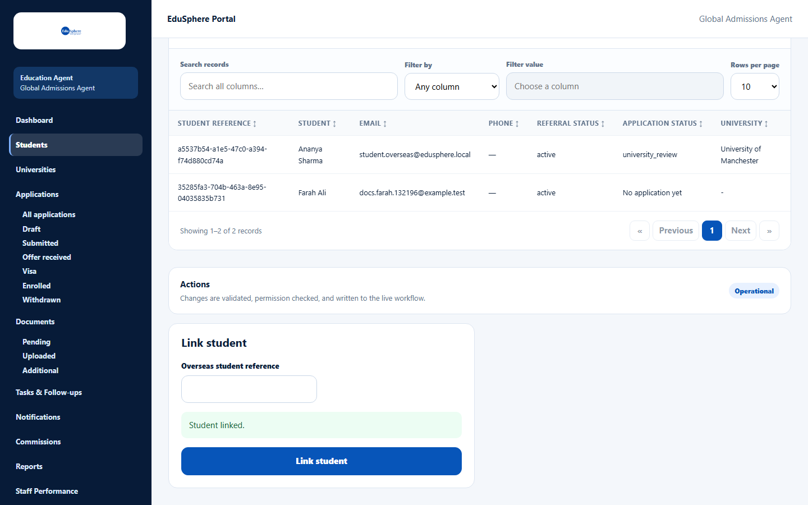
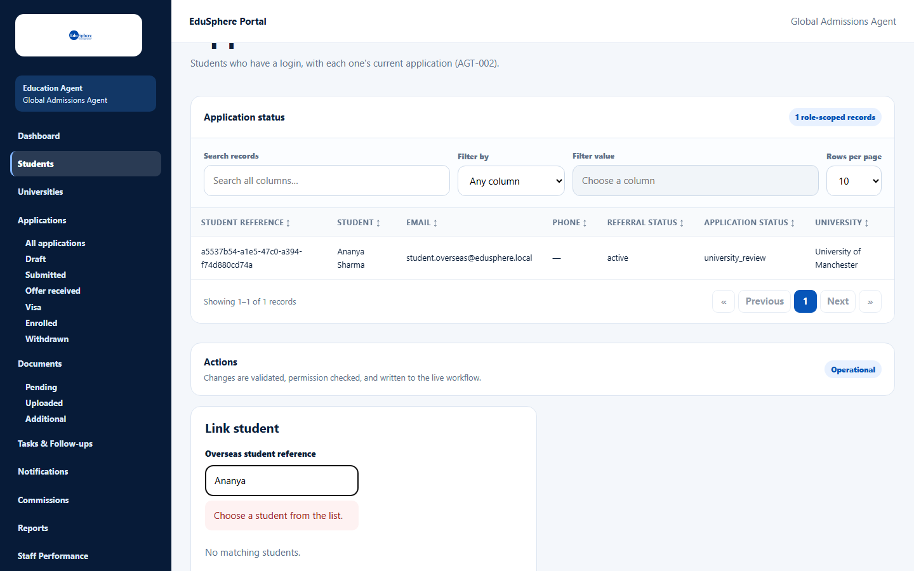

# Link an existing student account

> Doc ID: DOC-STU-009 · Verified 2026-10-05 against docs commit `717d6aa8` (`main` @ `6a9be770`) · Roles: Agency Master, Agency Staff

## Purpose
Some students create their own EduSphere Overseas account. **Link student** connects such an account to your agency,
so the student appears in your list with the badge **Has login**.

Use **Add student** instead when the student has no EduSphere account — see [Add a student](stu-002-add-a-student.md).

## Who Can Use This Feature
Agency Masters and Agency Staff.

## Prerequisites
The student has registered on EduSphere with Account type **Student** and is not yet linked to your agency.

## How to Access
Students page > scroll to **Actions** > **Link student**.

## Steps

### Step 1 — Find the student
In **Overseas student reference**, type the student's name. Matching students are suggested as
"{name} — {masked email}" (for example "Farah Ali — d***@example.test"). Students already linked to your agency are
not offered.

### Step 2 — Link
Choose the student from the suggestions and click **Link student**. The message **Student linked.** appears.

## Fields
| Field | Description | Required | Example |
|---|---|---|---|
| Overseas student reference | Type a name and choose the student from the list. | Yes | Farah Ali |

## Expected Result
The student appears in **All students** with **Has login**, and in the **Application status** table.

## Validation Messages
| Message | When |
|---|---|
| Choose a student from the list. | You typed a name but did not pick a suggestion (or there is no match). |
| No matching students. | No unlinked student matches what you typed. |
| Student is already linked to this agency | The student is already yours. |
| This student is archived — unarchive them first | The student is archived in your agency. |

## Common Errors
**Problem:** The student does not appear in the suggestions.
**Cause:** They have not registered as a student, or they are already linked to your agency.
**Resolution:** Check the **All students** list; otherwise use **Add student**.

## Tips
- Students with a login keep their own details up to date; you cannot edit them from your agency.

## Related Features
- [Find students](stu-001-find-students.md)
- [Add a student](stu-002-add-a-student.md)
