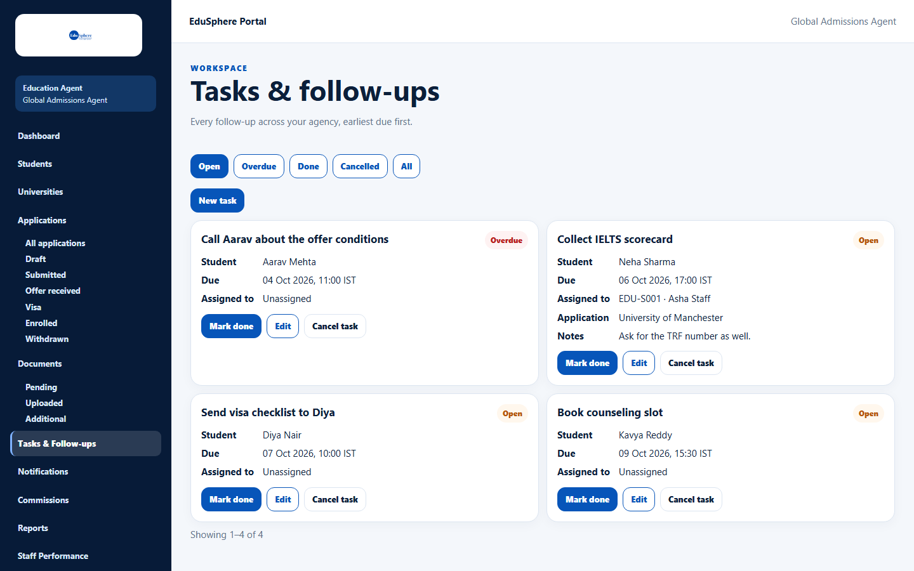
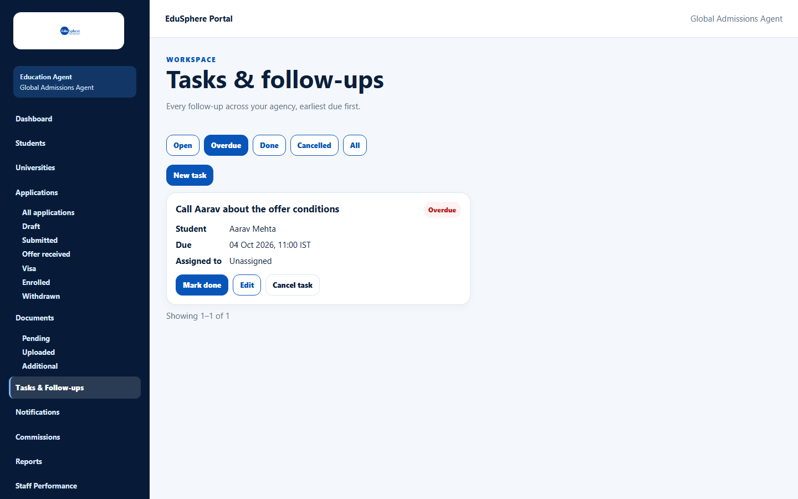
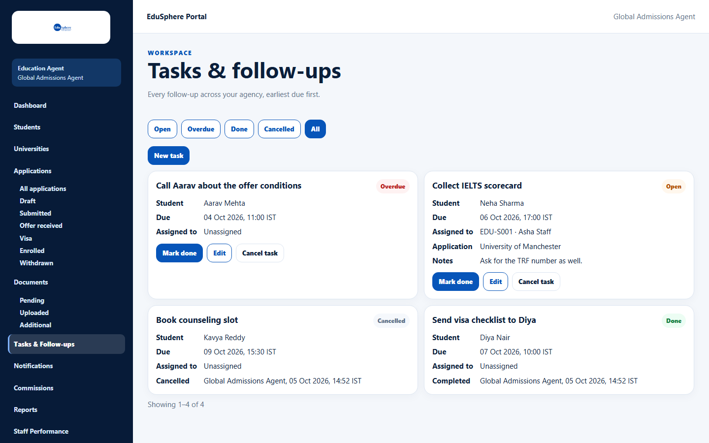
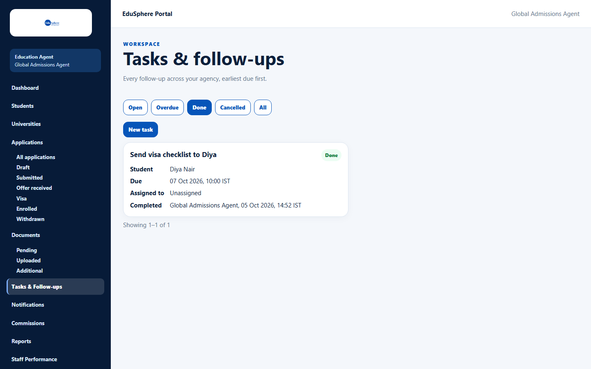
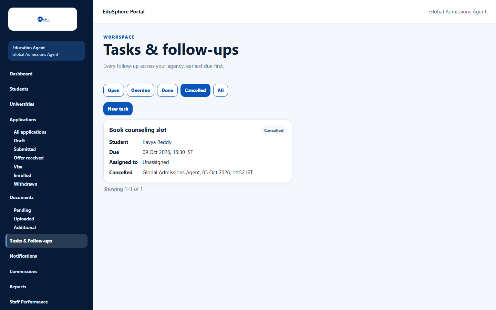
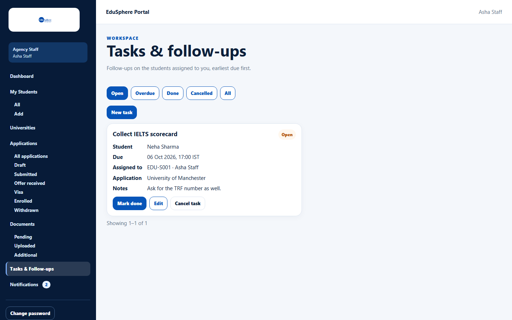

# View tasks and follow-ups

> Doc ID: DOC-TASK-001 · Verified 2026-10-05 against docs commit `717d6aa8` (`main` @ `6a9be770`) · Roles: Agency Master, Agency Staff

## Purpose
See the follow-ups your agency must do for its students — what is due, what is overdue and what is finished.

## Who Can Use This Feature
- **Agency Master:** "Every follow-up across your agency, earliest due first."
- **Agency Staff:** "Follow-ups on the students assigned to you, earliest due first."

## Prerequisites
None.

## How to Access
Sidebar > **Tasks & Follow-ups** (the dashboard's **Open tasks** link opens the same page). Tasks for one student also
appear in that student's record under **Tasks**.

## Steps

### Step 1 — Choose a view
Use the view links **Open**, **Overdue**, **Done**, **Cancelled** and **All** (Open is the default).

### Step 2 — Read the task cards
Each card shows the title and a badge (**Open**, red **Overdue**, **Done** or **Cancelled**), **Student**, **Due**,
**Assigned to**, and when set **Application** and **Notes**. Closed tasks also show who completed or cancelled them
and when.

## Fields
None.

## Expected Result
| View | Shows | Order |
|---|---|---|
| Open | Tasks not yet done or cancelled | Earliest due first |
| Overdue | Open tasks whose due time has passed | Earliest due first |
| Done / Cancelled | Closed tasks | Most recently closed first |
| All | Open tasks, then closed ones | — |

20 tasks per page with **Previous** / **Next**.

## Validation Messages
| Message | When |
|---|---|
| No open tasks. / Nothing overdue. / No completed tasks yet. / No cancelled tasks. / No tasks yet. | The view is empty. |
| Unable to load tasks. | Click **Retry**. |

## Common Errors
**Problem:** "Assigned to" shows **Unassigned** although someone is working on it.
**Cause:** A task follows its **student's** assignee — tasks have no assignee of their own.
**Resolution:** Assign the student to a staff member (see [Assign a student](../students/stu-005-assign-a-student.md)).

## Tips
- Staff see only tasks of their assigned students:

## Related Features
- [Add, edit, complete or cancel a task](task-002-manage-a-task.md)
