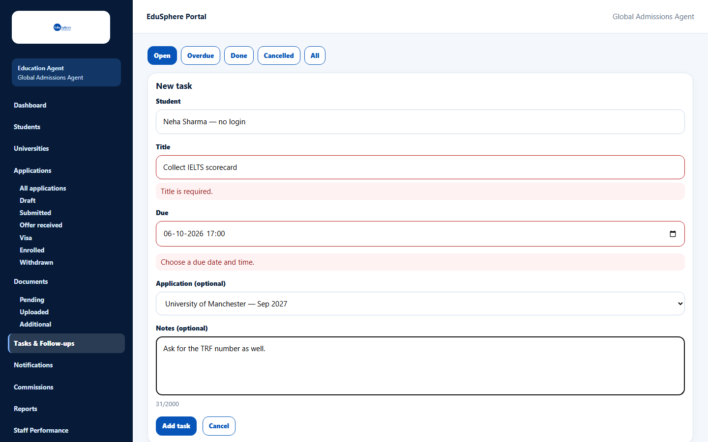
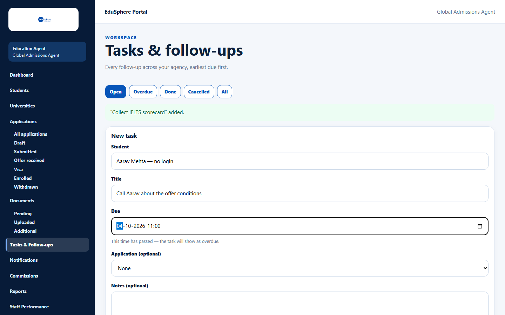
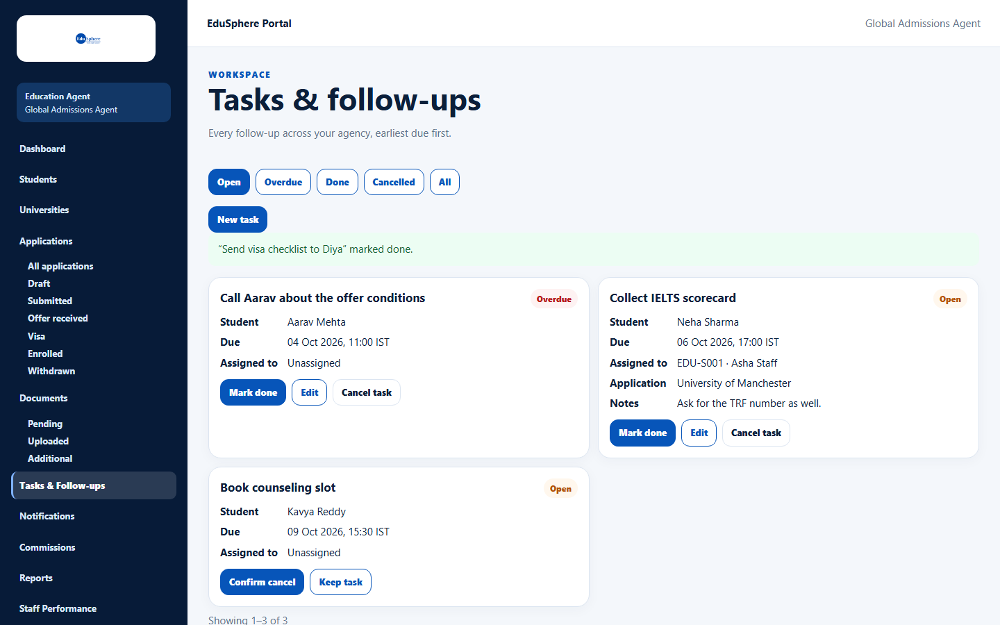
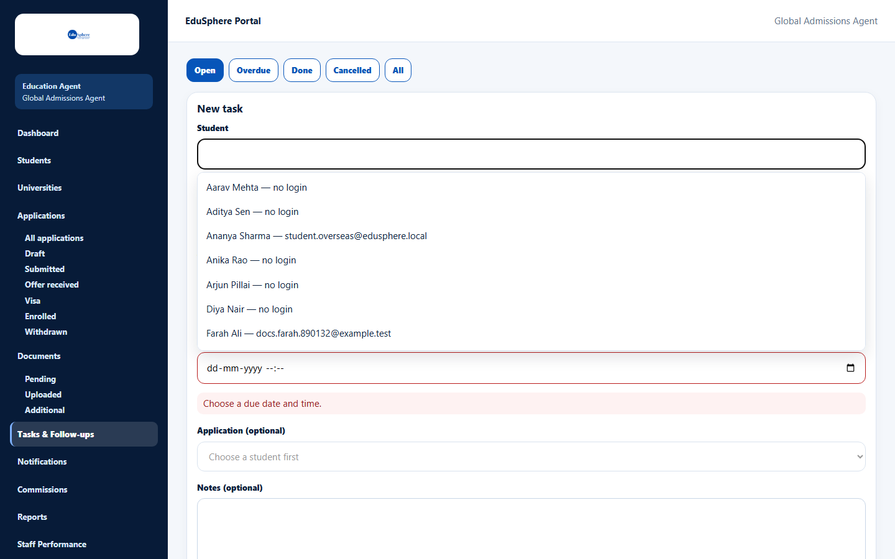

# Add, edit, complete or cancel a task

> Doc ID: DOC-TASK-002 · Verified 2026-10-05 against docs commit `717d6aa8` (`main` @ `6a9be770`) · Roles: Agency Master, Agency Staff

## Purpose
Create follow-up reminders for a student (optionally tied to one application) and close them when done.

## Who Can Use This Feature
Agency Masters and Agency Staff (staff: their assigned students only).

## Prerequisites
The student is active (not archived).

## How to Access
Sidebar > **Tasks & Follow-ups** > **New task** (also **New task** in a student's record).

## Steps

### Step 1 — Add a task
1. Click **New task**.
2. In **Student**, type and choose the student.
3. Enter a **Title** and the **Due** date and time.
4. Optional: choose an **Application (optional)** of that student and add **Notes (optional)**.
5. Click **Add task**. The message "“{title}” added." appears.

If the due time is already past, the form warns "This time has passed — the task will show as overdue." — you can
still save it.

### Step 2 — Complete a task
Click **Mark done** on the card. The message "“{title}” marked done." appears and the task moves to **Done**.

### Step 3 — Cancel a task
Click **Cancel task**, then **Confirm cancel** (or **Keep task**). The message "“{title}” cancelled." appears.

### Step 4 — Edit a task
Click **Edit** on an open task, change the title, due time, application or notes and save. The student cannot be
changed. (Edit was not exercised in testing — VERIFICATION REQUIRED for the exact save message.)

## Fields
| Field | Description | Required | Example |
|---|---|---|---|
| Student | The student the task is about; fixed after creation. | Yes | Neha Sharma — no login |
| Title | Up to 200 characters. | Yes | Collect IELTS scorecard |
| Due | Date and time. | Yes | 06-10-2026 17:00 |
| Application (optional) | One of the student's applications ("Choose a student first" until a student is chosen). | No | University of Manchester |
| Notes (optional) | Up to 2000 characters. | No | Ask for the TRF number as well. |

## Expected Result
The task appears in **Open** (or **Overdue**), on the student's record, and the student's assignee (or the Masters,
if unassigned) is notified "New task".

## Validation Messages
| Message | When |
|---|---|
| Choose a student from the list. Keep typing to narrow the list. | No student was chosen. |
| Title is required. | Title is empty. |
| Choose a due date and time. | Due is empty. |
| This student already has 100 open tasks. Complete or cancel some first. | Limit of open tasks per student. |
| This task is closed | You tried to change a done or cancelled task. |

## Common Errors
**Problem:** "The student is archived, so this task is read-only."
**Cause:** The student was archived.
**Resolution:** A Master unarchives the student.

## Tips
- Done and cancelled tasks cannot be reopened; create a new task instead.

## Related Features
- [View tasks and follow-ups](task-001-view-tasks.md)
- [Assign a student](../students/stu-005-assign-a-student.md)
