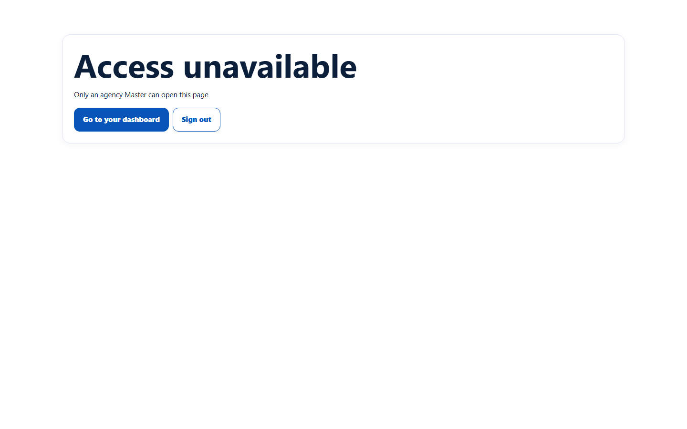
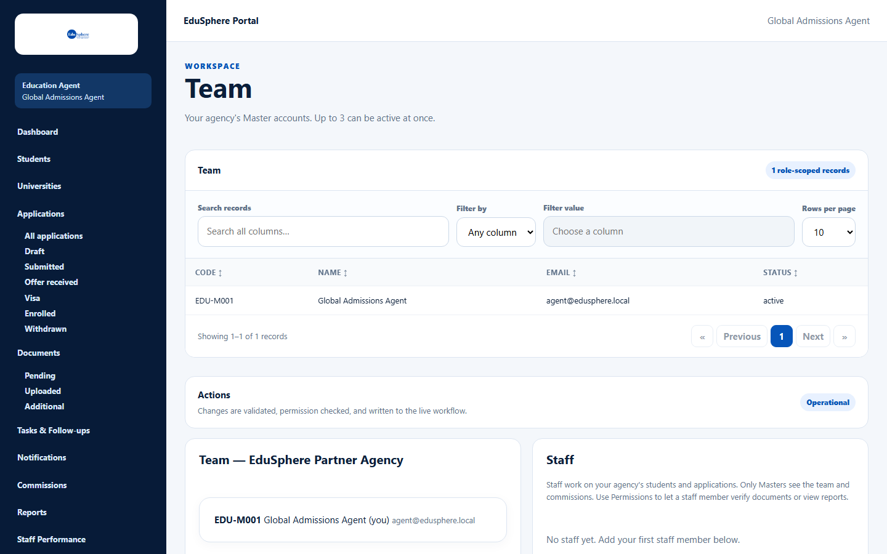
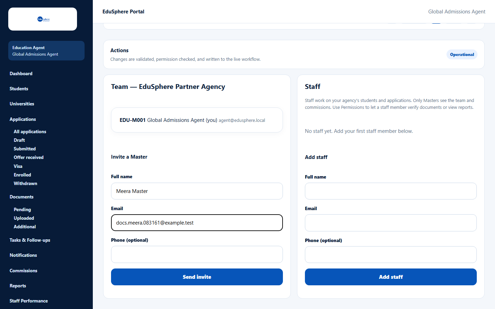
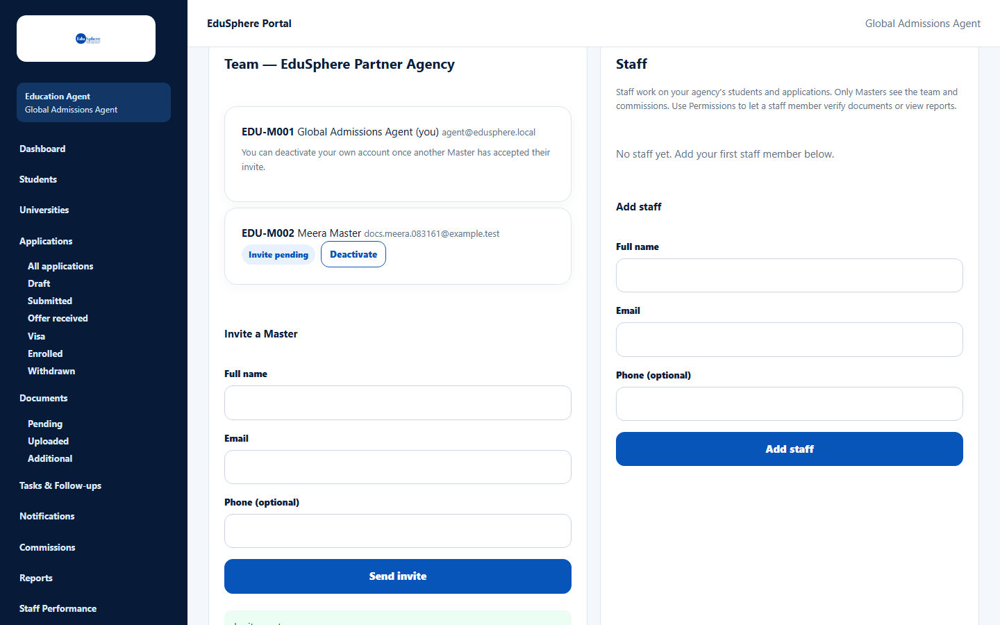
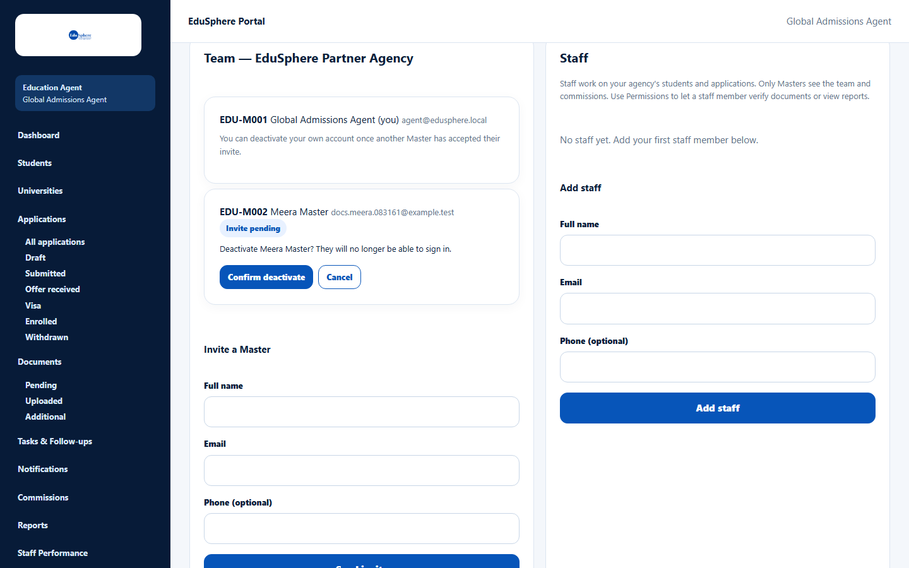

# Invite or deactivate a Master

> Doc ID: DOC-TEAM-001 · Verified 2026-10-05 against docs commit `717d6aa8` (`main` @ `6a9be770`) · Roles: Agency Master

## Purpose
An agency can have up to **3 active Masters** (owners/managers). Use the Team page to invite another Master or to
deactivate one who should no longer have access.

## Who Can Use This Feature
**Agency Masters only.** Staff do not see **Team** in the sidebar; if they open the page by its address they see
"Access unavailable — Only an agency Master can open this page".

## Prerequisites
- Your agency is approved.
- The new Master's email is not used by another EduSphere account.

## How to Access
Sidebar > **Team**.

## Steps

### Step 1 — Open Team
Click **Team** in the sidebar. The top of the page lists your agency's Masters in a table (Code, Name, Email, Status)
with **Search records**, **Filter by**, sortable column headings and **Rows per page**. Below it, the card
**Team — {your agency}** shows each Master with actions, and the **Staff** card lists your staff.

### Step 2 — Invite a Master
1. In **Invite a Master**, enter **Full name**, **Email** and (optionally) **Phone**.
2. Click **Send invite**.

The message **Invite sent.** appears. The new Master is listed with the badge **Invite pending** and a code such as
`EDU-M002`. They receive an email "Welcome to EduSphere -- set your password" with a link valid for 72 hours.

### Step 3 — Deactivate a Master (when needed)
1. Click **Deactivate** on the Master's card.
2. Read the confirmation and click **Confirm deactivate** (or **Cancel**).

The Master can no longer sign in. To deactivate **your own** account, another Master must first have accepted their
invite ("You can deactivate your own account once another Master has accepted their invite."). Deactivating yourself
signs you out.

## Fields
| Field | Description | Required | Example |
|---|---|---|---|
| Full name | The new Master's name (up to 160 characters). | Yes | Meera Master |
| Email | Their sign-in email (must be unused). | Yes | meera@agency.example |
| Phone (optional) | Contact number (up to 40 characters). | No | +91 90000 33333 |

## Expected Result
The invited Master sets a password from the email and signs in with full Master access to your agency.

## Validation Messages
| Message | When |
|---|---|
| Email already exists | Another EduSphere account uses this email. |
| Limit reached: 3 active Masters. Deactivate one to invite another. | Shown as a note when your agency has 3 active Masters; **Send invite** is disabled (from the application code). |
| This agency already has 3 active Masters | The server refuses an invite over the limit. |
| This agency has made 10 invite attempts in the last 24 hours. Try again later. | Too many invites in one day. |
| An agency must keep at least one active Master | You tried to deactivate the last active Master. |
| Invite created, but the email was not delivered. Ask Overseas Admin to re-send the link. | The invitation email could not be sent. |

## Common Errors
**Problem:** The invited Master never received the email.
**Cause:** Spam filtering, a mistyped address, or the email could not be sent.
**Resolution:** Ask them to check spam. An Overseas Admin can re-send the link (see the admin manual: Re-send a
set-password link).

## Tips
- Invite a second Master early so the agency is never locked out if one person leaves.

## Related Features
- [Create a staff login](team-002-create-staff.md)
- [Reset your password](../account-access/auth-004-reset-password.md)
