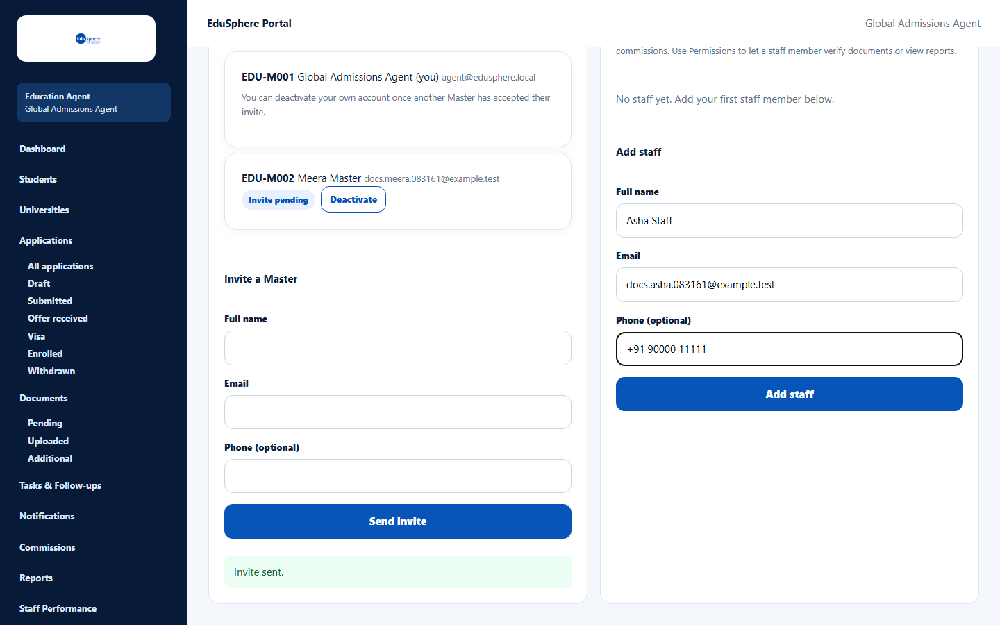
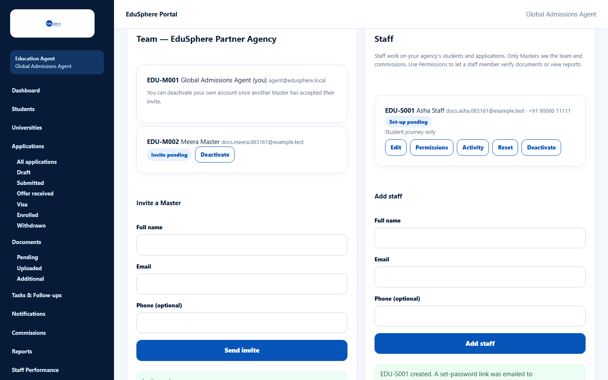
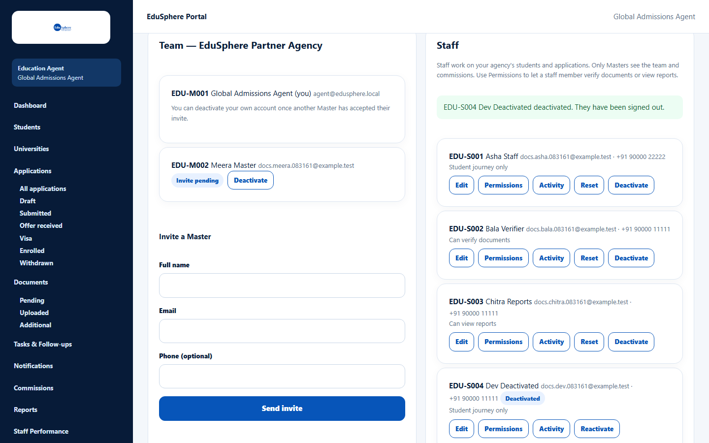

# Create a staff login

> Doc ID: DOC-TEAM-002 · Verified 2026-10-05 against docs commit `717d6aa8` (`main` @ `6a9be770`) · Roles: Agency Master

## Purpose
Give a team member their own EduSphere login as **Agency Staff**. Staff work only on the students assigned to them;
they do not see Team, Commissions or Staff Performance.

## Who Can Use This Feature
**Agency Masters only.**

## Prerequisites
- The staff member's email is not used by another EduSphere account.

## How to Access
Sidebar > **Team** > **Staff** card > **Add staff**.

## Steps

### Step 1 — Open the Staff card
On the Team page, scroll to **Staff**. A new agency shows "No staff yet. Add your first staff member below."

### Step 2 — Add the staff member
1. Under **Add staff**, enter **Full name**, **Email** and (optionally) **Phone (optional)**.
2. Click **Add staff**.

The message **"{code} created. A set-password link was emailed to {email}."** appears, for example
"EDU-S001 created. A set-password link was emailed to …". The new person is listed with the badge **Set-up pending**.

### Step 3 — The staff member sets a password
They receive the email **"Welcome to EduSphere -- set your password"**:

> Hi {name}, {Master's name} has created your EduSphere account as Agent. Set your password: {link}. This link is
> single-use and expires in 72 hours.

The link opens **Choose a new password**. After saving, they sign in at the Overseas sign-in page. The **Set-up
pending** badge then disappears from their row.

### Step 4 — Check the staff list
Each staff row shows the code, name, email and phone, a badge when relevant, and a permission summary:

| Badge / summary | Meaning |
|---|---|
| Set-up pending | They have not set a password yet. |
| Link expired | The set-password link expired before use; use **Reset** to send a new one. |
| Deactivated | They can no longer sign in. |
| Student journey only | No extra permissions (default). |
| Can verify documents / Can view reports | Extra permissions given by a Master. |

## Fields
| Field | Description | Required | Example |
|---|---|---|---|
| Full name | Staff member's name (up to 160 characters). | Yes | Asha Staff |
| Email | Their sign-in email (must be unused). Cannot be changed later. | Yes | asha@agency.example |
| Phone (optional) | Contact number (up to 40 characters). | No | +91 90000 11111 |

## Expected Result
The staff member has a login with the code `{agency prefix}-S{number}` and can sign in after setting a password. New
staff have no extra permissions until you set them (see [Set staff permissions](team-004-staff-permissions.md)).

## Validation Messages
| Message | When |
|---|---|
| Enter a valid email address, like name@example.com | The email is not valid. |
| Email already exists | Another EduSphere account uses this email. |
| {code} created, but the email was not delivered. Use Reset to send a new link. | The login was created but the email failed. |
| This agency has created or reset 20 staff logins in the last 24 hours. Try again later. | Daily limit reached. |

## Common Errors
**Problem:** The staff member did not get the email or the link expired.
**Cause:** Spam filtering, a typo, or more than 72 hours passed.
**Resolution:** Click **Reset** on their row to send a new link (see [Manage staff](team-003-manage-staff.md)).

## Tips
- Agree on staff email addresses before creating logins — the email cannot be changed afterwards.

## Related Features
- [Edit, reset, deactivate or reactivate staff](team-003-manage-staff.md)
- [Set staff permissions](team-004-staff-permissions.md)
- [Reset your password](../account-access/auth-004-reset-password.md)
