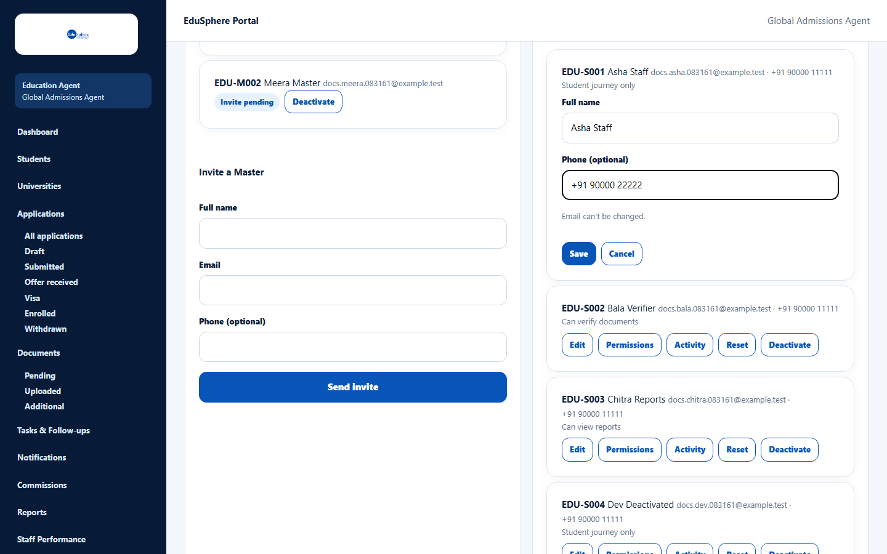
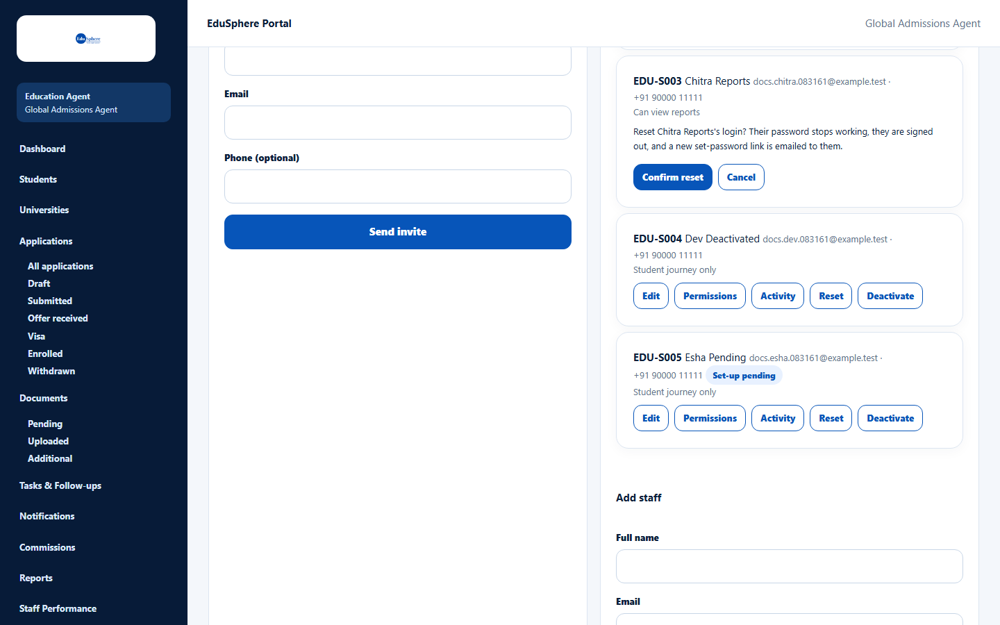
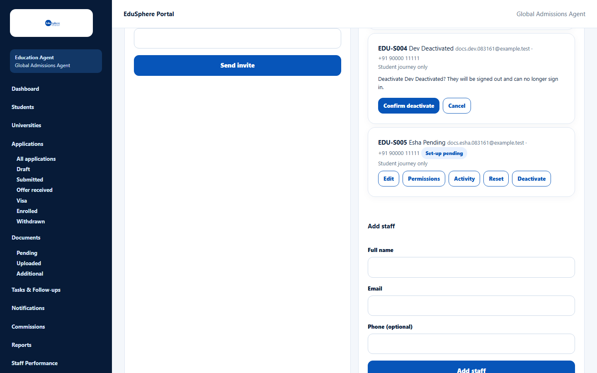
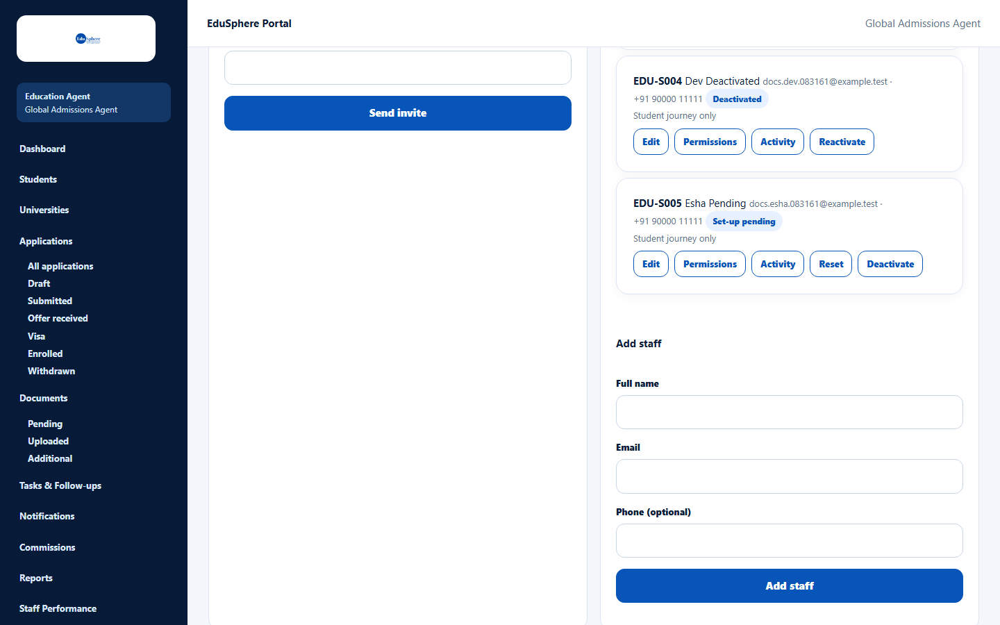

# Edit, reset, deactivate or reactivate staff

> Doc ID: DOC-TEAM-003 · Verified 2026-10-05 against docs commit `717d6aa8` (`main` @ `6a9be770`) · Roles: Agency Master

## Purpose
Keep staff logins up to date: correct a name or phone, send a fresh set-password link, block a person who has left,
or restore access.

## Who Can Use This Feature
**Agency Masters only.**

## Prerequisites
The staff member exists (see [Create a staff login](team-002-create-staff.md)).

## How to Access
Sidebar > **Team** > **Staff** card > the staff member's row. Each row has **Edit**, **Permissions**, **Activity**,
**Reset** and **Deactivate** (or **Reactivate** for a deactivated person).

## Steps

### Edit details
1. Click **Edit** on the row.
2. Change **Full name** and/or **Phone**. (Email can't be changed.)
3. Click **Save**. The message "{code} updated." appears.

### Reset a login
Use this when the person forgot their password, lost the email, or their link expired.
1. Click **Reset** on the row.
2. Read: "Reset {name}'s login? Their password stops working, they are signed out, and a new set-password link is
   emailed to them."
3. Click **Confirm reset** (or **Cancel**).

The message "A new set-password link was emailed to {name}." appears. The person sets a new password from the email.

### Deactivate
1. Click **Deactivate** on the row.
2. Click **Confirm deactivate**.

The message "{code} {name} deactivated. They have been signed out." appears and the row shows **Deactivated** with a
**Reactivate** button. A deactivated person who tries to sign in gets "Invalid credentials"; if they are signed in, their next page shows "Your account was deactivated by your agency. Contact your agency's Master." Their assigned students
stay assigned to them until you reassign them.

### Reactivate
Click **Reactivate** on the row. The message "{name} reactivated." appears and they can sign in again with their
existing password (confirmed in the application code; open set-password links stay cancelled). If they never set a password, the message adds "They have not set a password yet: use Reset to
send a new link."

## Fields
| Field | Description | Required | Example |
|---|---|---|---|
| Full name | Staff member's name. | Yes | Asha Staff |
| Phone | Contact number. | No | +91 90000 22222 |

## Expected Result
Changes apply immediately. A reset or deactivation signs the person out of every device.

## Validation Messages
| Message | When |
|---|---|
| A link was just sent; wait N seconds before resetting again | You pressed Reset again within a minute. |
| Reactivate this staff member first | You tried to reset a deactivated person. |
| Already deactivated / Already active | Someone else already made the change; reload the page. |
| …login was reset, but the email was not delivered. Try Reset again in a minute. | The reset worked but the email failed. |

## Common Errors
**Problem:** A former staff member's students are still "assigned" to them.
**Cause:** Deactivation does not move students.
**Resolution:** Reassign the students on the Students page (Assign).

## Tips
- Deactivate rather than reset when someone leaves the agency.

## Related Features
- [Create a staff login](team-002-create-staff.md)
- [Set staff permissions](team-004-staff-permissions.md)
- ["Access unavailable" messages](../account-access/auth-003-access-unavailable.md)
