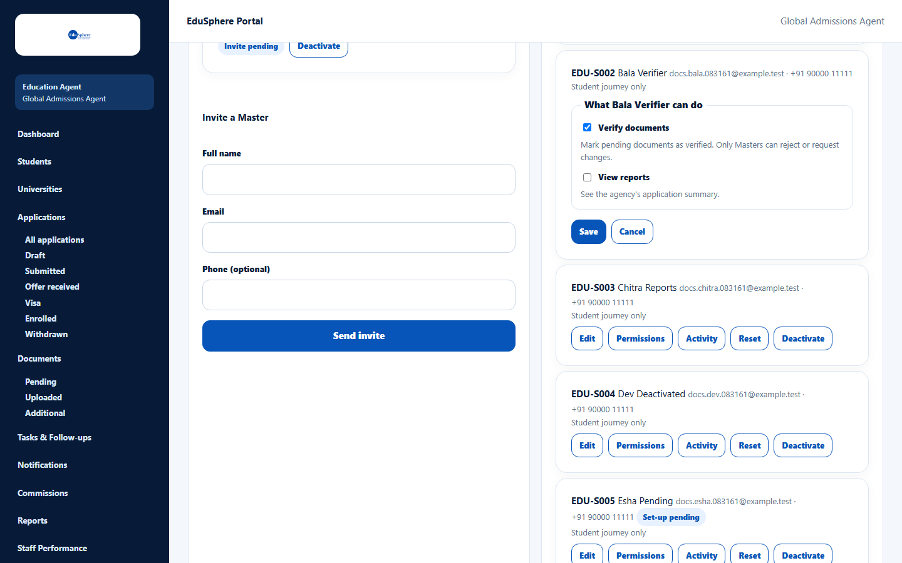
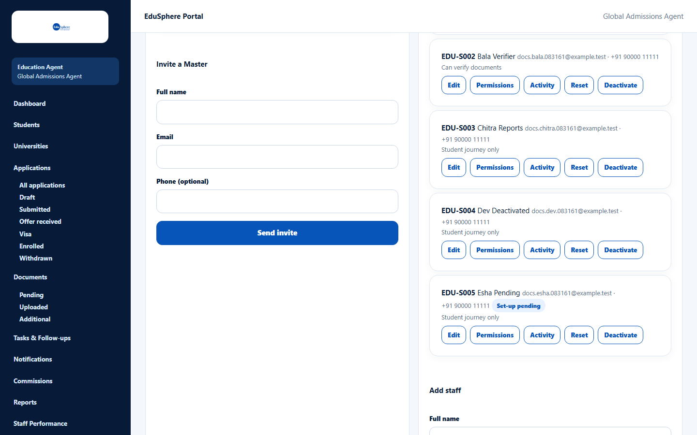
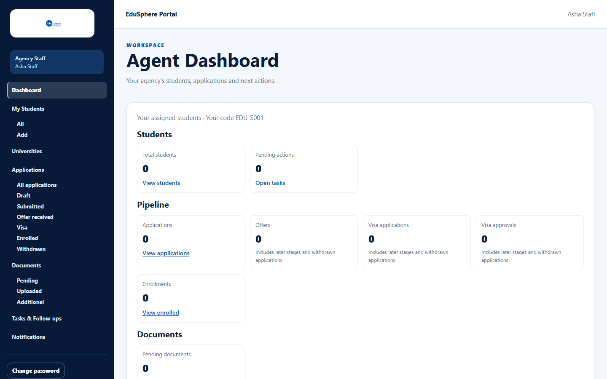
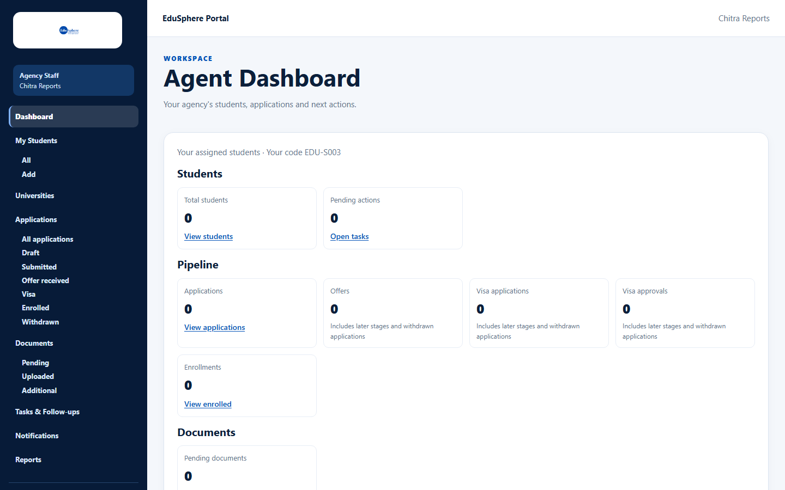

# Set staff permissions

> Doc ID: DOC-TEAM-004 · Verified 2026-10-05 against docs commit `717d6aa8` (`main` @ `6a9be770`) · Roles: Agency Master

## Purpose
Give individual staff members two optional extra rights: verifying documents and viewing reports. By default staff
can only work on their assigned students ("Student journey only").

## Who Can Use This Feature
**Agency Masters only.**

## Prerequisites
The staff member exists.

## How to Access
Sidebar > **Team** > **Staff** card > row > **Permissions**.

## Steps

### Step 1 — Open Permissions
Click **Permissions** on the staff member's row. The form **What {name} can do** opens.

### Step 2 — Choose permissions
Tick or untick:
- **Verify documents** — "Mark pending documents as verified. Only Masters can reject or request changes."
- **View reports** — "See the agency's application summary."

### Step 3 — Save
Click **Save** (or **Cancel**). The message "{code} permissions saved." appears and the row summary changes to
"Can verify documents" and/or "Can view reports".

## Fields
| Field | Description | Required | Example |
|---|---|---|---|
| Verify documents | Lets the staff member mark pending documents as **Verified** (only for their assigned students). | No | ticked |
| View reports | Shows **Reports** in their sidebar (their own students only; never Staff performance or Commission reports). | No | not ticked |

## Expected Result
The change applies on the staff member's next page load.

| Staff sidebar without View reports | Staff sidebar with View reports |
|---|---|
|  |  |

Staff always see **My Students** (All, Add) instead of Students, and never see Team, Commissions or Staff
Performance.

## Validation Messages
None on this form. Staff without a permission who try the action see:
- "Your agency Master hasn't given you permission to verify documents"
- "Your agency Master hasn't given you access to reports"

## Common Errors
**Problem:** A staff member says Reports is still missing.
**Cause:** Their page was opened before you saved.
**Resolution:** Ask them to reload the page.

## Tips
- Only Masters can reject a document or ask for changes, even if a staff member can verify.

## Related Features
- [Create a staff login](team-002-create-staff.md)
- [Staff activity](team-005-staff-activity.md)
