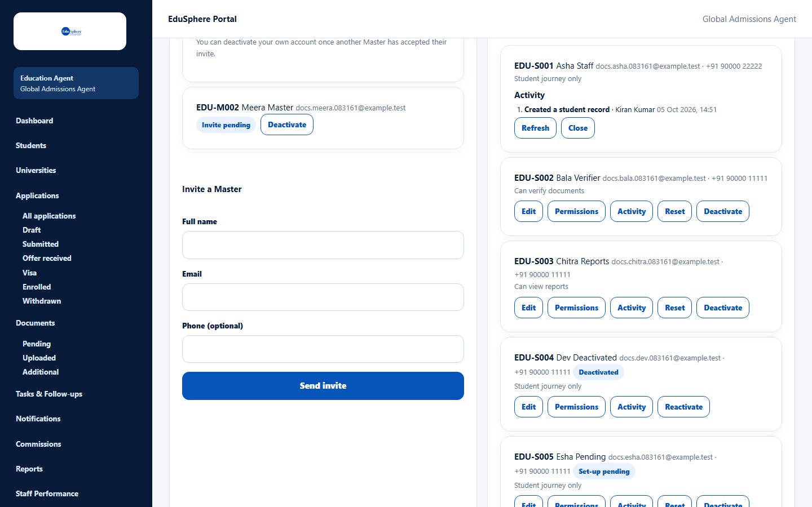
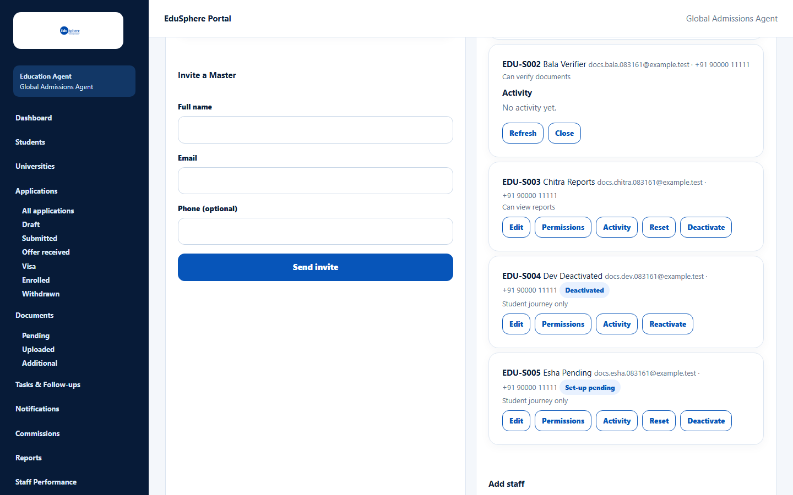

# Staff activity

> Doc ID: DOC-TEAM-005 · Verified 2026-10-05 against docs commit `717d6aa8` (`main` @ `6a9be770`) · Roles: Agency Master

## Purpose
See what a staff member has done recently — for example which students they created or which documents they verified.

## Who Can Use This Feature
**Agency Masters only.**

## Prerequisites
The staff member exists.

## How to Access
Sidebar > **Team** > **Staff** card > row > **Activity**.

## Steps

### Step 1 — Open Activity
Click **Activity** on the staff member's row. A numbered **Activity** list opens inside the row, newest first.
Each entry shows what was done, the record it concerns, and the date and time, for example
"Created a student record · Kiran Kumar 05 Oct 2026, 13:30".

### Step 2 — Refresh, page or close
- **Refresh** reloads the list.
- **Previous** / **Next** appear when there are more than 10 entries.
- **Close** hides the list.

If the person has done nothing yet, the list says **No activity yet.**

## Fields
None.

## Expected Result
You can see the staff member's recorded actions on students, applications, documents and tasks.

## Validation Messages
| Message | When |
|---|---|
| Unable to load activity. | The list could not load; click **Try again**. |

## Common Errors
None observed.

## Tips
- Use **Staff Performance** for counts and conversion; use Activity to see individual actions.

## Related Features
- [Set staff permissions](team-004-staff-permissions.md)
- [Staff performance](../staff-performance/perf-001-staff-performance.md)
