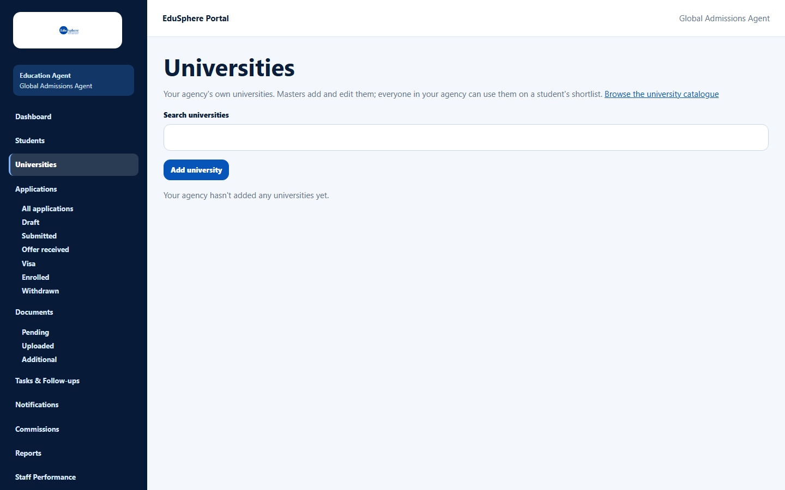
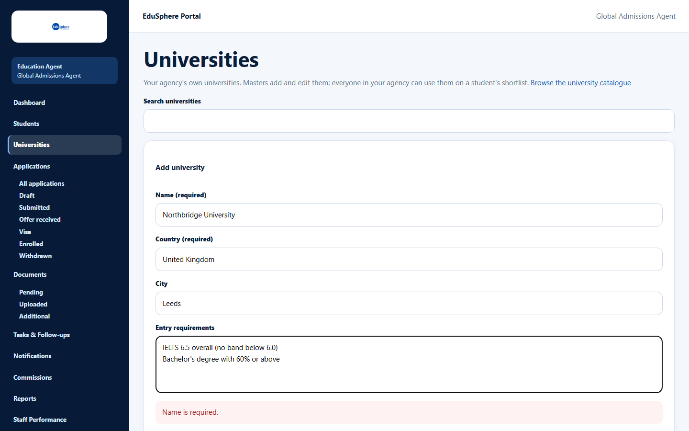
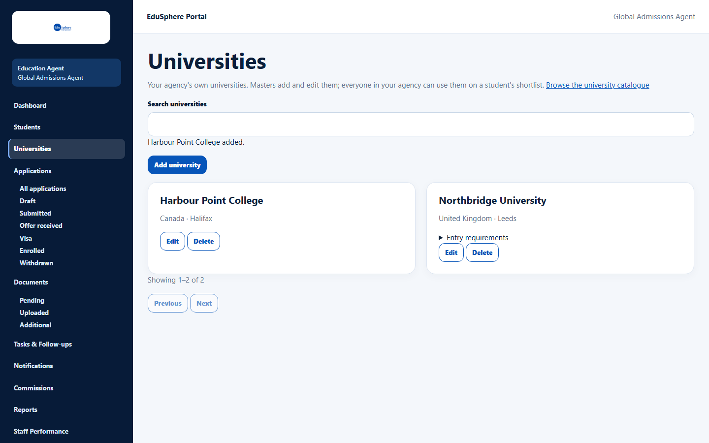
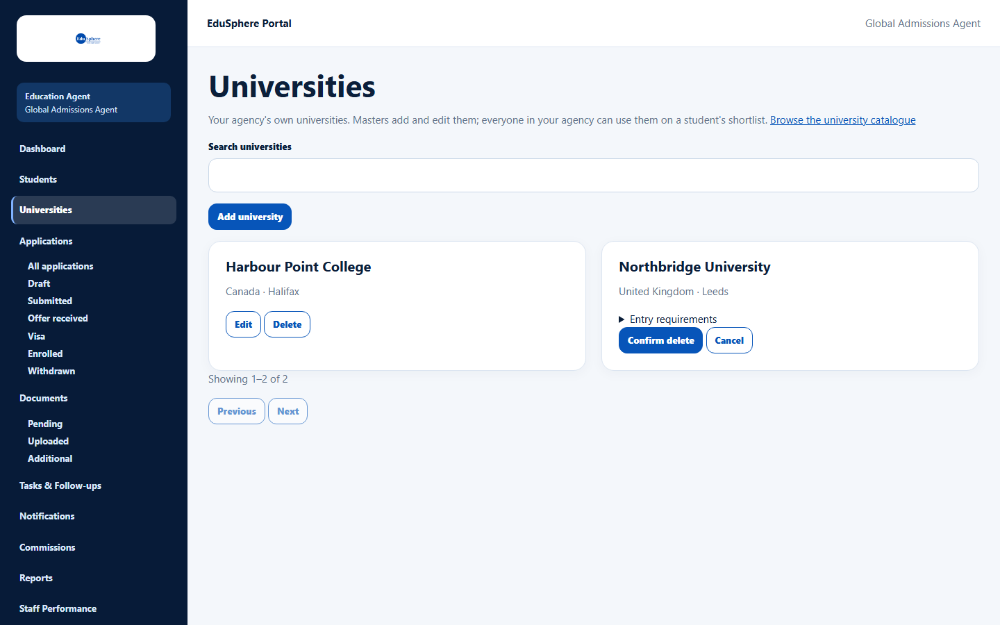
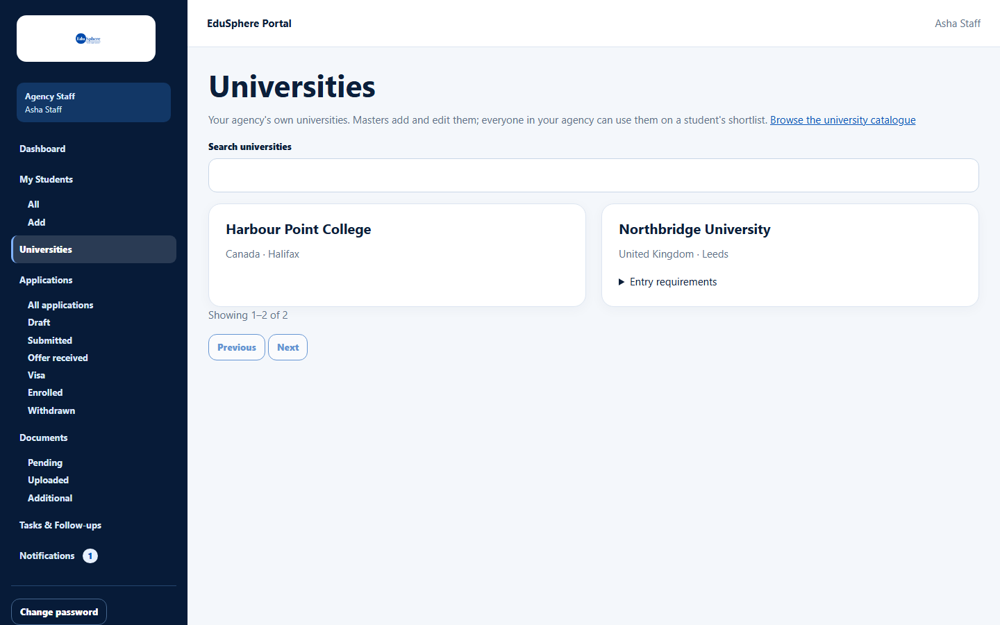
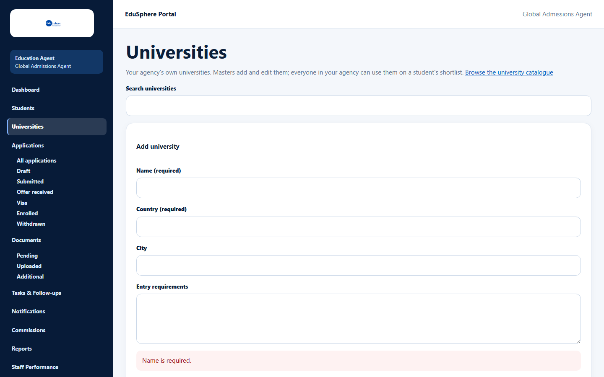
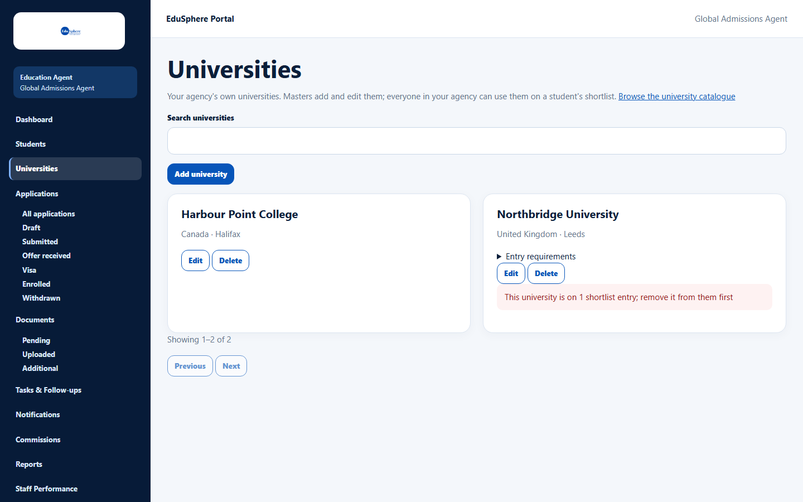

# Agency universities

> Doc ID: DOC-UNI-001 · Verified 2026-10-05 against docs commit `717d6aa8` (`main` @ `6a9be770`) · Roles: Agency Master, Agency Staff

## Purpose
Keep your agency's own list of universities (for example partner institutions that are not in the EduSphere
catalogue). Everyone in the agency can then pick them on a student's shortlist.

## Who Can Use This Feature
- **Agency Master:** add, edit and delete.
- **Agency Staff:** view and search only.

## Prerequisites
Your agency is approved.

## How to Access
Sidebar > **Universities**. The link **Browse the university catalogue** opens EduSphere's public catalogue.

## Steps

### Step 1 — Open Universities
A new agency sees "Your agency hasn't added any universities yet."

### Step 2 — Add a university (Master)
1. Click **Add university**.
2. Fill in **Name (required)**, **Country (required)**, **City** and **Entry requirements**.
3. Click **Save university**. The message "{name} added." appears.

### Step 3 — Edit or delete (Master)
- **Edit** opens the form; save to update ("{name} saved.").
- **Delete** asks for confirmation; click **Confirm delete** ("{name} deleted.").

### Staff view
Staff see the same list and search, but no **Add university**, **Edit** or **Delete**.

## Fields
| Field | Description | Required | Example |
|---|---|---|---|
| Name (required) | University name, up to 200 characters. | Yes | Northbridge University |
| Country (required) | Up to 120 characters. | Yes | United Kingdom |
| City | Up to 120 characters. | No | Leeds |
| Entry requirements | Up to 2000 characters; copied into shortlist entries. | No | IELTS 6.5 overall |
| Search universities | Name, country or city; press Enter to search. | No | Leeds |

## Expected Result
The university is listed (sorted by name, 20 per page) and can be chosen on any student's shortlist.

## Validation Messages
| Message | When |
|---|---|
| Name is required. / Country is required. | A required field is empty. |
| This university is already in your agency's list | The same university was already added. |
| Your agency has reached the limit of 500 universities | The agency list is full. |
| This university is on N shortlist entry; remove it from them first | You tried to delete a university that students have on their shortlist. |

## Common Errors
**Problem:** "This university is on 1 shortlist entry; remove it from them first".
**Cause:** At least one student's shortlist uses this university.
**Resolution:** Remove it from those shortlists first, then delete.

## Tips
- Check the catalogue first — universities already in the catalogue do not need to be added.

## Related Features
- [Build a university shortlist](../students/stu-007-university-shortlist.md)
